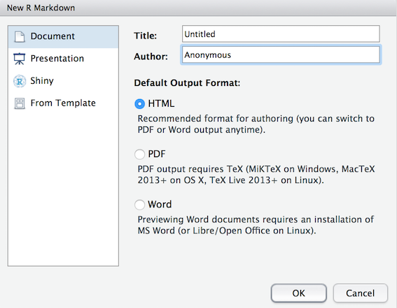

## R Markdown Basics

```{r preclass-setup1, echo=FALSE}

```

Having read the Overview for this chapter, and the reason behind using R, we are now going work on making a reproducible code. If you have a laptop, it is best to install R and Rstudio on that for you to use. In the Appendix below you will find a reminder of how to install R and Rstudio.

### Create a new R Markdown document

* Create a new R Markdown file (.Rmd) by opening Rstudio, and then on the top menu, selecting **`File >> New File >> R Markdown...`**. You should now see the following dialog box:

```{r img-rmarkdown-dialog, echo = FALSE, out.width='50%', fig.cap = "Starting an R Markdown file"}


```


* Click **`Document`** on the left-hand panel and then give your document a **Title**. 

This is your file so call it what you want but make sure it is informative to you and your reader. 

* Put your name or your student ID in the **Author** field as you are the author. For now we will focus on making an **HTML** output, so make sure that is selected as shown in Figure \@ref(fig:img-rmarkdown-dialog) then hit **`OK`** when you have done so. You should now have an .Rmd file open in Rstudio.

The first thing you will see in your R Markdown file is a header section enclosed at the top and bottom by `---`. Technically called the **yaml header**, this section lists the title, author, date and output format. The layout of the header is very precise and will look like that shown in Figure \@ref(fig:img-yaml-header), which is currently set to output as HTML.  

```{r img-yaml-header, echo = FALSE, out.width='50%', fig.cap = "An Rmd yaml header"}

knitr::include_graphics("images/s01-lab01/preclass/rmd_header.png")

```

By default the file header includes the info shown in Figure \@ref(fig:img-yaml-header) but there are many other options available. You can learn more about this in your spare time if you like through these links for
[**.html** options](http://rmarkdown.rstudio.com/html_document_format.html){_target="_blank"} or 
[**.pdf** options](http://rmarkdown.rstudio.com/pdf_document_format.html){target="_blank"}.

```{block, type = "try"}
**BUT WAIT**!! What if you spelt your name wrong? How would you change this?
```

`r hide("Explain This - I spelt my name wrong!")`
```{block, type = "info"}
The long way would be to close the file and start again. The shorter way would be to just correct the info in the header - just remember to keep between the quotes. E.g. "Si Cologe" instead of "Untitled"
```
`r unhide()`  

### Code Chunks

Immediately below the header information you will see the default setup **code chunk** as shown in Figure \@ref(fig:img-setup-chunk). Most of the time, in this lab series, you will not edit the information in this `r glossary("chunk")`. Instead, you will add information, text, code, and chunks, below this chunk.  

```{r img-setup-chunk, echo = FALSE, out.width='100%', fig.cap = "The defualt setup code chunk"}

knitr::include_graphics("images/s01-lab01/preclass/rmd_defaultchunk.png")
```

In RMarkdown you can type any text you want directly in the document just as you would in a word document. However, if you want to include code you need to include it in one of these **code chunks** similar to Figure \@ref(fig:img-setup-chunk). Code chunks start with a line that contains three backwards apostrophes **`** (these are called grave accents - often in the top-left of QWERTY keyboards), and then a set of curly brackets with the letter r inside: 

```{r empty-chunk, eval = FALSE, verbatim = 'r'}


```

You will **always** need both of these parts to create a code chunk:  

* The three back ticks **`** are the part of the Rmd file that says this is code being inserted into my document. 
* The {r} part says that you are specifically including R code. 

The default setup code chunk provides some basic options for your R Markdown file for when it knits your work. As above, for now, it is best to leave this particular code chunk alone. Instead we will show you how to use R Markdown by editing the code chunks that come after this default chunk. 

The next code chunk in your file will look a bit like this:

```{r cars-chunk, eval = FALSE, verbatim = 'r cars'}
summary(cars)
```

Within the curly brackets, on the first line of the chunk, the word `cars` is included after the letter `r`. This is simply the **name** or the **label** for the code chunk and it really could have been called anything. For example, you could have called this code chunk `cars1` and a later chunk `cars2` to show it was the first and second chunk relating to cars. Whilst it is always advisable you name your code chunks, you do not need to name them. However, if you do put in names for the chunks **do not use the same name twice** as this will cause your script to crash when you knit it, e.g. Do not use `data` and `data`; instead maybe use `personality-data` and `participant-info` or whatever makes sense to what you are doing in the chunk. OK? Different names for different chunks! They are all individual.

`r hide("Explain This - You can crash whilst knitting?")`
```{block, type = "info"}
Remember knitting just means converting or rendering your file as a pdf, webpage, etc. Crashing means that you had an error in your code that stopped your knitting from working or finishing. You can usually find the problem line of code from the error message you'll see.
```
`r unhide()`
<br>
The second line in the above **code chunk** is the R code we have written: `summary(cars)`. In this case, we are just asking for a `summary()` of the inbuilt dataset `cars`. R has a lot of inbuilt datasets for you to practice on; `cars` is one of these.

The third line closes off the code chunk, again with the three backwards apostrophes. This means that whatever is contained between the first and third lines will be the code that is run.  

`r hide("Helpful Hint - Be sure to close the chunk")`
```{block, type = "info"}
When people are first starting out using R Markdown, a common issue is code not working because they have started the code chunk correctly, but have forgotten to close it at the bottom with the three backticks. Remember, three backticks to open, three backticks to close, and in our chunk we bind them.
```
`r unhide()`
<br>

<span style="font-size: 22px; font-weight: bold; color: var(--green);">Quickfire Questions</span>

- From the following options what was the name, or label, of the **default setup code chunk** (i.e. the first code chunk in an R Markdown file)? `r mcq(c("include", "r", answer = "setup", "FALSE"))` 

`r hide("Explain This Answer")`
```{block, type = "info"}
If you look at the default setup code chunk you can see the code chunk has the name setup. include=FALSE is a rule which we will explain in a little bit.
```
`r unhide()`  

### Knitting Code

Now would be a good time to try knitting your file to see what the code chunks do. You can do this using the **Knit button** at the top of the RStudio screen:

```{r img-the-knit-button, echo = FALSE, out.width='75%', fig.cap = "The knit button. Clicking this will knit your file."}

knitr::include_graphics("images/s01-lab01/preclass/rmd_knit.png")

```

When you click `Knit` it will ask you to save the file as an .Rmd file. Call the file `L2Psych_Ch1_RMarkdownBasics.Rmd` and save it in a folder where you will keep all the information for this lab. When working in the Psychology labs or the University Library you need to save in a location or drive space that you have full access to and can save files to. The best one on campus is your `M:` drive. If using your own device then anywhere you can save the file should work. However, having a good folder structure will help you navigate the labs better.

`r hide("Helpful Hint - One folder for all your work")`
```{block, type = "info"}
It would be very beneficial to create a folder in your `M:` drive that will contain all your data skills work for the rest of Level 2. Maybe something like `Psychology_Level2_DataSkills_Work` and then have folders within that for each lab, e.g `Chapter1`. The clearer the structure of these folders the easier it will be to find and use your files again! This is important as one thing we will keep telling you to do is **LOOK BACK** (politely) at what you previously did. 
    
Couple of tips:

* Avoid spaces in file names and folder names. It can make life really complicated and is a bad habit to start with. Use underscores between words in filenames and folder names.
* Never call your folder "R". This will crash your R and potentially lead you to having to reinstall both R and Rstudio. When Rstudio opens it looks for a folder called R which it expects to contain the software and libraries. If they aren't there because it is now looking in a different folder with the same name, things go wrong.
```
`r unhide()`  

<br>
After saving the file, a webpage should appear. The first thing to notice is that some lines in the code chunks have disappeared: the <code>```{r}</code> and the closing <code>&#96;&#96;&#96;</code> in your code chunk have gone. Whenever you knit an R Markdown file these lines will disappear leaving only the code within. You'll also notice that the output of the code is also now showing in your webpage. In the next section we will show you how to control showing the output of your code, or not, through adding rules.

```{r img-rmd-summary2, echo = FALSE, out.width='100%', fig.cap = "The knitted summary output"}

knitr::include_graphics("images/s01-lab01/preclass/rmd_summary2.png")
```

### Adding Code Chunk Rules and Options

It can often be a good idea or even necessary to show the data or the outcome of a test in your report, for example if you were writing a report and wanted to include a table of results. But what if your code displayed a table that was 10,000 lines long? In that case we might want to not show the output and only show the code. You can do this by including a rule within the first line of your code chunk - your \`\`\`{r name, rule = option} line. You have already seen a rule before in the standard default chunk, the `include` rule, but there are a number of others. Let's look at some now: 

First, let's look at how to **hide the output but show the code**. Here, we use the `results = "hide"` rule:

```{r img-results-hide, echo = FALSE, out.width='100%', fig.cap = "The results Rule"}

knitr::include_graphics("images/s01-lab01/preclass/rmd_hide.png")
```

<br>
**Add this rule into your example code chunk, as shown above, and knit the file again. What happens?** Note that there is a comma separating the name of the chunk and the rule. You should now see the code only and not the data. A key thing to note here is that your code is still "running", it just isn't showing an output. For example, say your code said `x <- 2 + 2`.  With the `results = "hide"` rule, you would still be running that line of code, x being assigned as 4, but you just don't see the output.
<br><br>
Alternatively, we can **hide the code, but show the ouput** by using the `echo = FALSE` rule:   

```{r img-echo-hide, echo = FALSE, out.width='100%', fig.cap = "The echo Rule"}

knitr::include_graphics("images/s01-lab01/preclass/rmd_echo.png")
```

<br>
In your template Rmd file, the rule echo is set to `FALSE` meaning to show the figure and not the code. **Change the rule in your code to `echo` and set it as `TRUE`, then knit the file again**. What happens?  

`r hide("Explain This - Why would I hide my code?")`  
```{block, type = "info"}
Remember from Level 1 where we called in libraries to our environment. The "echo = FALSE" option is useful for commands like `library()` when you are just calling a package into the library but don't necessarily want to display that in your final report or in your final HTML file. Another example might be if you wanted to make a plot but didn't want to include the code, you just want to show the plot in your report. 
```
`r unhide()`  

<br>
Next, say you want to **hide both the code AND the output** but still run the code. You can do this using the `include` rule:

```{r img-include-hide, echo = FALSE, out.width='100%', fig.cap = "The include Rule"}

knitr::include_graphics("images/s01-lab01/preclass/rmd_hide_both.png")
```

<br>
**Change the rule to your example code chunk, as shown above, to `include = FALSE` and then knit the file again**. What happens? Note that here the code still runs. It just does not show you anything. 

Finally, you can use the `eval` rule which specifies whether or not you want the code chunk you have written to be evaluated when you knit the RMarkdown file. Evaluated means to run or carry out the code. Here, the `eval = FALSE` rule will stop the code from being evaluated. The code will be shown because there is no rule stopping it but there will be no output because it won't get evaluated because of the `eval` rule being `FALSE`. 

```{r img-eval-hide, echo = FALSE, out.width='100%', fig.cap = "The eval Rule"}

knitr::include_graphics("images/s01-lab01/preclass/rmd_eval.png")
```

<br>
This might be useful in cases where you want to show the code relating to how you programmed your stimuli for an experiment, but you don't necessarily want it to run as part of the R Markdown file. 
<br>
<br>
We could probably do with a wee summary here:
<br>

```{r chp1-secret-table-code, echo=FALSE}
sum_table <- tibble(Code = c("eval = FALSE", "echo = TRUE", "echo = FALSE", "results = \"hide\"", "include = FALSE"),
                    `Does Code Run` = c("NO","YES","YES","YES","YES"), 
                    `Does Code Show` = c("YES","YES","NO","YES","NO"),
                    `Do Results Show` = c("NO","YES","YES","NO","NO"))

```

```{r chp1-secret-table-disp, echo=FALSE, fig.cap="Yeah"}

knitr::kable(sum_table, align = "c", caption = "Rules! Rules! Rules!")
```
<br>

You can also mix and match rules to get the code/output to display as you want. It takes a little getting used to at first but if in doubt, just ask.

`r hide("Portfolio Point - autocompletes")`
```{block, type = "info"}
You can use RStudio's autocomplete (the tab button) to see the different options for the different rules. For example, type `include =` and then hit the tab button on your keyboard. You should see the options of `TRUE` or `FALSE`. 

Autocomplete also works for a lot of functions you can't quite remember how to spell as well. gg-what?  gg-{tab button}... Ah yes, `ggplot()`.
```
`r unhide()`
<br>

<span style="font-size: 22px; font-weight: bold; color: var(--green);">Quickfire Questions</span>

You've got a large dataset of thousands of participants' personality and happiness scores that you want to analyse and present in RMarkdown.

* You want to show the code you are running in your analysis but not show the output as this would be too much to display. Note that you want the code to run. Type in the box (e.g. `rule = set`) how you would set the `results` rule to do this? `r fitb("results = \"hide\"", width = 20, ignore_ws = TRUE)`

* You create a plot of happiness versus neuroticism scores but you want to hide the code and only show the output. How can you do this? `r mcq(c("echo = TRUE", "include = FALSE", "code = HIDE", answer = "echo = FALSE"))`

`r hide("Explain This - I don't understand these answers")`
```{block, type = "info"}
The first answer should be `results = "hide"` as you want to show the code and run the code but not necessarily show the output of the code.
    
In the second question, `include = FALSE` technically would hide the code, but this also hides the output! `echo = FALSE` allows you to still see your plot while hiding the code you want hidden. `code = HIDE` - if only it were that simple! 

Remember, the aim of these questions aren't to help you memorise these codes (no one can do that!); they're to help you gain a better understanding of how to apply these codes when you come across them in the future.
```
`r unhide()`  
<br>  

* True or False, writing `echo = TRUE` has the same effect on the output of a code chunk as if you had no echo rule at all: `r torf(TRUE)`

`r hide("Explain This - Echo True or Not at all")`
```{block, type = "info"}
All of the code chunk rules have a default option. For example, `echo`, `include`, and `eval` are usually by default set to `TRUE`. As a result, if you don't set any `echo` rule, i.e. you don't specifically set `echo = FALSE` in your code chunk, then it is the same as setting `echo = TRUE`. So not specifying an option will give you the default setting for that option.
```
`r unhide()`  
<br>  

* True or False, there is no difference between setting `results = "hide"` and `eval = FALSE` as they both hide the output: `r torf(FALSE)`

`r hide("Explain This - What's the difference?")`
```{block, type = "info"}
With setting `results = "hide"`, the code is evaluated and results are produced but the output is hidden. With setting `eval = FALSE`, the code is not evaluated and therefore no results or output have been produced. If you need your output for a later part of the code then you would might use `results = "hide"`. If you don't need the output and just want to show the code as an example then you might use `eval = FALSE`.
```
`r unhide()`  

### Adding Inline Code

An alternative way to add code to a report is through what is called using **inline code**. With inline code you don't use a code chunk. Instead the code appears **inline** with the text. Inline code can be inserted using a back-tick, then the letter `r`, followed by a space, then the code you want to include, then finally another back-tick. For example, writing `r backtick("r 2 + 2")` would return the answer **4** when you knit the file instead of showing the code. Remember, you do not do this inside a code chunk, you do this in line with your text, e.g.:
<br><br>
**"We ran `r backtick("r 2+2")` people".** 
<br><br>
Which when knitted becomes: 
<br><br>
**"We ran `r 2+2` people".**

So inline coding is really useful if you want to do calculations **within your text** or insert values into text, say from a dataframe, to make an informative sentence. We will look at more complex examples later in the labs but again this is a really useful tool for writing manuscripts through R Markdown the more comfortable you get with it.

<span style="font-size: 22px; font-weight: bold; color: var(--green);">Quickfire Questions</span>

- You need `r mcq(c("Two", "One", answer = "Three"))` back tick(s) to insert **code chunks**

- Why is this inline code, `r backtick("{r} 6 * 8")` , not going to show the calculated answer when you knit the file? Try editing the code line in Rmarkdown and knitting it to get it to work. `r mcq(c("You need a space between each back tick and the code", "Inline code cannot complete calcuations", answer = "Curly brackets around the r are only needed for code chunks"))`

`r hide("Explain This - Why are these answers correct?")`
```{block, type = "info"}
* All code chunks start and end with three back-ticks.

* Inline coding does not use the curly brackets around the `r`. 

* All you need for inline coding is a back-tick, r, space, code, and a final back-tick.
```
`r unhide()`

### Formatting the R Markdown File

The last thing we want to show you in this preclass activity is how to format your text. 

When you're not writing in code chunks you can format your document in lots of different ways just like you would in a Word document (or other expensive license-based software). The [R Markdown cheatsheet](https://www.rstudio.com/wp-content/uploads/2015/02/rmarkdown-cheatsheet.pdf){target="_blank"} provides lots of information about how to do this but we will show you a couple of things that you might want to try out. 

We can make text **bold** by including two \*\* (two asterisks) at the start and end of the text we want to present in bold font. For example:
<br><br>
"We ran \*\*4 people\*\*. 
<br><br>
Which when knitted becomes: 
<br><br>
"We ran **4 people**".
<br><br>
**Now write some text in your Rmd file and put it in bold.** Knit the file to check it worked.   

You could also try using italics by putting a single \* (asterisk) at the start and end of the word or sentence. **Try this now.** Here is an example to help.
<br><br>
"We ran \*4 people\*. 
<br><br>
Which when knitted becomes: 
<br><br>
"We ran *4 people*".
<br><br>

**Note:** italics can be difficult to read for many people and as such we have tried to avoid using it in this book. If you find some italics, where it is not necessary, please let us know and claim your reward of a packet of minstrels. Yes, a whole packet!

Finally, you might want to add headings and sub-headings to your file. For example, maybe you are writing a Psychology journal article and want to put in a header for the Introduction, Methods, Results, or Discussion sections. We do this using the # (hashtag) symbol as shown in Figure \@ref(fig:img-header-levels).

```{r img-header-levels, echo = FALSE, out.width='100%', fig.cap = "Inputting different Header levels using #s"}

knitr::include_graphics("images/s01-lab01/preclass/rmd_hashtag.png")
```

<br>
**Now, type the four main sections found in a Psychology journal article in your R Markdown file, typing each one in a separate line**. These are mentioned above. Knit the file. What do these look like? 

**Now add a different number of #'s before each heading**, with a space between the heading and the hashtag (e.g. # Introduction) and knit the file again. What do you notice about the different number of hashtags?  

<span style="font-size: 22px; font-weight: bold; color: var(--green);">Quickfire Questions</span>

* If \* puts words into italics, and \*\* puts words into bold, type in the box what might you put before (and technically after) a word to put it into italics with bold? `r fitb("***")`

* True or False: The **more** '#'s you include, the **smaller** the header is: `r torf(TRUE)`  

* From the options, the most common order of headings found in a Psychology Journal are: `r mcq(c("Discussion, Introduction, Methods, Results", "Discussion, Results, Methods, Introduction", answer = "Introduction, Methods, Results, Discussion", "Introduction, Results, Methods, Discussion"))`

`r hide("Explain This - I don't get these answers")`
```{block, type = "info"}
If \* at the start and end of the word puts it in italics (e.g. *italics*) and \*\* puts it in bold (e.g. **bold**), then putting three \*\*\* at the start and end will put it in italics with bold (e.g. ***italics-bold***).
    
It is true that the more #'s you use, the smaller the heading is. Word and other document writers use different headings as well. Here, # gives the biggest heading, and it gets smaller and smaller with every extra #.

Finally, in Psychology, the vast majority of journal articles are written in the format of: Introduction, Methods, Results, Discussion. This format does not always hold as some journals ask authors to use a different format, depending how much emphasis that journal (erroneously) likes to put on results over hypothesis and methods. We however teach the order stated above. The question and approach is always as important, if not more so, than the results! Which of course you know from learning about Registered Reports in the labs and lectures.
```
`r unhide()`  

<br>


