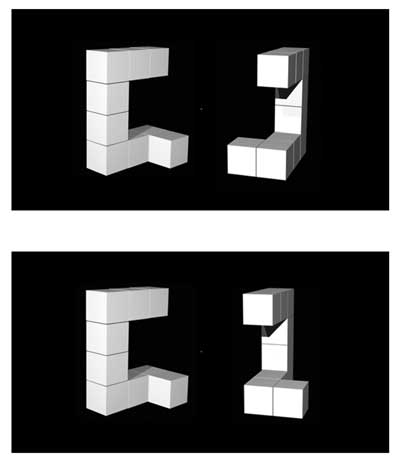

## Data Visualisation Basics

```{r lab3-preclass-data, eval = TRUE, echo = FALSE, message = FALSE, warning = FALSE}
menrot <-read_csv("./data/03-s01/preclass/MentalRotationBehavioralData.csv")
demog <- read_csv("./data/03-s01/preclass/demographics.csv")
``` 

### Introducing the Data Set: Mental Rotation Ability

The data we will use today comes from a replication of a classic experiment merging the fields of Perception and Cognition. <a href="http://science.sciencemag.org/content/171/3972/701" target = "_blank">Shepard and Metzler (1971)</a> demonstrated that when participants were shown two similar three-dimensional shapes, one just a rotated version of the other (see the figure below - top panel), and asked whether they were the same shape or not, the reaction time and error rates of responses were a function of rotation; i.e. the larger the difference in rotation between the two shapes, the longer it took participants to say "same" or "different", and the more errors they made. 

```{r img-rotation-task, echo = FALSE, out.width='50%', fig.cap = "The Mental Rotation Task as shown in Ganis and Kievit (2016) Figure 1"}



```

The image shown in Figure \@ref(fig:img-rotation-task) actually comes from the replication by <a href="https://openpsychologydata.metajnl.com/articles/10.5334/jopd.ai/" target="_blank">Ganis and Kievit (2016)</a>. In the top panel the two shapes are the same but the shape on the right is rotated vertically at 150 degrees from the original (the left shape) and so participants should respond "same". In the bottom panel, however, the two shapes are different; the one on the right is again rotated at 150 degrees, but in this trial it takes longer for participants to realise that they are different shapes. 

You can read more about Ganis and Kievit (2016) in your own time, but the basic methods are that they ran 54 participants on a series of these images using four angles of rotation (0, 50, 100, 150 degrees) and asked people to respond 'same' or 'different' on each trial. The data can be [downloaded from here](data/03-s01/preclass/ch3-preclass-data.zip). You should use this data to follow along below and try to answer the questions.

**Look at the data**

1. Download the data folder, unzip it, and save it to a folder you have access to.
2. Set your working directory to that folder **`Session >> Set Working Directory >> Choose Directory`**
3. Open a new Rscript or .RMarkdown file and save it within the folder that contains the data, giving the script a sensible name, e.g. `Chapter3_visualisations.R`. If you prefer to work in RMarkdown, just remember you will need to embed code into code chunks, as shown in Chapter 1.
4. Copy the three code lines below into your script and run them to bring `tidyverse` into the library and to read in the two data files.

```{r Ch3PreClassLib, eval = FALSE, warning=FALSE, message=FALSE, error=FALSE}
library("tidyverse")

menrot <- read_csv("MentalRotationBehavioralData.csv")
demog <- read_csv("demographics.csv")
```

* Note, there is no difference between `library(tidyverse)` and `library("tidyverse")` both will work. 
* However, there is a difference between `demog <- read_csv("demographics.csv")` and `demog <- read_csv(demographics.csv)`. You will need quotes around the .csv file name as shown in the code chunk above (e.g. `demog <- read_csv("demographics.csv")`), or the code won't work.


`r hide("Explain this - Why load tidyverse and not just ggplot2?")`
```{block, type ="info"}
This is a really great question as we always seem to be saying to use `dplyr` or `readr` or `ggplot`, but we never actually call them in. Remember, however, that `tidyverse` is actually a **collection of packages**, the most common packages in fact, and we use it to bring in these common packages (including `ggplot2`) because you will probably need the other packages along with it for the codes to run smoothly. We will try to tell you when you need to call other packages alongside `tidyverse`, but do keep in mind that most of your codes will at least start with the `tidyverse` package.

Small point, if looking for help on `ggplot`, the package is actually called `ggplot2`. This is the newer version of the package, so search `ggplot2` if you need help.
```
`r unhide()`
<br>
Let's start by having a look at the data we have brought in. You can do this whichever way you choose; we mentioned three ways in the previous chapter. 

First, `demog` - short for demographics. It has three columns:

* Participant - the ID of the participant
* Age - the age of the participant
* Sex - the sex of the participant

Secondly, `menrot` - short for mental rotation. It has 8 columns:

* Participant - the ID of the participant; matches with ID in `demog`
* Trial - the trial number in the experiment for each participant
* Condition - the name of the image shown; **R** indicates the rotated image was different
* Time - the reaction time to respond on each trial in milliseconds
* DesiredResponse - what participants should have responded on each trial; **Different** or **Same**
* ActualResponse - what participants did respond on each trial; **Different** or **Same**
* Angle - the angle that the shape on the right was rotated compared to the shape on the left (0, 50, 100, 150)
* CorrectResponse - whether the participant was **correct** or **incorrect** on a given trial

`r hide("Portfolio Point - Procedure sections in papers")`
```{block, type ="info"}
Ganis and Kievit (2016) is a very short paper that is really to introduce the stimuli set rather than give an extensive background on the topic of mental rotation - we call this a 'methods paper'. That said, the writing of the paper is very clear and the procedure is well detailed as to how they ran the actual experiment.

When writing a procedure, remember to give as much information as needed to allow someone to exactly replicate your study. Have a read at this procedure when you have time and think about what information is there, but also what information is not there, to help you develop your writing and your reports. For example, which fingers did the participants use to respond and why would that be important? 
```
`r unhide()`
<br>

We now have our data and we want to create some plots to visualise it. We will show you the code to create four types of plots and then get you to practice some yourself, but you will remember some of this from the PsyTeachR <a href="https://psyteachr.github.io/" target = "_blank">Data Skills book</a>. As we go through the plots, you should edit/change the code we give you and see what differences you can control and what changes you can create in the plots. Editing and altering code that works to see what happens when you change something is a great way of working.


### Basic Structure of `ggplot()`

The two main things to know about working with `ggplot` are that:

a. the usual `ggplot` format is:

`ggplot(data, aes(x = x_axis, y = y_axis)) + geom_type_of_plot()`

The first thing you enter is your dataframe/tibble; your `data`. Then, within the `aes()` you say what is on the `x_axis` and `y_axis`, using the column names from within your tibble. `aes` stands for aesthetics and maps data into visual features. Finally, you tell the code what type of plot you want.


b. `ggplot` works on a concept of layers

Layers are a common way for graphics to work. Think about it as `ggplot()` function creating your first layer and then every function after that is adding more layers on top to create the figure you want. The first layer is always your data and the axis/axes, i.e. `ggplot(....). The second layer, added by using the plus symbol '+', is the type of plot. We will look at adding more layers as we progress.

`ggplot()` is a powerful package that is used by a whole range of industries, including newspapers and mainstream media outlets, as it can make quite sophisticated images. One of the beauties of data skills is just how transferable they are across many fields.
  

### Scatterplots - `geom_point()`

Scatterplots are a great way of visualising continuous data - data that can take any value on the scale it is measured. For example, in the current dataset, you can use scatterplots to explore the potential relationship between two continuous variables such as Age and Reaction Time: Do both variables increase/decrease at the same rate (i.e., a positive relationship)? Does one variable increase and the other decrease (i.e., a negative relationship)? Or maybe there is no overall relationship?

In our data, say we want to test if the overall average time to respond in the mental rotation task is related to the age of the participant while highlighting the sex of the participants. We could show this relationship in a scatterplot using the code below, which: 

1. Wrangles the data to create an average response time for each participant, `Mean_Time`, and then joins this information to the demographic data, by `Participant`. All this is stored in the tibble `menrot_time_age`. 
2. It then plots a scatterplot (`geom_point()`) where `age` is plotted on the x-axis, and `Mean_Time` is on the y-axis
3. Finally, it uses an additional `aes` call to `color` by `Sex` which will color each point based on whether it was a male or female participant responding. This is the default coloring of this call when there are two options. Later we will look at controlling this and using more colors ourselves.   

```{r dim1, include=TRUE, eval = FALSE}
menrot_time_age <- group_by(menrot, Participant) %>% 
  summarise(Mean_Time = mean(Time, na.rm = TRUE)) %>%
  inner_join(demog, "Participant")

ggplot(data = menrot_time_age, 
       aes(x = Age, 
           y = Mean_Time, 
           color = Sex)) +
  geom_point()
```

```{r dim1-1, echo=FALSE, fig.cap='A scatterplot of Mean Time as a function of Age'}
menrot_time_age <- group_by(menrot, Participant) %>% 
  summarise(Mean_Time = mean(Time, na.rm = TRUE)) %>%
  inner_join(demog, "Participant")

ggplot(data = menrot_time_age, 
       aes(x = Age, 
           y = Mean_Time, 
           color = Sex)) +
  geom_point() +
  theme_gray()
```


<span style="font-size: 22px; font-weight: bold; color: var(--green);">Quickfire Questions</span>

* Looking at the scatterplot in Figure \@ref(fig:dim1-1), what can you say about the relationship between age and overall response time? `r mcq(c("as age increases, overall response time increases","as age increases, overall response time decreases",answer = "there is no overall relationship"))`

* Looking at the scatterplot, what can you say about difference between male and female participants? `r mcq(c("males show more of an increase in overall response time with age than females", "females show more of an increase in overall response time with age than males",answer = "there is no real difference between males and females in terms of overall response time and age"))`

`r hide("Explain This - I don't get these answers")`
```{block, type ="info"}
If you look at the figure, does it appear that as age increases (x-axis) so does overall resposne time (y-axis)? Or as age decreases so does overall response time? Or maybe even as age increases, overall response time decreases? Well, actually, looking at the figure there appears to be no relationship between the two variables at all and it is not the case that as one either increases or decreases so does the other. The relationship appears flat.

When comparing sex, based on the color of the dots, again there appears to be no major differences here as the relationship looks flat for both sex.

Later in the book we will look at correlational analysis - a method of quantifying the relationship between two variables.
```
`r unhide()`  
<br>
**Note**: It will often be the case that to visualise data you first have to wrangle it into a format. When we do this we will be using the functions we saw in Chapter 2, so make sure you have been through those tasks and have understood what the wrangle verbs are doing and how pipes work. Keep in mind that most functions use the format, `function(data, argument)`

### Histograms - geom_histogram()

Histograms are a great way of showing the **overall distribution** of your data. Does your data look normally distributed? Or is your data skewed - positive skew or negative skew? Is it peaky? Is it flat? These are terms that will become familiar to you as you learn more about statistics, so try to think about these terms and concepts when visualising and looking at your data.

Looking at our data, say we wanted to test if the overall distribution of mean response times for correct trials was normally distributed. We could visualise this question through the following code, which:

1. Wrangles the data to create an average response time for each participant, `Mean_Time`, and then filters this information for correct trials only. This is then stored in the tibble `menrot_hist_correct`.
2. Plots a histogram (`geom_histogram()`) where `Mean_Time` is plotted on the x-axis, and the count of each value in `Mean_Time` is plotted on the y-axis. The code creates the y-axis automatically and we don't have to state it:    

```{r dim2, include=TRUE, eval = FALSE}

menrot_hist_correct <- group_by(menrot, Participant, CorrectResponse) %>% 
  summarise(Mean_Time = mean(Time, na.rm = TRUE)) %>%
  filter(CorrectResponse == "Correct")

ggplot(data = menrot_hist_correct, 
       aes(x = Mean_Time)) + 
  geom_histogram()
```

```{r dim2-1, echo=FALSE, message=FALSE, fig.cap='A histogram of distribution of Mean Time counts'}
menrot_hist_correct <- group_by(menrot, Participant, CorrectResponse) %>% 
  summarise(Mean_Time = mean(Time, na.rm = TRUE)) %>%
  filter(CorrectResponse == "Correct")

ggplot(data = menrot_hist_correct, 
       aes(x = Mean_Time)) + 
  geom_histogram() +
  theme_gray()
```

<span style="font-size: 22px; font-weight: bold; color: var(--green);">Quickfire Questions</span>

* Looking at the histogram in Figure \@ref(fig:dim2-1), what can you say about the overall shape of the distribution? `r mcq(c(answer = "the data looks reasonably normally distributed","the data looks positively skewed","the data looks negatively skewed"))`

* Looking at the histogram, what is the most common average overall response time for correct trials? `r mcq(c("approximately 2000 milliseconds",answer = "approximately 2500 milliseconds","approximately 3000 milliseconds"))`

`r hide("Explain This - I don't get these answers")`
```{block, type ="info"}
Keep in mind that real data will never give that beautiful textbook shape that you see in classic diagrams when looking for normally distributed data or skewed data. Your decisions regarding your distributions will often require a degree of judgement.

Positive skewed data means that most of the data is shifted to the left (low numbers) with a tail stretching to the right (high numbers). Negative skew is where most of the data is shifted to the right (high numbers) with a tail stretching to the left (low numbers). Normally distributed data has most of the data in the middle with even tails on either side. Although not perfect, the data shown in our histogram is a reasonable representation of normally distributed data in the real world; particularly for a small sample of participants.

As the y-axis is the count of the values on the x-axis, the most common overall response time can be found by reading the highest column of the data. For this distribution, this looks to be around 2500 milliseconds or 2.5 seconds.
```
`r unhide()`  

### Boxplots - geom_boxplot()

Boxplots are a great means for visualising the **spread** of your data and for highlighting **outliers** in your data. When looking at boxplots, you should consider: 

* whether the median (thick horizontal black line) is in the middle of its box or is higher or lower than the middle of the box? 
* whether the box is evenly distributed around the median or not? 
* are the box whiskers (vertical tails at top and bottom of box) a similar length on both sides of the box? 
* are there any outliers - usually highlighted as a star or a dot beyond the whiskers? 

Let's look at and compare the distributions of mean reaction times for correct and incorrect responses. This can be done using the below code, which:

1. Repeats the first two wrangle steps as when we created a scatterplot, but additionally groups by `CorrectResponse`, and stores the data in the tibble `menrot_box_correct`
2. Plots a boxplot (`geom_boxplot()`) of the overall average response times on the y-axis, `Mean_Time`, based on the condition, `CorrectResponse`, on the x-axis 
3. Uses an additional `aes` call to `fill` the colour of the boxplots, of the two categories, based on whether `CorrectResponse` was correct or incorrect. Again these are default and we will look at editing this later.
4. Turns off the legend using the `guides()` call as it isn't needed because the x-axis tells you which group is which. More on that later though. 

Run the code as is first. Then, run the code with `fill = TRUE` instead. What's the difference? Notice that `fill` is the name of the call in the `ggplot(...)` function. They are linked.

```{r dim4, include=TRUE, eval=FALSE}

menrot_box_correct <- group_by(menrot, Participant, CorrectResponse) %>% 
  summarise(Mean_Time = mean(Time, na.rm = TRUE)) %>%
  inner_join(demog, "Participant")

ggplot(data = menrot_box_correct, 
       aes(x = CorrectResponse, 
           y = Mean_Time, 
           fill = CorrectResponse)) + 
  geom_boxplot() +
  guides(fill = FALSE)
```

```{r dim4-1, echo=FALSE, fig.cap='A boxplot of the spreads of Mean Time for Correct and Incorrect Responses'}

menrot_box_correct <- group_by(menrot, Participant, CorrectResponse) %>% 
  summarise(Mean_Time = mean(Time, na.rm = TRUE)) %>%
  inner_join(demog, "Participant")

ggplot(data = menrot_box_correct, 
       aes(x = CorrectResponse, 
           y = Mean_Time, 
           fill = CorrectResponse)) + 
  geom_boxplot() +
  guides(fill = FALSE) +
  theme_gray()
```

<span style="font-size: 22px; font-weight: bold; color: var(--green);">Quickfire Questions</span>

* Looking at the boxplots, how many outliers were there? `r mcq(c("1","2","3",answer = "0"))`

* Looking at the boxplots in Figure \@ref(fig:dim4-1), which condition has the longer median overall average response time to the mental rotation task? `r mcq(c("Median response time was longer for the Correct responses",answer = "Median response time was longer for the Incorrect responses","Both medians are the same approximately"))`

`r hide("Explain This - I don't get these answers")`
```{block, type ="info"}
There are a number of ways of determining outliers. Two methods are through standard deviations (usually 2.5 or 3 SD are used as cut-offs) or through boxplots, where an outlier is determined as $1.5*IQR$ (inter-quartile range) above or below the top and bottom of the box. Outliers are shown as dots above or below the whiskers of the boxplot. As you can see in the figure there are no outliers to see in this data.

The median is one of the five values required to make a boxplot and is shown as the horizontal thick black line within the box itself. Looking at the two conditions and comparing the position of the median on the y-axis (response time) we can see that the median response time for incorrect trials was higher than correct trials. This would suggest that people take longer to make up their mind and to give a decision on the trials that they get wrong. Makes sense if you think about it; uncertainty takes longer and leads to more errors.
```
`r unhide()`  

### Violin-boxplots – geom_violin() and geom_boxplot()

Violin-boxplots allow us to combine the information from a boxplot and a histogram into the one figure. As such, we can see the entire distribution of the data whilst retaining the useful information that boxplots convey.  

When looking at violin-boxplots, you should consider the points outlined in the previous section in addition to:

* whether the violin has a bulge in the middle 
* whether the violin tapers off at the top and at the bottom
* whether there is just one bulge in the violin (symbolising where most of the scores are) or more than one bulge (potentially indicating more than 1 response pattern or sample within the dataset)

As in the previous task, let's look at and compare the distributions of mean reaction times for correct and incorrect responses. To create an effective violin-boxplot, we can add two key pieces of information to the code in the previous task:

1.	Add on `geom_violin()` as another layer. You must ensure that your code is arranged correctly, such that the violin plots appear underneath the boxplots. That is,  you need to call `geom_violin()` before you call `geom_boxplot()`.
2.	Add a width call to the `geom_boxplot()` function. Through trial-and-error, you can choose a value that ensures the boxplots fit within the confines of the violin plots. 

```{r dim5, include=TRUE, eval=FALSE}

menrot_box_correct <- group_by(menrot, Participant, CorrectResponse) %>% 
  summarise(Mean_Time = mean(Time, na.rm = TRUE)) %>%
  inner_join(demog, "Participant")

ggplot(data = menrot_box_correct, 
       aes(x = CorrectResponse, 
           y = Mean_Time, 
           fill = CorrectResponse)) + 
  geom_violin() +
  geom_boxplot(width = 0.2) +
  guides(fill = FALSE)
```

```{r dim5-1, echo=FALSE, fig.cap='A violin-boxplot of the spreads of Mean Time for Correct and Incorrect Responses'}

menrot_box_correct <- group_by(menrot, Participant, CorrectResponse) %>% 
  summarise(Mean_Time = mean(Time, na.rm = TRUE)) %>%
  inner_join(demog, "Participant")

ggplot(data = menrot_box_correct, 
       aes(x = CorrectResponse, 
           y = Mean_Time, 
           fill = CorrectResponse)) + 
  geom_violin() +
  geom_boxplot(width = 0.2) +
  guides(fill = FALSE) +
  theme_gray()
```

<span style="font-size: 22px; font-weight: bold; color: var(--green);">Quickfire Questions</span>

* Looking at the code, what happens if you insert `trim = FALSE` into the `geom_violin()` call? `r mcq(c(answer = "the tails of the violin are not trimmed", "the tails of the violins are trimmed", "nothing changes in the figure"))`

* Looking at the code, what happens if you change the value of width from 0.2 to 0.6? `r mcq(c("the boxplots become narrower", answer = "the boxplots become wider", "nothing changes in the figure"))`

### Barplots - geom_bar() or geom_col()

Barplots typically show **specific values of a condition**. Sometimes this will be really simple like the **count** of a variable the mean, e.g. how many people replied yes. Others will show something a bit more complex such as the **average spread of values** via **error bars**, e.g. standard error. When looking at barplots, the main considerations are whether or not there appears to be a difference between the conditions you are interested in or whether all conditions are about the same.

It is worth knowing that barplots are now used less frequently than they were as they actually do not show a lot of information, as discussed in this blog, <a href="https://garstats.wordpress.com/2016/03/09/one-simple-step-to-improve-statistical-inferences/" target = "_blank">One simple step to improving statistical inference</a>. However, you will still see them being used so it is great to be able to create and interpret them.


**Using `geom_bar()`**

Using our data, let's say we are interested in whether there is a difference in the average percentage of correct and incorrect responses across male and female participants. We could visualise this using the following code, which:

1. Wrangles the data through a series of steps to establish the overall percent average for correct and incorrect responses for both sex, stored in `menrot_resp_sex`. 
2. Plots a barplot (`geom_bar()`) with the condition `Sex` on the x-axis, the `Avg_Percent` on the y-axis, created through the wrangle, and `fill` the bars based on `CorrectResponse`.
3. Finally, within the `geom_bar` it says to treat the data as final values and not to average them, `stat = "identity"`, and makes both columns visible by moving them apart `position = position_dodge(.9))` - without this last step the bars would overlap and you wouldn't see everything. Try changing the `.9`.
4. Note: Each participant did 96 trials in this study.

```{r dim6, include=TRUE, eval=FALSE}

total_n_trials <- 96

menrot_resp_sex <- count(menrot, Participant, CorrectResponse) %>% 
  inner_join(demog, "Participant") %>%
  mutate(PercentPerParticipant = (n/total_n_trials)*100) %>%
  group_by(Sex, CorrectResponse) %>%
  summarise(Avg_Percent = mean(PercentPerParticipant))

ggplot(data = menrot_resp_sex, 
       aes(x = Sex, 
           y = Avg_Percent, 
           fill = CorrectResponse)) + 
  geom_bar(stat = "identity", 
           position = position_dodge(.9))
```

```{r dim6-1, echo=FALSE, fig.cap='A barplot of the average percent Correct and Incorrect responses for Female and Male participants - using geom_bar()'}

total_n_trials <- 96

menrot_resp_sex <- count(menrot, Participant, CorrectResponse) %>% 
  inner_join(demog, "Participant") %>%
  mutate(PercentPerParticipant = (n/total_n_trials)*100) %>%
  group_by(Sex, CorrectResponse) %>%
  summarise(Avg_Percent = mean(PercentPerParticipant))

ggplot(data = menrot_resp_sex, 
       aes(x = Sex, 
           y = Avg_Percent, 
           fill = CorrectResponse)) + 
  geom_bar(stat = "identity", 
           position = position_dodge(.9)) +
  theme_gray()
```
<br>

**Using `geom_col()`**

`geom_col()` - short for column - is an alternative to `geom_bar()` that does not require the part of the code where you say to not do anything to the data, i.e. `stat="identity"`. This is shown below. Notice the difference in codes, but that they produce the same figure.

```{r dim7, include=TRUE, eval=FALSE}

ggplot(data = menrot_resp_sex, 
       aes(x = Sex, 
           y = Avg_Percent, 
           fill = CorrectResponse)) +
  geom_col(position = position_dodge(.9))
```

```{r dim7-1, echo=FALSE, fig.cap='A barplot of the average percent Correct and Incorrect responses for Female and Male participants - using geom_col()'}

ggplot(data = menrot_resp_sex, 
       aes(x = Sex, 
           y = Avg_Percent, 
           fill = CorrectResponse)) +
  geom_col(position = position_dodge(.9)) +
  theme_gray()
```

<span style="font-size: 22px; font-weight: bold; color: var(--green);">Quickfire Questions</span>

* Looking at the barplot and data, on average, which sex had the most correct responses? `r mcq(c(answer = "female","male","both the same", "can't tell"))`

* Looking at the barplot and data, on average, which sex had the most incorrect responses? `r mcq(c("female",answer = "male","both the same", "can't tell"))`

* Looking at the code, what happens if you decrease the position.dodge() value? `r mcq(c("the bars get further apart",answer = "the bars start to overlap","nothing changes in the figure"))`

* Looking at the code, what happens if you change the aes call of `fill` to `color`? `r mcq(c("the bars will stay a different color",answer = "the bars become grey and the outlines become different colors","nothing changes in the figure"))`

`r hide("Explain This - I don't get these answers")`
```{block, type ="info"}
Remember that in barplots plotting the mean, the top of the column is the average value of that condition. This is actually why people do not like barplots; though commonly used, they really only show you one value for your data, the average, and they disregard all other information unless some indication of spread is given. 

With that in mind, comparing the two Correct columns we can see that females had on average more correct responses than males. Doing the same for the Incorrect columns we can see that males had more incorrect responses than females. This actually makes sense as the response option in the experiment was either correct or incorrect, so when you add all the correct and incorrect percentage responses for one sex together you should get 100%. If females gave more correct reponses then they must have given less incorrect responses.

The last two questions are about playing with the code. Remember we said that plots work through a concept of layers. If you set `position.dodge()` to 0, you will find that one of the columns disappears because they completely overlap now. So we need to set `position.dodge()` to a reasonable value to have the columns separate. Why not set it at 1? In barplots, you often find that the different levels (or categories) of the the same variable are touching. Note, however, that the value of the dodge, in this case 1, is relative to the size of the x-axis - if the scale of your x-axis ran from 0 to 100 then a dodge of 1 will have very little effect. Sometimes you need a little trial and error. Always look at the output of your code.

The final point shows that you can add a lot more calls than just x and y axis to change the presentation of your figures. `fill` changes the color of the columns, `color` changes the outline color of the columns. We will see more of these as we progress and we will look at the difference between putting them inside the `aes()` and outside of it. Have a play about with these on other figures and see what happens. It is worth pointing out here though, above where we turned the legend off using `guides(fill = FALSE)`, that works because we used the `fill = ...` call to change colours. If we had used the `color = ...` call to change colours we need to use `guides(colors = FALSE)` to turn off the legend. See how they are linked? The guide matches what you called.
```
`r unhide()`

### Themes, Labels, Guides, and **`facet_wraps()`**

There are a couple of other layers you can add to your `ggplot` calls to make your figures look more professional. We will show you the code here, but we want you to run them and teach yourself how they work by changing the code, removing parts within ggplot, and by adding them to the other figures we have shown above.

* `themes` - changing the overall presentation of your figure. Try running the below code and comparing the figure to the barplot above. Remember, `?theme_bw()` will give some information or look at the cheatsheets for different themes such as `theme_light()`, `theme_classic()`, `theme_gray()` and `theme_dark()`.
    - `theme_gray()` is actually the default and is equivalent to not stating any theme function.
    _ `theme_classic()` is very close to a basic APA figure presentation.

* `labs` - putting appropriate labels on your figures so readers understand what is being displayed. Try changing the text within the quotes.

* `facet_wraps` - splitting data into separate figures for clarity. This will only work when one of your conditions is categorical, but it can be a really effective means of displaying information.

* `guides` - remove it and see what happens. Do you understand why we use `fill` in this situation, but perhaps not others?

Try running and editing this code:

```{r, dim3_3, eval=FALSE}
total_n_trials <- 96

menrot_better_plot <- count(menrot, Participant, CorrectResponse) %>% 
  inner_join(demog, "Participant") %>%
  mutate(PercentPerParticipant = n/total_n_trials) %>%
  group_by(Sex, CorrectResponse) %>%
  summarise(Avg_Percent = mean(PercentPerParticipant))

ggplot(data = menrot_better_plot, 
       aes(x = Sex,
           y = Avg_Percent, 
           fill = CorrectResponse)) + 
  geom_col(position = position_dodge(.9)) +
  labs(x = "Sex of Participant", 
       y = "Percent Average (%)") +
  guides(fill = FALSE) +
  facet_wrap(~CorrectResponse) +
  theme_bw()
```

### Choosing Appropriate Figures

As you progress through Psychology, you will come across a variety of different figures and plots, each looking slightly different and giving different information. When looking at these figures, and indeed when choosing one for your own analyses, you have to think about which figure is the most appropriate for your data. For example, scatterplots are great when both variables are continuous; boxplots and histograms are great for viewing spreads of data; and violin boxplots are particularly effective in conveying a more complete picture of the data distribution. In addition, barplots are commonly used where one variable is categorical - but as above note that barplots can be misleading and lots of new approaches to display categorical information are being created. Always keep asking yourself, does my plot display my data correctly. Also, do I have the right number of dots/conditions/groups in my figure? Too many or too few would suggest something is not quite right. Look at your data!
