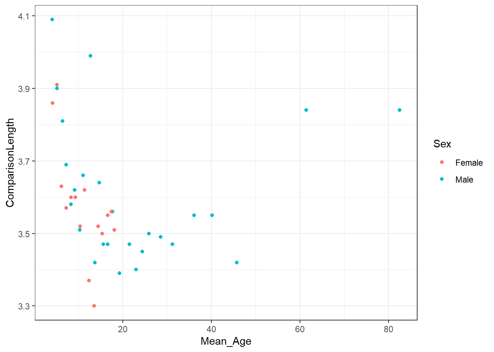

## InClass Comparison


This section shows the output that would be expected if you were to follow the inclass activities correctly.

* **Note:** Headings in this comparison will appear one size smaller than if you were to knit the Rmd due to rendering. Do not worry if yours look a bit bigger, it is more that you have them as **headers** is the key part.Your output should match the output of knitting [the .Rmd document found here](data/01-s01/inclass/ProducedPonzoTemplate.zip)

### Lab 1 - The Magnitude of the Ponzo Illusion varies as a function of Age {-}


### Introduction {-}

The Ponzo Illusion is where...

**There are two underlying hypotheses that may explain the Ponzo Illusion. These are: **

1. The Framing hypothesis
2. The Perspective hypothesis

### Methods {-}

#### Data {-}
The data in this report was obtained from within the original paper, [Lebowitz and Judisch (2016)]( https://www.jstor.org/stable/1420548?seq=1#page_scan_tab_contents)

#### Stimuli {-}


### Results {-}
<div class="kable-table">

|Sex    | NofGroups| mean_length|
|:------|---------:|-----------:|
|Female |        15|    3.574667|
|Male   |        26|    3.606923|

</div>


```r
ggplot(ponzo_data, 
       aes(x = Mean_Age, y = ComparisonLength, color = Sex)) +
  geom_point()
```

<div class="figure" style="text-align: center">

<p class="caption">(\#fig:lab1-inclass-figure)You won't have a caption. We will cover that later!</p>
</div>

<span style="font-size: 22px; font-weight: bold; color: var(--purple);">End of Comparison!</span>
