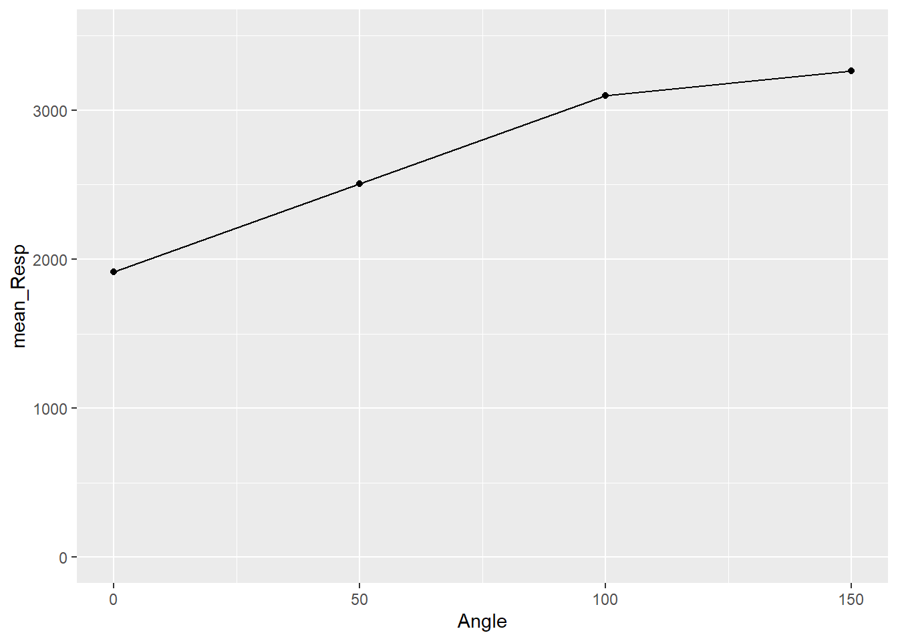
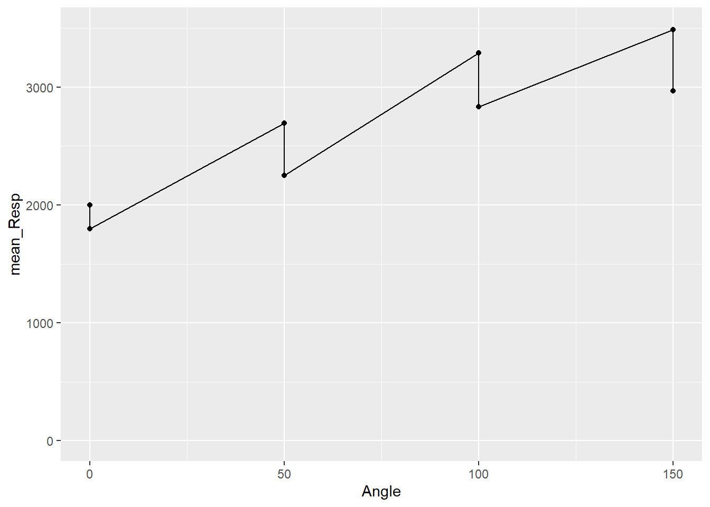
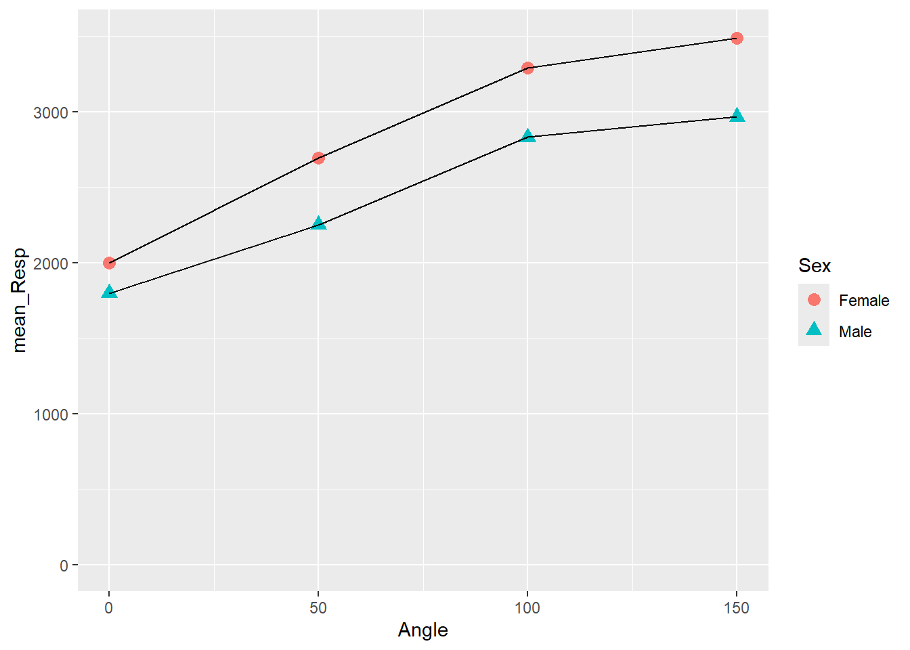
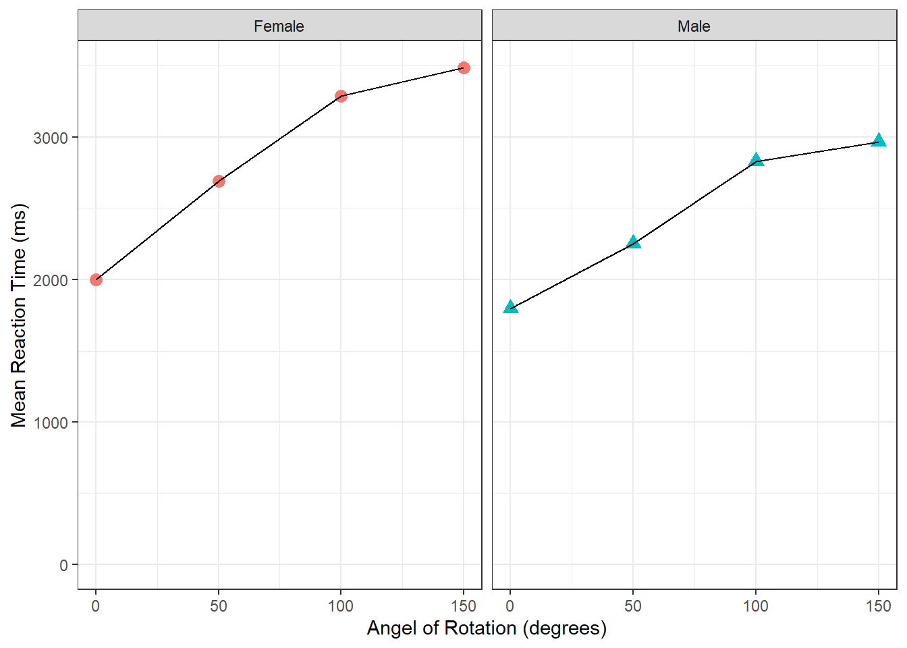

## InClass Activity


**Mental Rotation and Visualisations**

Visualisation is a key part of data analysis in exploring data, checking assumptions, and displaying results. Also, it is a really important skill for when you want to share your findings with others. As you develop your skills in Psychology you will start to analyse your own datasets, and learning how best to plot in different ways will benefit you in the long run. Keep in mind that this is a skill that you can carry into your future career even if that is outside of science. 

For visualisaion we use `ggplot2` and below we have listed some great online resources that you might want to consult if you want a fuller understanding. 

* <a href="http://www.cookbook-r.com/Graphs/" target = "_blank">R Graphics Cookbook</a>
* <a href="https://ggplot2-book.org/" target = "_blank">ggplot2 book</a>
* <a href="https://www.rstudio.com/wp-content/uploads/2015/03/ggplot2-cheatsheet.pdf" target = "_blank">ggplot2 cheatsheet</a>
* <a href="http://ggplot2.tidyverse.org/reference/" target = "_blank">ggplot2 Reference Guide</a>

But don't forget about what you have already covered in the PsyTeachR <a href="https://psyteachr.github.io/" target = "_blank">Grassroots book</a>. It is **highly recommended** that you consult the `ggplot2` cheatsheet when you work with the package to get familiar with the package.

### Mental Rotation: Angle and Reaction Time

We will use the same dataset for this class as we did in the preclass activity. To recap, <a href="https://openpsychologydata.metajnl.com/articles/10.5334/jopd.ai/" target = "_blank">Ganis and Kievit (2016)</a> created a modern stimuli set to test the classic experiment on mental rotation first proposed by <a href="http://science.sciencemag.org/content/171/3972/701" target = "_blank">Shepard and Metzler (1971)</a>. The idea is that the more rotated a test image is from an original image, the longer it will take for participants to determine if they are the same image or if they are completely different images. Results show that this is the case and suggest that, when doing mental rotation tasks, people do a form of internal linear interpolation, or internal mental rotation, meaning that they rotate the image in their mind back to the original angle and then compare the two images. This would be opposed to a more rapid contrast and compare approach not involving any rotation. As a result, the more rotation an image needs, the longer the task takes. 

Ganis and Kievit ran 54 participants on a series of these rotated images using 4 angles of rotation (0, 50, 100, 150 degrees rotated compared to the original) and asked people to respond 'same' or 'different' on each trial. Today, to further your understanding of this experiment as well as develop your skills in visualisation and interpretation, we will look at mean reaction time for correct trials, as a function of the angle of rotation and sex. The data can be [downloaded from here](data/03-s01/inclass/ch3-inclass-data.zip). 


<div class='webex-solution'><button>Portfolio Point - as a function means?</button>

<div class="info">
<p>You will come across this phrase ‘as a function of’ quite a bit when dealing with visualisations. It means something like ‘compared by’ or ‘across’. So you could say we are going to look at Mean Reaction Time across the four different Angles of Rotation which would be written as Mean Reaction Time as a function of Angle of Rotation. Usually it would be plotted as y axis as a function of x axis. It is a similar idea to the functions we use in our codes in that you want to see what happens when you put y in the function x. It is good to become familiar with the terms and language that is used in reports so that a) you understand what you are reading and b) you can use the same language in your writing to give a professional feel.</p>
<p>Remember to be developing your own notes as you go!</p>
</div>

</div>
  

### Task 1: Loading and Viewing the Data {#Ch3InClassQueT1}

1. Download the data, unzip it, and save it to a folder you have access to - e.g. somewhere on your `M:` drive
2. Set your working directory to the folder with your data in it. Do this through the menus at the top of RStudio, not through code.
3. Start a new script, save it to the folder with your data in it. Again R script or R Markdown will both be fine. Your choice.
4. In your script, load in the `tidyverse` library.
5. Load in both datasets exactly as we did in the preclass, storing the experimental data in `menrot` and the demographic data in `demog`.


<div class='webex-solution'><button>Helpful Hint</button>

<div class="info">
<p>library()</p>
<p>menrot &lt;- read_csv()</p>
<p>demog &lt;- read_csv()</p>
</div>

</div>

<br>
Remember to always be looking at your data as good practice and to make sure it is as you expect it to be. Use either `View()` or `glimpse()` but do this in the console window of RStudio, never in your script or .Rmd file. Other useful functions that you can use to check your data structure are:

1. `str()` - This shows what type your data is. Look for words like table, dataframe, <a class='glossary' target='_blank' title='A data type representing strings of text.' href='https://psyteachr.github.io/glossary/c#character'>character</a>, <a class='glossary' target='_blank' title='A data type representing whole numbers.' href='https://psyteachr.github.io/glossary/i#integer'>integer</a>, <a class='glossary' target='_blank' title='A data type representing a real decimal number' href='https://psyteachr.github.io/glossary/d#double'>double</a>.
2. `head()`, `tail()`, and `names()` - These show the top six and bottom six rows with column names, or just the column names with `names()`.
3. `dim()` - This shows the dimensions of the data.

Refer to the preclass for a list of what all the columns refer to if you are not sure. And keep in mind that to be **reproducible means being careful with the spelling and punctuation of the names of functions, tibbles, columns, conditions, etc, at all times - e.g. `Juggler` is not the same as `juggler`**.  

<span style="font-size: 22px; font-weight: bold; color: var(--green);">Quickfire Questions</span>

Take a couple of minutes to try the above functions and to answer the following questions.

* From the options, what type of data is the variable `Angle`, found in the dataframe `menrot`? <select class='webex-solveme' data-answer='["double/numerical"]'> <option></option> <option>character</option> <option>integer</option> <option>double/numerical</option></select>

* Type in the box the name of the dataframe that contains information regarding the sex of the participants: <input class='webex-solveme nospaces' size='8' data-answer='["demog"]'/>

* From the options, which of these is a column within `menrot`? <select class='webex-solveme' data-answer='["CorrectResponse"]'> <option></option> <option>Correctresponse</option> <option>CorretcResponse</option> <option>CorrectResponse</option> <option>correctReponse</option></select>

* From the options, according to the dim() call, how many rows are there in demog? <select class='webex-solveme' data-answer='["54"]'> <option></option> <option>3</option> <option>8</option> <option>54</option> <option>5184</option></select>


<div class='webex-solution'><button>Explain This - I don't get these answers</button>

<div class="info">
<p>This is about making sure you are loading in your data correctly, using the instructed names - so that you are being reproducible - and that you understand the data you are looking at. If you completed Task 1 successfully, loading in the data to the correct dataframes, then the following answers should work in the above questions.</p>
<ol style="list-style-type: decimal">
<li><p>calling <code>str(menrot)</code> and looking through the information that comes out you should see that the data in the column <code>Angle</code> are loaded in as double/numerical. Technically they are integers (whole numbers with no decimal places) but the default load in would make them numerical.</p></li>
<li><p><code>demog</code> should have been where you loaded information regarding the demographics including sex of participant.</p></li>
<li><p><code>names(menrot)</code> will give you column names. This question is about making sure of the correct spelling: CorrectResponse. All the other spellings would not work in this data as spelling of column names is specific!</p></li>
<li><p><code>dim(demog)</code> shows you the number of rows (54) by the number of columns (3).</p></li>
</ol>
</div>

</div>
  

### Task 2: Recreating the Figure {#Ch3InClassQueT2}

Let's start by making a representation of the top part of Figure 2 in <a href="https://openpsychologydata.metajnl.com/articles/10.5334/jopd.ai/" target = "_blank">Ganis and Kievit (2016)</a> - Mean Reaction Time as a function of Angle of Rotation.

1. Copy the lines of code below into your script.

2. Replace the `NULL`s in order to recreate the figure below similar to that of Ganis and Kievit (2016) Figure 2 (top). 
    * Note that this figure shows information for only correct responses just as in Ganis and Kievit (2016).
    * Remember `ggplot` is a case of layers. The first layer says where is my data and what do I want on each axis. Every subsequent layer says how I want the data displayed - points (`geom_point()`) with a connecting line (`geom_line()`).
    * After running through all these tasks, come back to this one and see if you can figure out what `coord_cartesian()` does by changing the numbers in the `ylim = ()` call. There is a comment on this in the solutions.


```r
menrot_angle <- filter(menrot, CorrectResponse == NULL) %>%
  inner_join(demog, NULL) %>%
  group_by(NULL) %>% 
  summarise(mean_Resp = mean(NULL))

ggplot(data = NULL, aes(x = NULL, y = NULL)) + 
  geom_point() +
  geom_line() +
  coord_cartesian(ylim = c(0, 3500), expand = TRUE)
```


<div class='webex-solution'><button>Helpful Hint</button>

<div class="info">
<p>The first four lines, to create <code>menrot_angle</code>, are all functions from the Wickham Six verbs so refer back to your portfolio to see how they work.</p>
<ol style="list-style-type: decimal">
<li><p>Which answer in <code>CorrectResponse</code> would allow you to keep just the correct answers?</p></li>
<li><p>What common variable will allow you to join this information to <code>demog</code>?</p></li>
<li><p>You only really care about the four levels of rotation, so what variable/column will you <code>group_by</code>?</p></li>
<li><p>Which variable/column do you want the mean of for a mean response time?</p></li>
</ol>
<p>For the <code>ggplot</code> line, think of the format, data, then the x axis name, then the y axis name. See your portfolio for examples.</p>
</div>

</div>
  
<br>

<div class="figure" style="text-align: center">

<p class="caption">(\#fig:Ch3InClassTask2-hidden)Basic Scatterplot of Response Time by Angle of Rotation</p>
</div>

<span style="font-size: 22px; font-weight: bold; color: var(--pink);">Group Discussion Point</span>

Great, you have replicated the figure! However, do you know what it means? Spend a couple of minutes discussing with your partner or group - what does the figure tell you about mean reaction time and angle of rotation, and how does it fit with the overall theory we introduced above? Answering this question may help:

* From the options, the figure would suggest that as angle of rotation increases: <select class='webex-solveme' data-answer='["mean reaction time increases"]'> <option></option> <option>mean reaction time decreases</option> <option>mean reaction time stays the same</option> <option>mean reaction time increases</option></select>


<div class='webex-solution'><button>Portfolio Point - Reaction Time as a function of Rotation</button>

<div class="info">
<p>As you can see from the figure, consistent with Shepard and Metzler (1971), the participants from Ganis and Kievit (2016) showed an increase in reaction time as the angle of rotation increased. Therefore, Ganis and Kievit (2016) have replicated the findings of Shepard and Metzler (1971).</p>
<p>A quick note though is that, yes, mean reaction time does increase with angle of rotation but it is not a consistent increase. You will see that the difference between mean reaction times for 150 and 100 degrees is smaller than between 0 and 50. Reaction times start to plateau after a certain angle of rotation.</p>
</div>

</div>
  

### Task 3: Examining Additional Variable Effects {#Ch3InClassQueT3}

In the preclass, we looked at sex of participant a lot and that was quite interesting. It is not covered in Ganis and Kievit (2016) so let us take a look at it for them.

1. To your pipeline of Task 2, add the variable `Sex` to the `group_by()` function to group the data by `Angle` and `Sex`.
2. Running the code again creates the below figure.


<div class='webex-solution'><button>Helpful Hint</button>

<div class="info">
<p><code>group_by(Angle, Sex)</code></p>
<p>Remember, to add more grouping variables just separate them by a comma. Everything else in our code stays the same.</p>
</div>

</div>

<br>


```
## `summarise()` has grouped output by 'Angle'. You can override using the `.groups` argument.
```

<div class="figure" style="text-align: center">

<p class="caption">(\#fig:Ch3InClassTask3-hidden)Separating points by Sex</p>
</div>

Hmmm, that figure does not look that informative. It looks similar to the one we created but the dots have doubled - we now have 8 instead of 4 - but we do not know which is male or female, and the connecting line is confusing. We need to add a little more to the code to tell it how to separate the data based on sex. 

### Task 4: Grouping the Figure Data {#Ch3InClassQueT4}

1. In the preclass we used `fill` and `color` inside the `aes()` to change basic information about the figure. There is also one called `group`. Add a `group` call inside your `aes(...)` to separate the data by `Sex`.
2. Run the code again and see what your figure looks like


<div class='webex-solution'><button>Helpful Hint</button>

<div class="info">
<p><code>ggplot(....., aes(x = , y = , group = ???))</code></p>
</div>

</div>

<br>

You should now at least see different lines for the two sex, but we still can't tell which sex is which line, can we? It just looks like two black parallel lines, one slightly higher than the other. What would be ideal would be changing the color of the points based on whether they are from male or female participants! Fortunately, the `geoms` can also take information as well.

### Task 5: Identifying Groups Using **`aes()`** {#Ch3InClassQueT5}

1. Add an `aes()` call inside your `geom_point()` function to `color` the dots by `Sex`.


<div class='webex-solution'><button>Helpful Hint</button>

<div class="info">
<p><code>geom_point(aes(??? = ???)</code></p>
</div>

</div>

<br>
You should now have something like this:
<br>


```
## `summarise()` has grouped output by 'Angle'. You can override using the `.groups` argument.
```

<div class="figure" style="text-align: center">

<p class="caption">(\#fig:Ch3InClassTask5-hidden)Separate lines for each Sex</p>
</div>

Great! We can now see that the female line is on top and the male line is on the bottom. But before we start interpreting this figure let's finish tidying it up with a few more tasks. For example the dots for each data point are perhaps a little small for our old eyes to see, so we could increase them in size. Also, color is great if you can print in color but we could also change the shape of the dots to help people distinguish between the Sex for when displaying in color isn't an option. To do this we will use the additional calls of `shape` and `size` within our `geom_point()`.

### Task 6: Changing the Shape and Size of Data Points {#Ch3InClassQueT6}

1. We want each Sex to have different shaped points, so add a call to `shape` within the `aes()` call of our `geom_point()` function, just like you did for color. 

2. However, we want each Sex to have the same size of point, so add a call to `size` within the `geom_point()` function, **but not inside the `aes()` call**. Set an appropriate number for the size instead of naming a variable. Maybe `size = 3`?


<div class='webex-solution'><button>Helpful Hint</button>

<div class="info">
<p><code>geom_point(aes(color = Sex, Shape = ???), size = ???)</code></p>
</div>

</div>

<br>

This should give you a figure like this:


```
## `summarise()` has grouped output by 'Angle'. You can override using the `.groups` argument.
```

<div class="figure" style="text-align: center">

<p class="caption">(\#fig:Ch3InClassTask6-hidden)Changing Shape and Size of Data Points</p>
</div>


**A quick point - in, out, what's the aes about?**

Hopefully you are beginning to spot the difference between setting a call within `aes()` (which stands for aesthetics) and setting outside the `aes()`. Outside `aes()` means that all observations take the one value or color or type. Inside means that each observation within a condition takes the same value or color or type, but different conditions have different values/color/type

Let's look at what we have done above to help us compare. 

`size` is called outside of the `aes()` and we assign it a specific value. As you can see from the Task 6 figure, each condition now has the same size of points. We could set this size to what we want but keep it smallish: 3 or 5 are ok; 50 would be artistic but not that informative.

In contrast, we called `shape` inside the `aes()` and we set it based on a variable, `Sex`. Doing it this way ensures that each level of the `Sex` variable, male or female, get a different shape. 

Had we instead set `shape` outside the `aes()`, something like `geom_point(shape = 3, size = 3)` then all conditions would have the same shape and the same size. Different numbers relate to different shapes and different sizes. For example compare `shape = 3` to `shape = 13`

Likewise, had we set the size within `aes()`, something like `geom_point(aes(shape = Sex, size = Sex))` then both male and female would have different shapes AND different sizes. You can play around with this in your code to see how things work. 
And of course there are other arguments you could use. For example if you wanted all points to have the same color, say red for example, then you could do `geom_point(color = "red")`. Remember to put the quotes around the color.

So hopefully this is starting to make sense and you can think about implementing it in your own figures. Note that arguments are separated by a comma. e.g. `geom_point(color = "red", size = 3, shape = 2)`

### Task 7: Adding Labels and Changing the Background {#Ch3InClassQueT7}

This figure is looking really nice now. Let's finish it off by making it look a little more professional with appropriate labels and by editing the background. We introduced these to you in the preclass so hopefully you had a play with them to see how they work. 

To change a label, we use the `labs()` function and it works like `labs(x = "Name", y = "Name", title = "Name")`.  

1. Add this function to your code so that the y axis indicates `Mean Reaction Time (ms)` and the x axis indicates `Angle of Rotation (degrees)`. We haven't set a title here but you can if you want some practice. Titles on Psychology figures are not common. That said, a recent change to the APA style guide might change that!

2. Set the figure as `theme_bw()` - this looks nice but there are other options you might want to try which you can explore through `?theme` or the <a href = "https://www.rstudio.com/wp-content/uploads/2015/03/ggplot2-cheatsheet.pdf" target = "_blank">cheatsheet</a>.


<div class='webex-solution'><button>Helpful Hint</button>

<div class="info">
<p><code>labs(x = "...", y = "...") + theme_bw()</code></p>
<p>The key thing is to remember to <code>+</code> the layer into the ggplot chain. And don’t get this confused with pipes (%&gt;%).</p>
<p><strong>Note:</strong> You add (+) layers to figures, and you pipe (%&gt;%) between functions.</p>
</div>

</div>


### Task 8: Separating a Variable and Removing Legends {#Ch3InClassQueT8}

Finally in the preclass we showed you two other functions that you could use to tidy up figures: `facet_wrap()` and `guides()`. 

* `facet_wrap()` is really effective for splitting up figures into panels based on a variable; it works like `facet_wrap(~variable)` where `~` can be read as `by`. So "split up the figure by variable", for example `Sex`. And if you had two variables to split the figure by, then: `facet_wrap(~variable1 + variable2)`. 

* `guides()` is handy for turning on and off legends which might be taking up space. For instance, if you use a `facet_wrap()` to split the panels into Female and Male, do you really need the legend on the right saying Female and Male? You will normally have a guide for all the `color`, `shape`, `etc`, calls you have in your pipeline within your `aes()` calls. It works like `guide(call = FALSE)`.

1. Add a `facet_wrap()` to have separate panels in your figure based on `Sex`.

2. Turn off all guides so that you do not have a legend in your figure.


<div class='webex-solution'><button>Helpful Hint</button>

<div class="info">
<ol style="list-style-type: decimal">
<li><code>facet_wrap(~variable)</code></li>
<li><code>guides(group = FALSE, ???? = False, ....)</code></li>
</ol>
</div>

</div>
  
<br>

<span style="font-size: 22px; font-weight: bold; color: var(--pink);">Group Discussion Point</span>

If you have followed all the tasks correctly then you should have the following figure:


```
## `summarise()` has grouped output by 'Sex'. You can override using the `.groups` argument.
```

```
## Warning: `guides(<scale> = FALSE)` is deprecated. Please use `guides(<scale> =
## "none")` instead.
```

<div class="figure" style="text-align: center">

<p class="caption">(\#fig:Ch3InClassTask8-hidden)The finished figure!</p>
</div>

Take a few minutes with your partner or group to look at the figure and try to intepret it in terms of reaction time as a function of rotation and sex. Try answering the following questions to help your discussion:

* In both sexes, mean reaction time <select class='webex-solveme' data-answer='["increases with"]'> <option></option> <option>decreases with</option> <option>increases with</option> <option>is unaffected by</option></select> angle of rotation.

* Angle of Rotation influences <select class='webex-solveme' data-answer='["female participants"]'> <option></option> <option>female participants</option> <option>male participants</option></select> more than <select class='webex-solveme' data-answer='["male participants"]'> <option></option> <option>female participants</option> <option>male participants</option></select>


<div class='webex-solution'><button>Portfolio Point - Interpreting the results</button>

<div class="info">
<p>By looking at the figure, as angle of rotation increases (moving to the right of the x axis), the mean reaction time increases (getting higher on the y axis), indicating that participants take longer to respond the further the target image is rotated from the original. Also, as the male mean reaction times are quicker overall than the female mean reaction times, and the differences in reaction times between 0 degrees and 150 degrees is smaller in males, then you could perhaps say that males are affected less than females, or males perform the task quicker.</p>
<p>Keep in mind that we are only looking at correct responses here. As such, this figure would suggest the difference is not just male participants just responding quicker overall. Instead it may suggest that males are responding correctly quicker overall but you would need to take into consideration the difference in overall correct reponses between females and males which we saw in the preclass.</p>
<p>Differences in mental roration tasks have received much attention over the years and you should refer to the reference sections of the two main papers of this activity should you wish to follow the topic further and wish to add this to your Portfolio.</p>
</div>

</div>


### Additional Considerations (briefly!)

1. Many of the options we have seen in terms of `geom_point()` could have been applied to `geom_line()` to make alterations to the line. Try playing with these options. For example, the code line below would result in both sexes having a red line of equal size but the style of line being different. Give it a shot!

`geom_line(aes(linetype = Sex), size = .5, color = "red")`

2. Finally, if you look closely at the figure, you will see that the line between points actually goes in front of the points. It looks a bit messy. How could you make it tidier by having the line run behind the data points? Not sure? Remember that figures are constructed based on a series of layers. We draw one layer and then the next, so changing Task 8 to would draw the lines first and then the points on top. Give it a go!


```r
ggplot(data = menrot_facet_guide, aes(x = Angle, y = mean_Resp, group = Sex)) + 
  geom_line() +
  geom_point(aes(color = Sex, shape = Sex), size = 3) +
  coord_cartesian(ylim = c(0, 3500), expand = TRUE) +
  labs(x = "Angel of Rotation (degrees)", y = "Mean Reaction Time (ms)") +
  facet_wrap(~Sex) +
  guides(group = FALSE, color = FALSE, shape = FALSE) +
  theme_bw()
```

<span style="font-size: 22px; font-weight: bold; color: var(--blue);">Job Done - Activity Complete!</span>

In this chapter we have looked at working with layers and a variety of calls to shape, color, fills, etc, to create professional looking figures. Understanding figures through `ggplot` can seem like trial and error until you have a lot of experience. That is fine but just remember to keep adding notes to your Portfolio to help out the future you. And the beauty of it all is that once you have a figure you really like, you run the code and you get exactly the same figure again! Amazing or what???

You should now be ready to complete the Homework Assignment for this lab. **The assignment for this Lab is summative and should be submitted through the Moodle Level 2 Assignment Submission Page no later than 1 minute before your next lab.** If you have any questions, please post them on the available forums. Finally, don't forget to add any useful information to your Portfolio before you leave it too long and forget.
