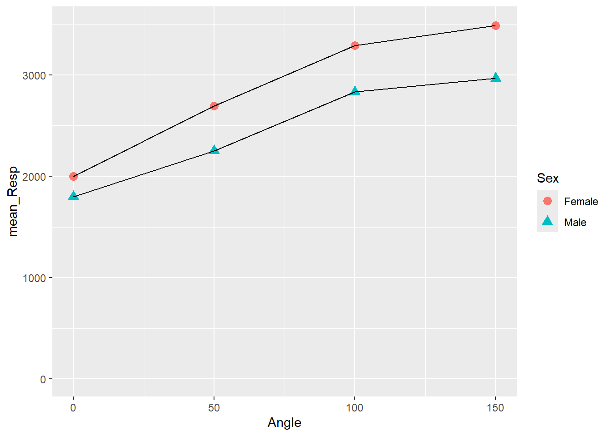
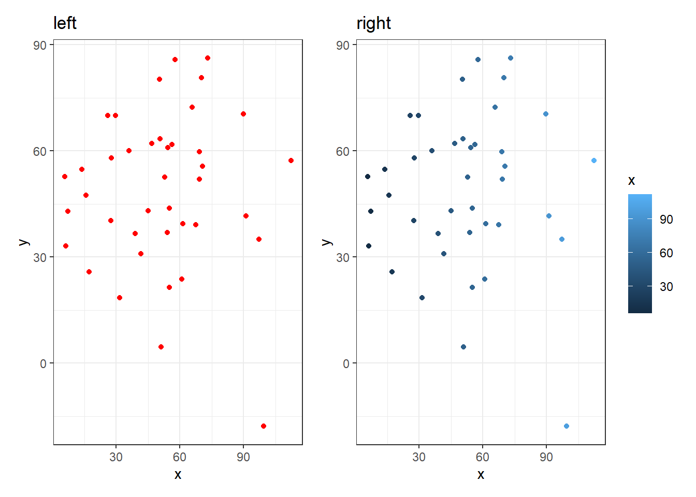

## Additional Material

Below is some additional material that might help you understand figures a bit more and how to present them in reports. Thus, if you want further clarification on the `aes()` call or want to know how to combine several plots into one, then read on!


### More on `aes()`

In this chapter, we added a short note about using the `aes()` call, but we see people having issues with this so we thought a quick demonstration might help. Here is the code from the previous activity:


```r
menrot_angle_sex <- filter(menrot, CorrectResponse == "Correct") %>%
  inner_join(demog, "Participant") %>%
  group_by(Angle, Sex) %>% 
  summarise(mean_Resp = mean(Time))
```

```
## `summarise()` has grouped output by 'Angle'. You can override using the `.groups` argument.
```

```r
ggplot(data = menrot_angle_sex, aes(x = Angle, y = mean_Resp, group = Sex)) + 
  geom_point(aes(color = Sex, shape = Sex), size = 3) +
  geom_line() +
  coord_cartesian(ylim = c(0, 3500), expand = TRUE) +
  theme_gray()
```

<div class="figure" style="text-align: center">

<p class="caption">(\#fig:Ch3InClassTask6-more-hidden)Changing Shape and Size of Data Points</p>
</div>

Specifically, we are going to focus on the `geom_point()` line. Inside the `aes()` we stated `color = Sex, shape = Sex` and outside the `aes()` we stated, `size = 3`. Earlier we said, outside `aes()` means that all observations take the one value or color or type. Inside means that each observation within a condition takes the same value or color or type, but different conditions have different values/color/type. So based on that understanding, in the above plot, all shapes have the same size (i.e., 3), but there is a different shape and color of shape for each sex. Now let's demonstrate some alternatives.

1. All points have the same shape, color and size - nothing is in an `aes()`.
    i. here we need to state the color, shape and size we want all observations to have. We have chosen red for color (in quotes) shape style 3 (+) and size 6. We are not using a variable to split observations into groups.
    ii. we have changed the size to make the visualisation clearer


```r
ggplot(data = menrot_angle_sex, aes(x = Angle, y = mean_Resp, group = Sex)) + 
  geom_point(color = "red", shape = 3, size = 6) +
  geom_line() +
  coord_cartesian(ylim = c(0, 3500), expand = TRUE) +
  theme_bw()
```

<div class="figure" style="text-align: center">

<p class="caption">(\#fig:Ch3InClassTask6-more-hidden-11)All points have the same shape, color and size</p>
</div>

2. All points have the same shape and size, but color is determined by `Sex` (so goes inside the `aes()`).
    i. here we need to state the shape and size we want all dots to have. But this time we are giving the different levels within `Sex` (i.e., male and female) different colors - by putting that inside the `aes()`


```r
ggplot(data = menrot_angle_sex, aes(x = Angle, y = mean_Resp, group = Sex)) + 
  geom_point(aes(color = Sex), shape = 3, size = 6) +
  geom_line() +
  coord_cartesian(ylim = c(0, 3500), expand = TRUE) +
  theme_bw()
```

<div class="figure" style="text-align: center">

<p class="caption">(\#fig:Ch3InClassTask6-more-hidden-12)All points have the same shape and size but color is determined by Sex</p>
</div>

3. We showed the code for setting color and shape by `Sex` previously. Instead now we will set the color, shape and size by the variable `Sex`. 
    i. here as all options are in the `aes()` we will have different colors, sizes, and shapes between males and females, but all males will have the same color, size and shape, and all females will have the same color size and shape.


```r
ggplot(data = menrot_angle_sex, aes(x = Angle, y = mean_Resp, group = Sex)) + 
  geom_point(aes(color = Sex, shape = Sex, size = Sex)) +
  geom_line() +
  coord_cartesian(ylim = c(0, 3500), expand = TRUE) +
  theme_bw()
```

```
## Warning: Using size for a discrete variable is not advised.
```

<div class="figure" style="text-align: center">

<p class="caption">(\#fig:Ch3InClassTask6-more-hidden-13)All points have the same shape and size but color is determined by Sex</p>
</div>

You actually get a warning when doing this option. Why? Because if you had numerous options then you would have too many different shapes being created and it would cause issues with the code and may even crash it. Pay attention to warnings.

And the reason you have to decide what is the best approach for displaying your data is because if all observations within a condition are the same, then showing them as all different colors and shapes makes very little sense. You always need to think about what you are trying to convey. Look at these two figures and think about which one is easier to understand that all observations are from the same condition. The one on the left! The one on the right suggests there is something different about all the observations.


<div class="figure" style="text-align: center">

<p class="caption">(\#fig:comb6-more-hidden-2)The plot on the left suggests all observations are of the same condition. The figure on the right suggests a difference between all observations. Always think about what your information you convey in your figures!</p>
</div>

Hopefully that is beginning to become clearer. Insider the `aes()` means that all observations within a variable/condition are shown the same, but are different from observations from a different variable/condition. Outside the `aes()` means that all observations are shown as the same regardless of condition.

### Combining Plots into one Figure

Space within a report is a commodity. Figures can be incredibly useful in getting information across in a very efficient manner, but when you have a strict word count, having multiple figures can really chew into the limit, given that each figure needs a legend and each legend counts. One way to get around this is to merge figures together into one big figure that perhaps convey similar or related information. We are going to show you how to do that using a package called `patchwork`. 

<div class="danger">
<p><strong>DO NOT install packages in the Boyd Orr labs; most are already there and just need called in through <code>library()</code>. If it is not there, speak to a member of the team.</strong></p>
<p><code>patchwork</code> is unlikely to be on our lab machines so please only try this on your own machine. If you haven't previously installed the <code>patchwork</code> package on your own machine before, you will have to install it first, e.g. <code>install.packages("patchwork")</code>.</p>
</div>
<br>

Plots like boxplots and histograms, when combined, can be incredibly useful in understanding the overall shape of your data and whether or not it fits the assumptions of inferential tests, something we will come on to later. If we were to create two separate plots, we might get something like this:


```r
menrot_hist_correct <- group_by(menrot, Participant, CorrectResponse) %>% 
  summarise(Mean_Time = mean(Time, na.rm = TRUE)) %>%
  filter(CorrectResponse == "Correct") %>%
  inner_join(demog, "Participant")

ggplot(data = menrot_hist_correct, 
       aes(x = Mean_Time,
           fill = Sex)) + 
  geom_histogram() +
  theme_bw()
```

<div class="figure" style="text-align: center">

<p class="caption">(\#fig:ch3-add-1)A histogram of distribution of Mean Time counts by Sex</p>
</div>
<br>

And:


```r
menrot_box_correct <- group_by(menrot, Participant, CorrectResponse) %>% 
  summarise(Mean_Time = mean(Time, na.rm = TRUE)) %>%
  filter(CorrectResponse == "Correct") %>%
  inner_join(demog, "Participant")
```

```
## `summarise()` has grouped output by 'Participant'. You can override using the `.groups` argument.
```

```r
ggplot(data = menrot_box_correct, 
       aes(x = CorrectResponse, 
           y = Mean_Time, 
           fill = Sex)) + 
  geom_boxplot() +
  theme_bw()
```

<div class="figure" style="text-align: center">

<p class="caption">(\#fig:ch3-add-2)A boxplot of the spreads of Mean Time for Correct Responses by Sex</p>
</div>
<br>

Now given that they both divide the data by sex, you can start to see how the figure legend for each plot becomes a bit repetitive, and how combining them into one figure would potentially make things easier. There are a number of packages to do this, but `patchwork` is very straightforward and flexible.

Let's now call in `patchwork`


```r
library(patchwork)
```

The first thing you need to do when using patchwork is save your plots in an object (just like you would with the output of any function). Using the code above, this might look like below for the boxplot:


```r
p_box <- ggplot(data = menrot_box_correct, 
       aes(x = CorrectResponse, 
           y = Mean_Time, 
           fill = Sex)) + 
  geom_boxplot() +
  labs(title = "A") +
  theme_bw()
```

And below for the histogram:


```r
p_hist <- ggplot(data = menrot_hist_correct, 
       aes(x = Mean_Time,
           fill = Sex)) + 
  geom_histogram() +
  labs(title = "B") +
  theme_bw()
```
<br>

**Note:** The reason for the inclusion of a title on each plot will become clear in a second.

**Note:** When you run these codes no plots will be generated as you are saving them as objects - the boxplot in `p_box` and the histogram in `p_hist`. It is important to realise this distinction as if someone asks you to make produce a code where the figure is generated when your code knits, and you have saved your plot as an object, then your figure might not show.  If you have save a plot as an object, you can generate the figure by just calling the name of the object. If you look at the ggplot cheatsheet you will see this approach a lot. Here is how we would call the boxplot stored in `p_box`.


```r
p_box
```

<div class="figure" style="text-align: center">

<p class="caption">(\#fig:p-box)A boxplot of the spreads of Mean Time for Correct Responses by Sex</p>
</div>


```r
p_hist
```

```
## `stat_bin()` using `bins = 30`. Pick better value with `binwidth`.
```

<div class="figure" style="text-align: center">

<p class="caption">(\#fig:p-hist)A histogram of distribution of Mean Time counts by Sex</p>
</div>
<br>

**Note:** You will see a warning from the histogram plot about selecting a binwidth. We haven't really looked at this yet but will do in due course. If you wanted to "fix" that warning then changing the histrogram code to something like `+ geom_histogram(binwidth = 100)` might work. The value that you enter is relative to the scale of your data. A binwidth of 1 would create a bin every increase of 1 ms. A binwidth of 100 creates a bin every 100 ms. 

So far so nothing exciting. Looks just like what we have seen before. Didn't we say we wanted both the plots in a single figure, right? Well to do that in patchwork, we simply "add" the plots together using a plus sign (+), as such:


```r
p_box + p_hist
```

```
## `stat_bin()` using `bins = 30`. Pick better value with `binwidth`.
```

<div class="figure" style="text-align: center">

<p class="caption">(\#fig:comb1)A boxplot (A - left) of the spreads of Mean Time for Correct Responses, and histogram (B - right) of distribution of Mean Time counts, both separated by Sex (female - red, male - cyan)</p>
</div>

**Note:** We can use the "titles"" we added to the plots in the original code above to tell readers which plot, within the combined figure, we are referring to, A or B, left or right, as shown in the figure legend beneath the figure. This might seem a bit pedantic, but you have no control over how somebody views your published figure, and as such clarity is paramount!

Awesome, that it? No! We can also change the configuration of the plots in the combined figure. Say we wanted the plots on top of each other - portrait rather than landscape - well in that instance we divide the plots using the divide sign (/), as such:


```r
p_box / p_hist
```

```
## `stat_bin()` using `bins = 30`. Pick better value with `binwidth`.
```

<div class="figure" style="text-align: center">

<p class="caption">(\#fig:comb2)A boxplot (A - top) of the spreads of Mean Time for Correct Responses, and histogram (B - bottom) of distribution of Mean Time counts, both separated by Sex (female - red, male - cyan)</p>
</div>

And now we refer to top and bottom, rather than left and right.  In fact, `patchwork` is really flexible and can work with multiple plots and arrangements. Hypothetically, say you had three plots and wanted two on top of one, then you would use the approach of combining "+" and "/" as such:


```r
(plot1 + plot2)/plot3
```

Remember the trick to using patchwork is to save your plots as objects first (`p1 <- ggplot(....)`) and the rest is easy. But be sure to always know if your figure is to be shown when knitted or not; more often than not, seeing the figure is more important than seeing the code.

**Happy Visualising!**

<span style="font-size: 22px; font-weight: bold; color: var(--purple);">End of Additional Material!</span>
