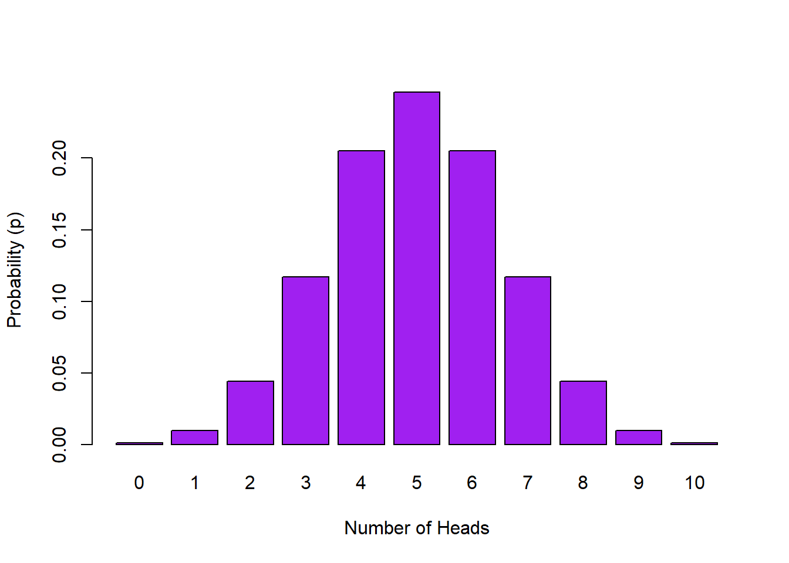
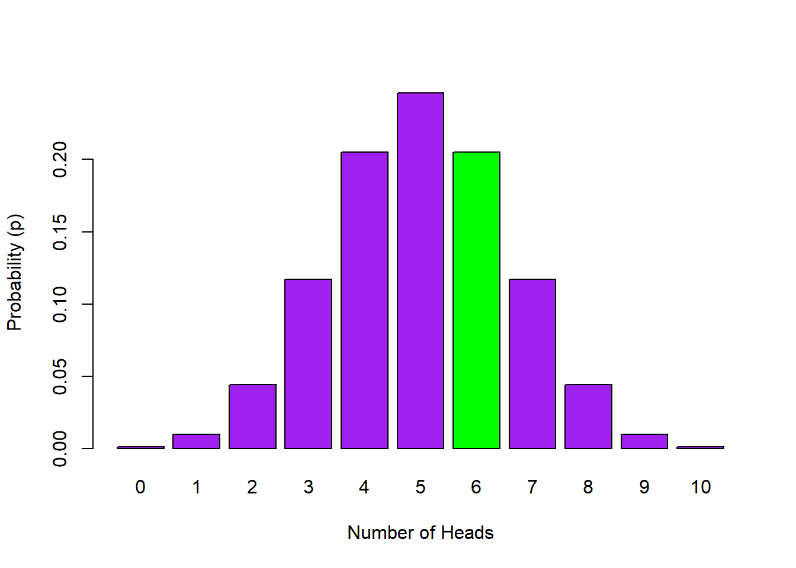

## Discrete Data and Binomial Distributions

### General Probability Calculations

Today we will begin by recapping the concepts of probability calculations from lectures and the PsyTeachR <a href="https://psyteachr.github.io/" target = "_blank">Data Skills book</a>, looking at discrete distributions - where values are categories (e.g., house, face, car) or whole numbers (e.g., 1,2, 3 and not 1.1, 1.2 etc).

When we talk about probability we mean we are interested in the likelihood of an event occurring. The probability of any discrete event occurring can be formulated as:

$$p = \frac{number \  of  \ ways \ the \ event \ could \  arise}{number \ of \ possible \ outcomes}$$

The probability of an event is represented by a number between 0 and 1, and the letter **p**. For example, the probability of flipping a coin and it landing on 'tails', most people would say, is estimated at **p = .5**, i.e. the likelihood of getting tails is $p = \frac {1}{2}$ as there is one desired outcome (tails) and two possibilities (heads or tails).  
<br>

**For example:**

**1.** The probability of drawing the ten of clubs from a standard pack of cards would be 1 in 52:  $p = \frac {1}{52} \ = .019$. One outcome (ten of clubs) with 52 possible outcomes (all the cards)

**2.** Likewise, the probability of drawing **either** a ten of clubs or a seven of diamonds as the the first card that you draw from a full deck would be 2 in 52: $p = \frac {2}{52} \ = .038$. In this case you are adding to the chance of an event occurring by giving two possible outcomes so it becomes **more likely** to happen than when you only had one outcome.  

**3.** Now say you have two standard packs of cards **mixed** together. The probability of drawing the 10 of clubs from this mixed pack would be 2 in 104: $p = \frac{2}{104}= .019$. Two possible outcomes **but more alternatives** than above, 104 this time, meaning it is **less probable** than Example 2 but the same probability as Example 1. The key thing to remember is that probability is a ratio between the number of ways a specified outcome can happen and the number of all possible outcomes.

**4.** Let's instead say you have two **separate** packs of cards. The probability of drawing the 10 of clubs from **both** packs would be: $p = \frac{1}{52} \times \frac{1}{52}= .0004$. The probability has gone down again because you have created an event that is **even more unlikely** to happen. This is called the **joint probability** of events.  

    * To find the joint probability of two separate events occuring you multiply together the probabilities of the two individual separate events (often stated as independent, mutually exclusive events). 

**5.** What about the probability of drawing the 10 of clubs from a pack of 52, putting it back (which we call **replacement**), and subsequently drawing the 7 of diamonds? Again, this would be represented by multiplying together the probability of each of these events happening: $p = \frac{1}{52} \times \frac{1}{52}= .0004$. 
    
    * The second event (drawing the 7 of diamonds) has the same probability as the first event (drawing the 10 of clubs) because we put the original card back in the pack, keeping the number of all possible outcomes at 52. This is **replacement**.

**6.** Finally, say you draw the 10 of clubs from a pack of 52 but this time **don't replace it**. What is the probability that you will draw the 7 of diamonds in your next draw (again without replacing it) and the 3 of hearts in a third draw? This time the number of cards in the pack is **fewer** for the second (51 cards) and third draws (50 cards) so you take that into account in your multiplication:  $p = \frac{1}{52} \times \frac{1}{51}\times \frac{1}{50}= .000008$.


<div class='webex-solution'><button>Portfolio Point - Presenting probabilities</button>

<div class="info">
<p>So, the probability of an event is the number of all the possible ways an event could happen, divided by the number of all the possible outcomes. When you combine probabilities of two separate events you multiple them together to obtain the joint probability.</p>
<p>You may have noticed that we tend to write p = .008, for example, as opposed to p = 0.008 (with a 0 before the decimal place). Why is that? Convention really. As probability can never go above 1, then the 0 before the decimal place is pointless. Meaning that most people will write p = .008 instead of p = 0.008, indicating that the max value is 1.</p>
<p>We allow either version in the answers to this chapter as we are still learning, but try to get in the habit of writing probability without the 0 before the decimal place.</p>
</div>

</div>

<br>
<span style="font-size: 22px; font-weight: bold; color: var(--green);">Quickfire Questions</span>

* What is the probability of randomly drawing your name out of a hat of 12 names where one name is definitely your name? Enter your answer to 3 decimal places: <input class='webex-solveme nospaces' size='5' data-answer='["0.083",".083"]'/>

* What is the probability of randomly drawing your name out of a hat of 12 names, putting it back, and drawing your name again? Enter your answer to 3 decimal places: <input class='webex-solveme nospaces' size='5' data-answer='["0.007",".007"]'/>

* **Tricky**: In a stimuli set of 120 faces, where 10 are inverted and 110 are the right way up, what is the probability of randomly removing one inverted face on your first trial, not replacing it, and then removing another inverted face on the second trial? Enter your answer to three decimal places:<input class='webex-solveme nospaces' size='5' data-answer='["0.006",".006"]'/>


<div class='webex-solution'><button>Helpful Hint</button>

<div class="info">
<ol style="list-style-type: decimal">
<li><p>Out of 12 possible outcomes you are looking for one possible event.</p></li>
<li><p>There are two separate scenarios here. In both scenarios there are 12 possible outcomes in which you are looking for one possible event. Since there are two separate scenarios, does this make it more or less likely that you will draw your name twice?</p></li>
<li><p>In the first trial here are 120 possible outcomes (faces) in which you are looking for 10 possible events (inverted faces). In the second trial you have removed the first inverted face from the stimuli set so there are now only 119 trials in total and 9 inverted faces. Remember you need to multiply the probabilities of the first trial and second trial results together!</p></li>
</ol>
</div>

</div>
  


<div class='webex-solution'><button>Explain This - I don't get these answers</button>

<div class="info">
<ol style="list-style-type: decimal">
<li><p>p = .083. One outcome (your name) out of 12 possibilities, i.e. <span class="math inline">\(p = \frac{1}{12}\)</span></p></li>
<li><p>p = .007. Because you replace the name on both draws it is <span class="math inline">\(p = \frac{1}{12}\)</span> in each draw. So <span class="math inline">\(p = \frac{1}{12} * \frac{1}{12}\)</span> and then rounded to three decimal places</p></li>
<li><p>p = .006. In the first trial you have 10 out of 120, but as you remove one inverted face the second trial is 9 out of 119. So the formula is <span class="math inline">\(p = \frac{10}{120} * \frac{9}{119}\)</span></p></li>
</ol>
</div>

</div>


### Creating a Simple Probability Distribution 

We will now recap plotting probability distributions by looking at a simulated coin toss. You may remember some of this from the the PsyTeachR <a href="https://psyteachr.github.io/" target = "_blank">Data SKills book</a> but don't worry if not as we are going to work through it again. Work or read through this example and then apply the logic to the quickfire questions at the end of the section.

**Scenario:** Imagine we want to know the probability of X number of heads in 10 coin flips - for example, what is the probability of flipping a coin 10 times and it coming up heads two times. 

To simulate 10 coin flips we will use the `sample()` function where we randomly sample (with replacement) from all possible events: i.e. either **heads** or **tails**. 

**Let's begin:**

* Open a new script and copy in the code lines below. 
    * The first line of code loads in the library as normal. 
    * The second line of code provides the instruction to sample our options "Heads" or "Tails", ten times, with replacement set to `TRUE`.
    
* **Note:** Because our event labels are strings (text), we enter them into the function as a vector; i.e. in "quotes"
* **Note:** Below the lines of code, you will see the output that we got when we ran our code. Don't worry if your sequence of heads and tails is different from this output; this is to be expected as we are generating a random sample.


```r
library("tidyverse")
sample(c("HEADS", "TAILS"), 10, TRUE) 
```

```
##  [1] "TAILS" "HEADS" "TAILS" "HEADS" "TAILS" "TAILS" "TAILS" "HEADS" "HEADS"
## [10] "TAILS"
```

* **Note:** If you want to get the same output as we did, add this line of code to your script prior to loading in the library. This is the `set.seed()` function which you can put a number in so that each time you run a randomisation you get the same number.


```r
set.seed(1409)
```


<div class='webex-solution'><button>Portfolio Point - Sampling and Replacement</button>

<div class="info">
<p>Sampling is simply choosing or selecting something - here we are randomly choosing one of the possible options; heads or tails. Other examples of 'sampling' include randomly selecting participants, randomly choosing which stimuli to present on a given trial, or randomly assigning participants to a condition e.g.drug or placebo...etc.</p>
<p>Replacement is putting the sampled option back into the 'pot' of possible options. For example, on the first turn you randomly sample HEADS from the options of HEADS and TAILS <strong>with replacement</strong>, meaning that on the next turn you have the same two options again; HEADS or TAILS. Sampling <strong>without replacement</strong> means that you remove the option from subsequent turns. So say on the first turn you randomly sample HEADS from the options HEADS and TAILS but without replacement. Now on the second turn you only have the option of TAILS to 'randomly' sample from. On the third turn without replacement you would have no options.</p>
<p>So replacement means putting the option back for the next turn so that on each turn you have all possible outcome options.</p>
</div>

</div>

<br>
Why would you or why wouldn't you want to use sampling with replacement in our coin toss scenario? If you aren't sure then set replacement as `FALSE` (change the last argument from `TRUE` to `FALSE`) and run the code again. The code will stop working after 2 coin flips. We want to sample with replacement here because we want both options available at each sampling - and if we didn't then we would run out of options very quickly since we're doing 10 flips.

So far our code returns the outcomes from the 10 flips; either heads or tails. If we want to count how many 'heads' we have we can simply sum up the heads. However, heads isn't a number, so to make life easier we can re-label our events (i.e. our flips) as **0 for tails** and **1 for heads**. Now if we run the code again we can pipe the sample into a `sum()` function to total up all the 1s (heads) from the 10 flips. 

* Run this line of code a number of times, what do you notice about the output?
* **Note:** As our event labels are now numeric, we don't need the vector.
* **Note:** `0:1` means all numbers from 0 to 1 in increments of 1. So basically, 0 and 1.


```r
sample(0:1, 10, TRUE) %>% sum() 
```

```
## [1] 5
```

The ouptut of this line changes every time we run the code as we are randomly sampling 10 coin flips each time. And to be clear, if you get an answer of 6 for example, this means 6 heads, and in turn, 4 tails. By running this code over and over again we are basically demonstrating how a **sampling distribution** is created. 


<div class='webex-solution'><button>Portfolio Point - What's a sampling distribution?</button>

<div class="info">
<p>A sampling distribution shows you the probability of drawing a sample with certain characteristics from the population; e.g. the probability of 5 heads in 10 flips, or the probability of 4 heads in 10 flips, or the probability of X heads in 10 flips of the coin.</p>
</div>

</div>
  
<br>
Now in order to create a full and accurate sampling distribution for our scenario we need to replicate these 10 flips a large number of times - i.e. replications. The more replications we do the more reliable the estimates. Let's do 10000 replications of our 10 coin flips. This means we flip the coin 10 times, count how many heads, save that number, and then repeat it 10000 times. We could do it the slow way we demonstrated above, just running the same line over and over and over again and noting the outcome each time. Or we could use the `replicate()` function. 

* Copy the line of code below into your script and run it.
* Here we are doing exactly as we said and saving the 10000 outputs (counts of heads) in the dataframe called `heads10k` (k is shorthand for thousand).


```r
heads10k <- replicate(10000, sample(0:1, 10, TRUE) %>% sum())   
```

To reiterate, the sum of heads (i.e., the number of times we got heads) from each of these 10000 replications are now stored as a <a class='glossary' target='_blank' title='A type of data structure that collects values with the same data type, like T/F values, numbers, or strings.' href='https://psyteachr.github.io/glossary/v#vector'>vector</a> in `heads10k`. If you have a look at `heads10k`, as shown in the box below, it is a series of 10000 numbers between 0 and 10 each indicating the number of heads, or more specifically 1s, that you got in a set of 10 flips.


```
##  int [1:10000] 7 4 5 6 2 6 2 6 8 5 ...
```

Now, in order to complete our distribution we need to:

1. Convert the <a class='glossary' target='_blank' title='A type of data structure that collects values with the same data type, like T/F values, numbers, or strings.' href='https://psyteachr.github.io/glossary/v#vector'>vector</a> (list of numbers for the heads counts) into a data frame (a tibble) so we can work on it. The numbers will be stored in a column called `heads`.
2. Then group the results by the number of possible `heads`; i.e. group all the times we got 5 heads together, all the times we got 4 heads together, etc. 
3. Finally, we work out the probability of a `heads` result, (e.g., probability of 5 heads), by totaling the number of observations for each possible result (e.g., 5 heads) and submitting it to our probability formula above (number of outcomes of event divided by all possible outcomes) 
    - so the number of times we got a specific number of heads (e.g., 5 heads) divided by the total number of outcomes (i.e., the number of replications - 10000). 

We can carry out these steps using the following code:

* Copy the below code into your script and run it.


```r
data10k <- tibble(heads = heads10k) %>%       # creating a tibble/data frame
                group_by(heads) %>%           # group by number of possibilities
                summarise(n = n(), p=n/10000) # count occurences of possibility,
                                              # & calculate probability (p) of
                                              # each
```

We now have a discrete probability distribution of the number of heads in 10 coin flips. Use the `View()` function  to have  look at your `data10k` variable. You should now see for each heads outcome, the total number of occurrences in 10000 replications (`n`) plus the probability of that outcome (`p`). 


Table: (\#tab:coin-distribution-show)A sampling distribution for the number of heads in 10 flips of a coin. p = probability of obtaining that number of heads in 10000 replications of 10 flips of a coin

| heads |  n   |   p    |
|:-----:|:----:|:------:|
|   0   |  7   | 0.0007 |
|   1   |  82  | 0.0082 |
|   2   | 465  | 0.0465 |
|   3   | 1186 | 0.1186 |
|   4   | 2070 | 0.2070 |
|   5   | 2401 | 0.2401 |
|   6   | 2113 | 0.2113 |
|   7   | 1166 | 0.1166 |
|   8   | 422  | 0.0422 |
|   9   |  79  | 0.0079 |
|  10   |  9   | 0.0009 |

It will be useful to visualize the above distribution:


```r
ggplot(data10k, aes(heads,p)) + 
  geom_col(fill = "skyblue") + 
  labs(x = "Number of Heads", y = "Probability of Heads in 10 flips (p)") +
  theme_bw() +
  scale_x_discrete(limits=0:10)
```

```
## Warning: Continuous limits supplied to discrete scale.
## Did you mean `limits = factor(...)` or `scale_*_continuous()`?
```

<div class="figure" style="text-align: center">

<p class="caption">(\#fig:10khist)Probability Distribution of Number of Heads in 10 Flips</p>
</div>

So in our analysis, the probability of getting 5 heads in 10 flips is **0.2401**. But remember, do not be surprised if you get a slightly different value. Ten thousand replications is a lot but not a huge amount compared to infinity. If you run the analysis with more replications your numbers would become more stable, e.g. `100K`.

Note that as the possible number of heads in 10 flips are **all related to one another**, then summing up all the probabilities of the different number of heads will give you a total of 1. This is different to what we looked at earlier in cards where the events were unrelated to each other. As such, you can use this information to start asking questions such as what would be the probability of obtaining 2 or less Heads in 10 flips?  Well, if the probability of getting no heads (in 10 flips) in this distribution is **0.0007**, and the probability of getting 1 head is **0.0082**, and the probability of getting 2 heads is **0.0465**, then the probability of 2 or less Heads in this distribution is simply the sum of these values: **0.0554**. Pretty unlikely then!

<span style="font-size: 22px; font-weight: bold; color: var(--green);">Quickfire Questions</span>

Look at the probability values corresponding to the number of coin flips you created in the `data10k` sample distribution (use `View()` to see this):

* Choose from the following options, if you wanted to calculate the probability of getting 4, 5 or 6 heads in 10 coin flips you would: <select class='webex-select'><option value='blank'></option><option value=''>multiply individual probabilities together</option><option value='answer'>sum individual probabilities together</option></select>

* Choose from the following options, if you wanted to calculate the probability of getting 6 or more heads in 10 coin flips you would: <select class='webex-select'><option value='blank'></option><option value=''>multiply individual probabilities together</option><option value='answer'>sum individual probabilities together</option></select>

* Choose from the following options, the distribution we have created is: <select class='webex-select'><option value='blank'></option><option value=''>continuous</option><option value='answer'>discrete</option></select>


<div class='webex-solution'><button>Explain This - I don't understand the answers!</button>

<div class="info">
<p>If you think about it, we can't get 5.5 heads or 2.3 heads, we can only get whole numbers, 2 heads or 5 heads. This means that the data and the distribution is discrete. (Don't be confused by one of the functions saying continuous)</p>
<p>To find the probability of getting say 4, 5, or 6 heads in 10 coin flips, you are combining related scenarios together, therefore you need to find the individual probabilities of getting 4, 5 or 6 heads in 10 coin flips, then sum the probabilities together to get the appropriate probability of obtaining 4, 5 or 6 heads. It is the same with 6 or more heads, just sum the probabilities of 6, 7, 8, 9 and 10 heads to get the probability of 6 or more heads.</p>
<p>Not sure if you should be summing or multiplying probabilities? A good way to remember, from both the coin flip examples and from the pack of cards examples earlier, is that if the scenarios are <strong>related</strong> you are summing probabilities, if scenarios are <strong>separate</strong> you are multiplying probabilities. <strong>Related</strong> scenarios are usually asking you about the probability of <strong>'either / or'</strong> scenarios occuring, whereas <strong>separate</strong> scenarios usually ask about the probability of one scenario <strong>'and'</strong> another scenario both occuring.</p>
<p>Your sample distribution <code>data10k</code> has already completed the first part of this calculation for you (finding individual probabilities of n heads in 10 coin flips), so all you need to to is sum the required probabilities together!</p>
</div>

</div>


### The Binomial Distribution - Creating a Discrete Distribution

Great, so we are now learning how probabilities and distributions work. However, if we had wanted to calculate the probability of 8 heads from 10 coin flips, we don't have to go through this entire procedure each time. Instead, because we have a dichotomous outcome, "heads or tails", we can establish probabilities using the **binomial distribution** - effectively what you just created. You can look up the R help page on the binomial distribution (type `?dbinom` directly into the console) to understand how to use it but we will walk through some essentials here.

We'll use 3 functions to work with the binomial distribution and to ask some of the questions we have asked above:

* `dbinom()` - **the density function**. This function gives you the probability of `x` successes (e.g., heads) given the `size` (e.g., number of trials) and probability of success `prob` on a single trial (here it's 0.5, because we assume we're flipping a fair coin - Heads or Tails)

* `pbinom()` - **the cumulative probability function**. This function gives you the probability of getting a number of successes below a certain cut-off point given the `size` and the `prob`. This would be for questions such as the probability of 5 heads or less for example. It sums the probability of 0, 1, 2, 3, 4, and 5 heads.

* `qbinom()` - **the quantile function**. This function is the inverse of `pbinom` in that it gives you the x-axis value below (and including the value) which the summation of probabilities is greater than or equal to a given probability `p`, given the `size` and `prob`. In other words, how many heads would you need to have a probability of **p = 0.0554**

Let's look at each of these functions in turn a little. The thing to keep in mind about probability is that every event has a likelihood of occurring on their distribution. We are trying to look at how those numbers come about and what they mean for us.

### **`dbinom()`** - The Density Function

Using the `dbinom()` function we can create probabilities for any possible outcomes where there are two possibilities of outcome on each trial - e.g., heads or tails, cats or dogs, black or red. We are going to stick with the coin flip idea. Here we are showing the code for obtaining 3 heads in 10 flips:


```r
dbinom(3, 10, 0.5)
```

or all possible outcomes of heads (0:10) in 10 flips:


```r
dbinom(0:10, 10, 0.5)
```

And if we plot the probability of all possible outcomes in 10 flips it would look like this:

<div class="figure" style="text-align: center">

<p class="caption">(\#fig:binom-distrib1)Probability Distribution of Number of Heads in 10 Flips</p>
</div>

The dbinom (**d**ensity **binom**) function takes the format of `dbinom(x, size, prob)`, where the arguments we give are: 

* `x` the number of 'heads' we want to know the probability of. Either a single one, `3` or a series `0:10`.
* `size` the number of trials (flips) we are doing; in this case, 10 flips. 
* `prob` the probability of 'heads' on one trial. Here chance is 50-50 which as a probability we state as 0.5 or .5

Now say if we wanted to know the probability of 6 heads out of 10 flips. We would only have to change the first argument to the code we used above for 3 heads, as such:


```r
dbinom(6, 10, 0.5)
```

```
## [1] 0.2050781
```

So the probability of 6 heads, using `dbinom()` is p = 0.2050781. If you compare this value to the `data10k` value for 6 you will see they are similar but not quite the same. This is because `dbinom()` uses a lot more replications than the 10000 we used in our simulation. 

In terms of visualising what we have just calculated, p = 0.2050781 is the height of the green bar in the plot below. 

<div class="figure" style="text-align: center">

<p class="caption">(\#fig:binom-plot1)Probability Distribution of Number of Heads in 10 Flips with the probability of 6 out of 10 Heads highlighted in green</p>
</div>

<span style="font-size: 22px; font-weight: bold; color: var(--green);">Quickfire Questions</span>

* To three decimal places, what is the probability of 2 heads out of 10 flips? <input class='webex-solveme nospaces' size='10' data-answer='["0.044",".044"]'/>


<div class='webex-solution'><button>Explain This - I can't get the right answer</button>

<div class="info">
<p>You want to know the probability of 2 heads in 10 flips.</p>
<ul>
<li>X is therefore 2;</li>
<li>Size is therefore 10;</li>
<li>and the probability of outcomes on each trial stays the same at .5.</li>
</ul>
<p>As such the would be <code>dbinom(2, 10, 0.5)</code> = .04394531 or rounded = .044</p>
</div>

</div>
  

### **`pbinom()`** - The Cumulative Probability Function

What if we wanted to know the probability of **up to and including** 3 heads out of 10 flips? We have asked similar questions above. We can either use `dbinom` for each outcome up to 3 heads and sum the results:


```r
dbinom(0:3, 10, 0.5) %>% sum()
```

```
## [1] 0.171875
```

Or we can use the `pbinom()` function; known as the **cumulative probability distribution function** or the **cumulative density function**. The first argument we give is the **cut-off value up to and including** the value which we want to know the probability of (here it's up to 3 `heads`). Then, as before, we tell it how many flips we want to do and the probability of `heads` on a single trial. 

* Copy this line into your script and run it:


```r
pbinom(3, 10, 0.5, lower.tail = TRUE)  
```

```
## [1] 0.171875
```

So the probability of **up to and including 3 heads** out of 10 flips is **0.172**. For visualization, what we have done is calculated the cumulative probability of the lower tail of the distribution (`lower.tail = TRUE`; shown in green below) up to our cut-off of 3:

<div class="figure" style="text-align: center">

<p class="caption">(\#fig:binom-plot2)Probability Distribution of Number of Heads in 10 Flips with the probability of 0 to 3 Heads highlighted in green - `lower.tail = TRUE` </p>
</div>

The `pbinom` function gives us the **cumulative probability** of outcomes **up to and including the cut-off**. But what if we wanted to know the probability of outcomes **including and above** a certain value? Say we want to know the probability of 7 heads or more out of 10 coin flips. The code would be this:


```r
pbinom(6, 10, 0.5, lower.tail = FALSE) 
```

```
## [1] 0.171875
```

Let's explain this code a little. 

* First, we switch the `lower.tail` call from `TRUE` to `FALSE` to tell `pbinom()` we don't want the lower tail of the distribution this time (to the left of and including the cut-off), we want the **upper tail, to the right of the cut-off**. This results in the cumulative probability for the upper tail of the distribution down to our cut-off value (shown in green below). 
* Next we have to specify a cut-off but instead of stating 7 as you might expect, even though we want 7 and above, we specify our cut-off as 6 heads. But why?  We set the cut-off as '6' because when working with the discrete distribution, only `lower.tail = TRUE` includes the cut-off (6 and below) whereas `lower.tail = FALSE`  would be everything above the cut-off **but not including** the cut-off (7 and above).
* So in short, if we want the upper tail when using the discrete distribution we set our cut-off value (`x`) as one lower than the number we were interested in. We wanted to know about 7 heads so we set our cut-off as 6. 

<div class="figure" style="text-align: center">

<p class="caption">(\#fig:binom-plot3)Probability Distribution of Number of Heads in 10 Flips with the probability of 7 or more Heads highlighted in green - `lower.tail = FALSE`</p>
</div>


<div class='webex-solution'><button>Portfolio Point - All in a tail spin! Lower TRUE or FALSE</button>

<div class="info">
<p>The most confusing part for people we find is the concept of <code>lower.tail</code>. If you look at a distribution, say the binomial, you find a lot of the high bars are in the middle of the distribution and the smaller bars are at the far left and right of the distribution. Well the far left and right of the distribution is called the <strong>tail</strong> of the distribution - they tend to be an extremity of the distribution that taper off like a.....well like a tail. A lot of the time we will talk of left and right tails but the <code>pbinom()</code> function only ever considers data in relation to the left side of the distribution - this is what it calls the <code>lower.tail</code>.</p>
<p>Let's consider <code>lower.tail = TRUE</code>. This is the default, so if you don't state <code>lower.tail = ...</code> then this is what is considered to be what you want. <code>lower.tail = TRUE</code> means all the values to the left of your value <strong>including</strong> the value you state. So on the binomial distribution if you say give me the probability of 5 heads or less, then you would set <code>lower.tail = TRUE</code> and you would be counting and summing the probability of 0, 1, 2, 3, 4 and 5 heads. You can check this with <code>dbinom(0:5, 10, .5) %&gt;% sum()</code>.</p>
<p>However, if you say give me the probability of 7 or more heads, then you need to do <code>lower.tail = FALSE</code>, to consider the right-hand side tail, but also, you need to set the code as <code>pbinom(6, 10, .5, lower.tail = FALSE)</code>. Why 6 and not 7? Because the <code>pbinom()</code> function, when <code>lower.tail = FALSE</code>, starts at the value <strong>plus one to the value you state</strong>; it always considers the value you state as being part of the <code>lower.tail</code> so if you say 6, it includes 6 in the <code>lower.tail</code> and then gives you 7, 8, 9 and 10 as the upper tail. If you said 7 with <code>lower.tail = FALSE</code>, then it would only give you 8, 9 and 10. This is tricky but worth keeping in mind when you are using the <code>pbinom()</code> function. And remember, you can always check it by using <code>dbinom(7:10, 10, .5) %&gt;% sum()</code> and seeing whether it matches <code>pbinom(6, 10, 0.5, lower.tail=FALSE)</code> or <code>pbinom(7, 10, 0.5, lower.tail=FALSE)</code></p>
</div>

</div>
  
<br>
<span style="font-size: 22px; font-weight: bold; color: var(--green);">Quickfire Questions</span>

* Using the format shown above for the `pbinom()` function, enter the code that would determine the probability of **up to and including** 5 heads out of 20 flips, assuming a probability of 0.5: <input class='webex-solveme nospaces' size='45' data-answer='["pbinom(5, 20, 0.5)","pbinom(5, 20, .5)","pbinom(5, 20, 0.5, lower.tail=TRUE)","pbinom(5, 20, .5, lower.tail=TRUE)"]'/>

* To two decimal places, what is the probability of obtaining **more than but not including** 50 heads in 100 flips? <input class='webex-solveme nospaces' size='15' data-answer='[".46","0.46"]'/>


<div class='webex-solution'><button>Helpful Hint</button>

<div class="info">
<ol style="list-style-type: decimal">
<li><p>You are looking to calcuate the probability of 5 or less heads (<code>x</code>) out of 20 flips (<code>size</code>), with the probability of 'heads' in one trial (<code>prob</code>) remaining the same. Do you need the <code>lower.tail</code> call here if you are calculating the cumulative probability of the lower tail of the distribution?</p></li>
<li><p>You are looking to calculate the probability of 51 or more heads (<code>x</code>), out of 100 flips (<code>size</code>), with the probability of 'heads' in one trial (<code>prob</code>) remaining the same (<code>0.5</code>). Do you need the <code>lower.tail</code> call here if you are calculating the cumulative probability of the upper tail of the distribution? Remember, because you are not looking at the <code>lower.tail</code>, the value of heads that you enter in <code>pbinom()</code> will <strong>not</strong> be included in the final calculation, e.g. entering <code>pbinom(3, 100, lower.tail = FALSE)</code> will give you the probability for 4 and above heads. If you were instead looking at the <code>lower.tail</code>, entering <code>pbinom(3, 100, lower.tail = TRUE)</code> would give you the probability of 3 and below heads.</p></li>
</ol>
</div>

</div>
  


<div class='webex-solution'><button>Explain This - I can't get these answers</button>

<div class="info">
<ol style="list-style-type: decimal">
<li><p>The code for the first one would be: <code>pbinom(5, 20, 0.5)</code> or <code>pbinom(5, 20, 0.5, lower.tail = TRUE)</code></p></li>
<li><p>The code for the second one would be: <code>pbinom(50, 100, 0.5, lower.tail = FALSE)</code>, giving an answer of .46. Remember you can confirm this with: <code>dbinom(51:100, 100, 0.5) %&gt;% sum()</code></p></li>
</ol>
</div>

</div>

<br>

### **`qbinom()`** - The Quantile Function

The `qbinom()` function is the **inverse** of the `pbinom()` function. Whereas with `pbinom()` you supply an outcome value `x` and get a tail probability, with `qbinom()` you supply a tail probability and get the outcome value that (approximately) cuts off that tail probability. Think how you would rephrase the questions above in the `pbinom()` to ask a `qbinom()` question. Worth noting though that `qbinom()` is approximate with a discrete distribution because of the "jumps" in probability between the discrete outcomes (i.e. you can have probability of 2 heads or 3 heads but not 2.5 heads).

Let's see how these two functions are inverses of one another. Below is code for the probability of 49 heads or less in 100 coin flips


```r
p1 <- pbinom(49, 100, .5, lower.tail = TRUE)
p1
```

```
## [1] 0.4602054
```

This tells us that the probability is p = 0.4602054. If we now put that probability (stored in p1) into qbinom we get back to where we started. E.g.


```r
qbinom(p1, 100, .5, lower.tail = TRUE)
```

```
## [1] 49
```

This can be stated as the number of heads required to obtain a probability of 0.4602054 is 49. So the `qbinom()` function is useful if you want to know the minimum number of successes (‘heads’) that would be needed to achieve a particular probability. This time the cut-off we specify is not the number of ‘heads’ we want but the **probability** we want.

For example say we want to know the minimum number of ‘heads’ out of 10 flips that would result in a 5% heads success rate (a probability of .05), we would use the following code.


```r
qbinom(.05, 10, 0.5, lower.tail = TRUE) 
```

```
## [1] 2
```

Because we are dealing with the lower tail, this is telling us for a lower tail probability of .05, we would expect at most 2 heads in 10 flips. However, it is important to note that for a discrete distribution, this value is not exact. We can see this by:


```r
pbinom(2, 10, .5, lower.tail = TRUE) 
```

```
## [1] 0.0546875
```

This is not exactly p = .05 but very close. This is because the data we are working with is a discrete distribution and so `qbinom()` gives us the closest category to the boundary.


<div class='webex-solution'><button>Portfolio Point - I don't understand qbinom arguments</button>

<div class="info">
<p>We found a lot of students asking about <code>qbinom()</code> and how it works when you are inputting two different probabilities as the arguments for <code>qbinom()</code>. Let us try and make things clearer.</p>
<p>First, it is useful to remember that it is the inverse of <code>pbinom()</code>: <code>pbinom()</code> gives you a tail probability associated with <code>x</code>, and <code>qbinom()</code> gives you the closest <code>x</code> that cuts off the specified tail probability. If you understand <code>pbinom()</code> then try reversing the question and see if that helps you understand <code>qbinom()</code>.</p>
<p>The <code>qbinom()</code> function is set up as <code>qbinom(p, size, prob)</code>. First of all, you have used <code>prob</code> in the previous two functions, <code>dbinom()</code> and <code>pbinom()</code>, and it represents the probability of success on a single trial (here it is the probability of 'heads' in one coin flip, <code>prob</code> = .5). Now, <code>prob</code> represents the probability of success in <strong>one</strong> trial, whereas <code>p</code> represents the tail probability you want to know about. The function gives you the value of <code>x</code> that would yield that probability you asked for. So you give <code>qbinom()</code> a tail probability of p = .05, in 10 flips, when the probability of a success on any one flip is prob = .5. And it tells you the answer is 2, meaning that getting up to 2 flips on 10 trials has a probability of roughly .05.</p>
<p><code>qbinom()</code> also uses the <code>lower.tail</code> argument and it works in a similar fashion to <code>pbinom()</code>.</p>
</div>

</div>
  
<br>
<span style="font-size: 22px; font-weight: bold; color: var(--green);">Quickfire Questions</span>

* Type in the box, the maximum number of heads associated with a tail probability of 10% (.1) in 17 flips: <input class='webex-solveme nospaces' size='1' data-answer='["6"]'/>


<div class='webex-solution'><button>Explain This - I can't get the answer</button>

<div class="info">
<p>The answer would be 6 because the code would be:</p>
<p><code>qbinom(0.1, 17, 0.5, lower.tail = TRUE)</code></p>
<p>Remember that you want an overall probability of 10% (<code>p</code> = .1), you have 17 flips in each go (<code>size</code> = 17), and the probability of heads on any one flip is .5 (<code>prob</code> = .5). And you want the maximum number for the lower tail, so the <code>lower.tail</code> is TRUE.</p>
</div>

</div>

<br>

Keep in mind: You are trying to get an understanding that every value in a distribution has a probability of existing in that distribution. That probability may be very large, meaning that, for bell-shaped distributions we have looked at, the value is from the middle of the distribution, or that probability might be rather low, meaning it is from the tail, but ultimately every value of a distribution has a probability.
