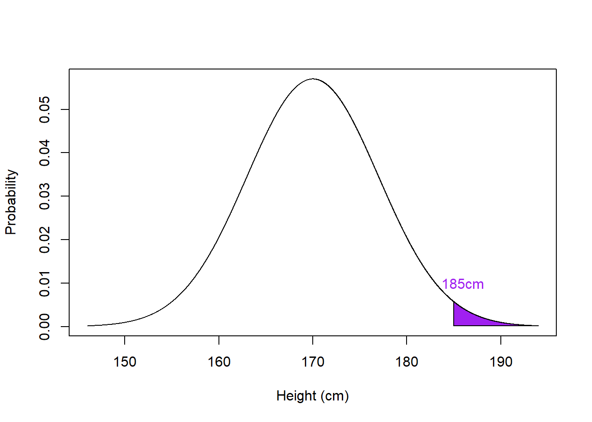

## Continuous Data and Normal Distribution

### Continuous Data Properties

In the previous section, we have seen how we can use a distribution to estimate probabilities and determine cut-off values (these will play an important part in hypothesis testing in later chapters), but we have looked only at the **discrete binomial distribution**. Many of the variables we will encounter will be **continuous** and tend to show a **normal distribution** (e.g., height, weight, IQ).

Let's say we're interested in the height of the <a class='glossary' target='_blank' title='All members of a group that we wish to generalise our findings to. E.g. all students taking Psychology at the University of Glasgow. We draw our testing sample from the population.' href='https://psyteachr.github.io/glossary/p#population'>population</a> of psychology students, which we estimate to be between 146cm and 194cm. If we plotted this as a continuous, normal distribution, it will look like:

<div class="figure" style="text-align: center">

<p class="caption">(\#fig:normplot1)The Normal Distribution of height in Psychology students (black line). Green line represents the mean. Blue line represent 1 Standard Deviation from the mean. Yellow line represents 2 Standard Deviation from the mean. Red line represents 3 Standard Deviation from the mean.</p>
</div>

The figure shows the hypothetical probability density of heights ranging from 146cm to 194cm in the population of Psychology students (black curve). This data is **normally distributed** and has the following properties:

<span style="font-size: 22px; font-weight: bold; color: var(--black);">Properties of the Normal distribution</span>

**1. The distribution is defined by its mean and standard deviation:** The mean   ($\mu$) describes the center, and therefore peak density, of the distribution. This is where the largest number of the people in the population will be in terms of height. The standard deviation ($\sigma$) describes how much variation there is from the mean of the distribution - on the figure, the standard deviation is the distance from the mean to the inflection point of the curve (the part where the curve changes from a upside-down bowl shape to a right-side-up bowl shape).  

**2. Distribution is symmetrical around the mean:** The mean lies in the middle of the distribution and divides the area under the curve into two equal sections - so we get the typical bell-shaped curve.  

**3. Total area under the curve is equal to 1:** If we were to add up the probabilities (densities) for every possible height, we would end up with a value of 1.  

**4. The mean, median and mode are all equal:** A good way to check if a given dataset is normally distributed is to calculate each measure of central tendency and see if they are approximately the same (normal distribution) or not (skewed distribution).  

**5. The curve approaches, but never touches, the x axis:** You will never have a probability of 0 for a given x axis value. 

**6. The normal distribution follows the Empirical Rule:** The Empirical Rule states that 99.7% of the data within the normal distribution falls within three standard deviations ($\pm3\sigma$) from the mean, 95% falls within two standard deviations ($\pm2\sigma$), and 68% falls within one standard deviation ($\pm\sigma$).


Continuous data can take any precise and specific value on a scale, e.g. 1.1, 1.2, 1.11, 1.111, 1.11111. Many of the variables we will encounter in Psychology will:  

* be **continuous** as opposed to discrete. 
* tend to show a **normal distribution**. 
* look similar to below - the bell-shaped curve - when plotted.


### Estimating from the Normal Distribution

Unlike coin flips, the outcome in the normal distribution is not just 50/50 and as such we won't ask you to create a normal distribution as it is more complicated than the binomial distribution you estimated in the previous section. Instead, just as with the binomial distribution (and other distributions) there are functions that allow us to estimate the normal distribution and to ask questions about the distribution. These are:

* `dnorm()` - the Density function for the normal distribution
* `pnorm()` - the Cumulative Probability function for the normal distribution
* `qnorm()` - the Quantile function for the normal distribution

You might be thinking those look familiar. They do in fact work in a similar way to their binomial counterparts. If you are unsure about how a function works remember you can call the help on it by typing in the console, for example, `?dnorm` or `?dnorm()`.
<br>

<span style="font-size: 22px; font-weight: bold; color: var(--green);">Quickfire Questions</span>

* Type in the box the binomial counterpart to `dnorm()`? <input class='webex-solveme nospaces' size='10' data-answer='["dbinom()"]'/>

* Type in the box the binomial counterpart to `pnorm()`? <input class='webex-solveme nospaces' size='10' data-answer='["pbinom()"]'/>

* Type in the box the binomial counterpart to `qnorm()`? <input class='webex-solveme nospaces' size='10' data-answer='["qbinom()"]'/>


<div class='webex-solution'><button>Explain This - I don't get the answers</button>

<div class="info">
<p>The counterpart functions all start with the same letter, d, p, q, it is just the distribution name that changes, <code>binom</code>, <code>norm</code>, <code>t</code> - though we haven't quite come across the t-distribution yet.</p>
<ol style="list-style-type: decimal">
<li><p><code>dbinom()</code> is the binomial equivalent to <code>dnorm()</code></p></li>
<li><p><code>pbinom()</code> is the binomial equivalent to <code>pnorm()</code></p></li>
<li><p><code>qbinom()</code> is the binomial equivalent to <code>qnorm()</code></p></li>
</ol>
<p>There is also <code>rnorm()</code> and <code>rbinom()</code> but we will look at them another time.</p>
</div>

</div>


### **`dnorm()`** - The Density Function

Using `dnorm()`, like we did with `dbinom`, we can plot a normal distribution. This time however we need: 

* `x`, a vector of quantiles (in other words, a series of values for the x-axis - think of this as the max and min of the distribution we want to plot) 
* the `mean` of our data
* and standard deviation `sd` of our data. 

We will use IQ as an example. There is actually some disagreement of whether or not IQ is continuous data and to some degree it will depend on the measurement you use. IQ however is definitely normally distributed and we will assume it is continuous for the purposes of this demonstration. Many Psychologists are interested in studying IQ, perhaps in terms of heritability, or interested in controlling for IQ in their own studies to rule out any effect (e.g., clinical and autism studies).  

#### Task 1: Standard Deviations and IQ Score Distribution {#Ch4InClassQueT1}

1. Copy the below code into a new script and run it. Remember that you will need to call `tidyverse` to your library first. 

This code creates the below plot showing a normal distribution of IQ scores (M = 100, SD = 15) ranging from 40 to 160. These are values considered typical for the general population.

* First we set up our range of IQ values from 40 to 160
* Then we plot the distribution of IQ_data, where we have M = 100 and SD = 15


```r
IQ_data <- tibble(IQ_range = c(40, 160))

ggplot(IQ_data, aes(IQ_range)) + 
  stat_function(fun = dnorm, args = list(mean = 100, sd = 15)) +
  labs(x = "IQ Score", y = "probability") +
  theme_classic()
```

<div class="figure" style="text-align: center">

<p class="caption">(\#fig:normplot)Distribution of IQ scores with mean = 100, sd = 15</p>
</div>

* Which part of the code do you need to change to alter the SD of your plot? <select class='webex-select'><option value='blank'></option><option value=''>mean = 100</option><option value='answer'>sd = 15</option><option value=''>(40, 160)</option></select>

2. Now copy and edit the above code to plot a distribution with `mean = 100` and `sd = 10`, and visually compare the two plots. 
<br>

<span style="font-size: 22px; font-weight: bold; color: var(--pink);">Thinking Cap Point</span>

What does changing the standard deviation (`sd`) do to the shape of the distribution? Spend a few minutes changing the code to various values and running it, and discussing with your group to answer the following questions:

* What happens to the shape of the distribution if you change the `sd` from 10 to 20? <select class='webex-select'><option value='blank'></option><option value=''>the distribution gets narrower</option><option value='answer'>the distribution gets wider</option></select>

* What happens to the shape of the distribution if you change the `sd` from 10 to 5? <select class='webex-select'><option value='blank'></option><option value='answer'>the distribution gets narrower</option><option value=''>the distribution gets wider</option></select>

* What does a small or large standard deviation in your sample tell you about the data you have collected?


<div class='webex-solution'><button>Explain This - I don't get Standard Deviations!</button>

<div class="info">
<ol style="list-style-type: decimal">
<li>Changing the SD from 10 to 20 means a larger standard deviation so you will have a wider distribution.</li>
<li>Changing the SD from 10 to 5 means a smaller standard deviation so you will have a narrower distribution.</li>
<li>Smaller SD results in a narrower distribution meaning that the data is less spread out; larger SD results in a wider distribution meaning the data is more spread out.</li>
</ol>
<p><strong>A note on the Standard Deviation</strong>:</p>
<p>You will know from your lectures that you can estimate data in two ways: point-estimates and spread estimates. The mean is a point-estimate and condenses all your data down into one data point - it tells you the average value of all your data but tells you nothing about how spread out the data is. The standard deviation however is a spread estimate and gives you an estimate of how spread out your data is from the mean - it is a measure of the standard deviation from the mean.</p>
<p>So imagine we are looking at IQ scores and you test 100 people and get a mean of 100 and an SD of 5. This means that the vast majority of your sample will have an IQ around 100 - probably most will fall within 1 SD of the mean, meaning that most of your participants will have an IQ of between 95 and 105.</p>
<p>Now if you test again and find a mean of 100 and an SD of 20, this means your data is much more spread out. If you take the 1 SD approach again then most of your participants will have an IQ of between 80 and 120.</p>
<p>So one sample has a very tight range of IQs and the other sample has a very wide range of IQs. All in, from the point-estimate and spread estimate of your data you can tell the shape of your sample distribution.</p>
</div>

</div>

<br>
So far so good! But in the above example we told `dnorm()` the values at the limit of our range and it did the rest; we said give us a range of 40 to 160 IQ scores. However, we could plot it another way by telling `dnorm()` the sequence, or range, of values we want and how much precision we want between them.  

#### Task 2: Changing Range and Step Size of The Normal Distribution {#Ch4InClassQueT2}

1. Copy the code below in to your script and run it. 
Here we plot the standard Normal Distribution from -4 to 4 in steps of 0.01. We have also stated a mean of 0 and an sd of 1.


```r
ND_data <- tibble(ND_range = seq(-4, 4, 0.01))
ggplot(ND_data, aes(ND_range)) + 
  stat_function(fun = dnorm, args = list(mean = 0, sd = 1)) +
  labs(x = "SD units", y = "probability", title = "The Normal Distribution") +
  theme_classic()
```

<div class="figure" style="text-align: center">

<p class="caption">(\#fig:ND-example)The Normal Distribution with Mean = 0 and SD = 1</p>
</div>
<br>
<span style="font-size: 22px; font-weight: bold; color: var(--green);">Quickfire Questions</span>

* Fill in the box to show what you would type to create a tibble containing a column called `ND_range` that has values ranging from `-10` to `10` in steps of `.05`:

**ND_data** <- <input class='webex-solveme nospaces' size='40' data-answer='["tibble(ND_range = seq(-10, 10, 0.05))","tibble(ND_range = seq(-10, 10, .05))"]'/>

Now that you know what to change, try plotting a normal distribution with the following attributes:

* range of -10 to 10 in steps of 0.05, 
* a mean of 0, 
* and a standard deviation of 1.

* Compare your new plot the the original one we created. What change is there in the distribution? <select class='webex-select'><option value='blank'></option><option value=''>Distribution widens</option><option value='answer'>No change in distribution</option><option value=''>Distribution narrows</option></select>


<div class='webex-solution'><button>Explain This - I don't understand the answer!</button>

<div class="info">
<p>To change the distribution you would write: <code>ND_data &lt;- tibble(ND_range = seq(-10, 10, 0.05))</code></p>
<p>However, when comparing the plots, whilst the plot itself may look thinner, the distribution has not changed. The change in appearance is due to the range of <code>sd</code> values which have been extended from -4 and 4 to -10 and 10. The density of values within those values has not changed however and you will see, more clearly in the second plot, that values beyond -3 and 3 are very unlikely.</p>
</div>

</div>


Remember, every value has a probability on a distribution and we have been able to use the `dnorm()` function to get a visual representation of how the probability of values change in the normal distribution. Some values are very probable. Some values are less probable. This is a key concept when it comes to thinking about significant differences later. 

However, as you know, there is one important difference between continuous and discrete probability distributions - the number of possible outcomes. With discrete probability distributions there are usually a finite number of outcomes over which you take a probability. For instance, with 5 coin flips, there are 5 possible outcomes for the number of heads: 0, 1, 2, 3, 4, 5. And because the binomial distribution has exact and finite outcomes, we can use `dbinom()` to get the exact probability for each outcome. 

In contrast, with a truly continuous variable, the number of possible outcomes are infinite, because you not only have 0.01 but also .0000001 and .00000000001 to arbitrary levels of precision. So rather than asking for the probability of a single value, we ask the probability for a **range of values**, which is equal to the area under the curve (the black line in the plots above) for that range of values.

As such, we will leave `dnorm()` for now and move onto looking at establishing the probability of a range of values using the Cumulative Probability function

### **`pnorm()`** - The Cumulative Probability Function

Just as `dnorm()` works like `dbinom()`, `pnorm()` works just like `pbinom()`. So, `pnorm()`, given the `mean` and `sd` of our data, returns the **cumulative density function (cumulative probability)** that a given probability (`p`) lies at a specified **cut-off point and below**, unless of course `lower.tail = FALSE` is specified in which case it is from the **cut-off point and above**.

OK, in English that people can understand, that means the `pnorm()` function tells you the probability of obtaining a given value or lower if you set `lower.tail = TRUE`.  Contrastingly, `pnorm()` function tells you the probability of obtaining a given value or higher if you set `lower.tail = FALSE`.

We will use height to give a concrete example. Say that we test a sample of students (M = 170cm, SD = 7) and we we want to calculate the probability that a given student is 150cm or shorter we would do the following:

* Remember, `lower.tail = TRUE` means lower than and including the value of X
* `TRUE` is the default so we don't actually need to declare it


```r
pnorm(150, 170, 7, lower.tail = TRUE)
```

This tells us that finding the probability of someone 150cm or shorter in our class is about **p = 0.0021374**. Stated differently, we would expect the proportion of students to be 150cm or shorter to be **0.21%** (You can convert probability to proportion by multiplying the probability by 100). This is a very small probability and suggests that it is pretty unlikely to find someone shorter than 150cm in our class. This is mainly because of how small the standard deviation of our distribution is. Think back to what we said earlier about narrow standard deviations round the mean! 

Another example might be, what would be the probability of a given student being 195 cm or taller? To do that, you would set the following code:


```r
pnorm(195, 170, 7, lower.tail = FALSE)
```

This tells us that finding the probability of someone 195cm or taller in our class is **0.02%**. So again, really unlikely.

Did you notice something different about the cut-off for this example and from when using the `dbinom()` function and looking above a cut-off? Why might that be? We will discuss in a second but first a quick task.

#### Task 3: Calculating Cumulative Probability of Height {#Ch4InClassQueT3}

1. Edit the `pnorm()` code above to calculate the probability that a given student is 190cm **or taller**.

To three decimal places, as in Task 3, what is the probability of a student being 190cm or taller in this class? <input class='webex-solveme nospaces' size='5' data-answer='["0.002",".002"]'/>


<div class='webex-solution'><button>Explain This - I don't understand the answer or the tail!</button>

<div class="info">
<p>The answer is .002. See the solution code at the end of the chapter.</p>
<p>The key thing is that there is a difference in where you need to specify the cut-off point in the <code>pbinom()</code> (discussed in the preclass activity) and <code>pnorm()</code> functions for values <strong>above</strong> <code>x</code>, i.e. when <strong><code>lower.tail = FALSE</code></strong>.</p>
<p>If you had discrete data, say the number of coin flips that result in <code>heads</code>, and wanted to calculate the probability above <code>x</code>, you would apply <code>pbinom()</code> and have to specify your cut-off point as <strong><code>x-1</code></strong> to include <code>x</code> in your calculation. For example, to calculate the probability of 4 or more 'heads' occuring in 10 coin flips, you would specify <code>pbinom(3, 10, 0.5, lower.tail = FALSE)</code> as <code>lower.tail</code> includes the value you state.</p>
<p>For continuous data, however, such as height, you would be applying <code>pnorm()</code> and therefore can specify your cut-off point simply as <strong><code>x</code></strong>. In the above example, for the cut-off point of 190, a mean of 170 and standard deviation of 7, you can write <code>pnorm(190, 170, 7, lower.tail = FALSE)</code>. The way to think about this is that setting <code>x</code> as 189 on a continuous scale, when you only want all values greater than 190, would also include all the possible values between 189 and 190. Setting <code>x</code> at 190 starts it at 190.0000000...001.</p>
<p>This is a tricky difference between <code>pbinom()</code> and <code>pnorm()</code> to recall easily, so best include this explanation point in your portfolio to help you carry out the correct analyses in the future!</p>
</div>

</div>
  

#### Task 4: Using Figures to Calculate Cumulative Probability {#Ch4InClassQueT4}

Have a look at the distribution below:

<div class="figure" style="text-align: center">

<p class="caption">(\#fig:pnormplot1)The Normal Distribution of Height with the probability of people of 185cm highlighted in purple, with a mean = 170cm and SD = 7</p>
</div>

1. Using the information in the figure, and the mean and SD as above, calculate the probability associated with the shaded area.


<div class='webex-solution'><button>Helpful Hint</button>

<div class="info">
<p>You already have your mean and standard deviations to input in <code>pnorm()</code>, look at the shaded area to obtain your cut-off point. What should the <code>lower.tail</code> call be set to according to the shaded area?</p>
</div>

</div>

<br>
<span style="font-size: 22px; font-weight: bold; color: var(--green);">Quickfire Question</span>

To three decimal places, what is the cumulative probability of the shaded area in Task 4?  <input class='webex-solveme nospaces' size='5' data-answer='["0.016",".016"]'/>


<div class='webex-solution'><button>Explain This - I don't get this answer</button>

<div class="info">
<p>The answer should be p = .016. See the solution code at the end of the chapter for the correct code.</p>
<p>Remember, <code>lower.tail</code> is set to FALSE as you want the area to the right.</p>
</div>

</div>
  

So `pnorm()` is great for telling us the probability of obtaining a specific value or greater on a distribution, given the mean and standard deviation of the distribution. The significance of this will come clearer in the coming chapters but this is a key point to have in mind as we progress through our understanding of analyses. We will leave it there for now and look at the last function of the normal distribution.


### **`qnorm()`** - The Quantile Function

Using `qnorm()` we can do the inverse of `pnorm()`, and instead of finding out the cumulative probability from a given set of values (or to a cut-off value), we can find a cut-off value given a desired probability. For example, we can use the `qnorm()` function to ask what is the maximum IQ a person would have if they were in the bottom 10% of the above IQ distribution (`M = 100` & `SD = 15`)?

* **Note:** We first need to convert 10% to a probability by dividing by 100 
* 10% = 10 / 100 = 0.1.


```r
qnorm(0.1, 100, 15) 
```

So anyone with an IQ of **80.8** or lower would be in the bottom 10% of the distribution. Or to rephrase that, a person in the bottom 10% of the distribution would have a max IQ value of **80.8**. 

To recap, we have calculated the **inverse cumulative density function (or inverse of the cumulative probability)** of the **lower tail** of the distribution, with a cut-off of a probability of 0.1 (10%), illustrated in purple below:

<div class="figure" style="text-align: center">

<p class="caption">(\#fig:pnormplot2)The Normal Distribution of Height with the bottom 10% of heights highlighted in purple</p>
</div>

Again, in English that people can understand, that means the `qnorm()` function tells you the maximum value a person can have to maintain a given probability if you set `lower.tail = TRUE`.  Contrastingly, `pnorm()` function tells you the the minimum value a person can have to maintain a given probability if you set `lower.tail = FALSE`.

#### Task 5: Using **`pnorm()`** and **`qnorm()`** to find probability and cut-off values {#Ch4InClassQueT5}

1. Calculate the lowest IQ score a student must have to be in the top 5% of the above distribution.  

2. More challenging: Using the appropriate normal distribution function, calculate the probability that a given student will have an IQ between 105 and 110, on a normal distribution of mean = 100, sd = 15.  


<div class='webex-solution'><button>Helpful Hint</button>

<div class="info">
<p>Part 1: Remember to include the <code>lower.tail</code> call if required! If you are unsure, visualise what you are trying to find (i.e. the lowest IQ score you can have to be in top 5%) by sketching it out on a normal distribution curve. It may help to reverse the question to sound more like the previous example.</p>
<p>Part 2: For the second part, each function, not necessarily <code>qnorm()</code>, gives one value, so you are looking to do a separate calculation for each IQ. Then you have to combine these two values, but are you summing or subtracting them? Is it more or less likely for students to have an IQ that falls between this range than above or below a cut-off? Again try sketching out what you are trying to achieve.</p>
</div>

</div>

<br>
<span style="font-size: 22px; font-weight: bold; color: var(--green);">Quickfire Questions</span>

* To one decimal place, enter your answer for Task 5 part 1: What is the lowest IQ score a student must have to be in the top 5% of the distribution? <input class='webex-solveme nospaces' size='5' data-answer='["124.7"]'/>

* To two decimal places, enter your answer for Task 5 part 2: What is the probability that a student will have an IQ between 105 and 110, on a normal distribution of mean = 100, sd = 15? <input class='webex-solveme nospaces' size='4' data-answer='["0.12",".12"]'/>
<br>

<div class='webex-solution'><button>Explain This - I dont get this answer</button>

<div class="info">
<ol style="list-style-type: decimal">
<li><p>The question can be rephrased as what value would give you 95% of the distribution - and the answer would be 124.7. See the solution code for Task 5 Question 1 at the end of the chapter.</p></li>
<li><p>You could use <code>pnorm()</code> to establish the probability of an IQ of 110. And you could use <code>pnorm()</code> again to establish the probability of an IQ of 105. The answer is the difference between these two probabilities and should be p = .12. See the solution code for Task 5 Question 2 at the end of the chapter.</p></li>
</ol>
</div>

</div>

