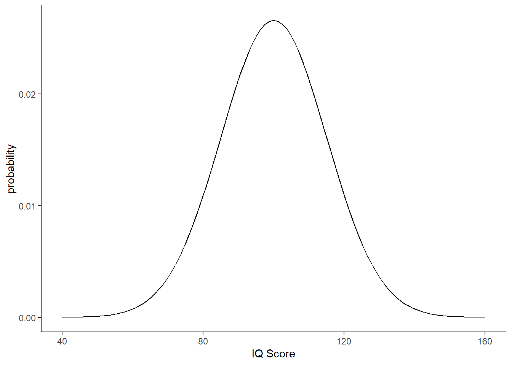

## Solutions to Questions

Below you will find the solutions to the questions for the Activities for this chapter. Only look at them after giving the questions a good try and speaking to the tutor about any issues.

### InClass Activities

#### InClass Task 1

* First we set up our range of IQ values from 40 to 160
* Then we plot the distribution of IQ_data, where we have M = 100 and SD = 10


```r
library(tidyverse)

IQ_data <- tibble(IQ_range = c(40, 160))

ggplot(IQ_data, aes(IQ_range)) + 
  stat_function(fun = dnorm, args = list(mean = 100, sd = 15)) +
  labs(x = "IQ Score", y = "probability") +
  theme_classic()
```

<div class="figure" style="text-align: center">

<p class="caption">(\#fig:unnamed-chunk-1)Distribution of IQ scores with mean = 100, sd = 10</p>
</div>

[Return to Task](#Ch4InClassQueT1)

#### InClass Task 2


```r
ND_data <- tibble(ND_range = seq(-10,10,0.05))

ggplot(ND_data, aes(ND_range)) + 
  stat_function(fun = dnorm, args = list(mean = 0, sd = 1)) +
  labs(x = "SD units", y = "probability", title = "The Normal Distribution") +
  theme_classic()
```

<div class="figure" style="text-align: center">

<p class="caption">(\#fig:unnamed-chunk-2)Normal Distribution shown on a scale of -10 to 10, with a mean = 0, sd = 1</p>
</div>

[Return to Task](#Ch4InClassQueT2)

#### InClass Task 3

* Key thing is to set lower.tail to FALSE to calculate the above area. When using `pnorm()` you state the actual cut-off even if using `lower.tail = FALSE`. If using `pbinom()` you state the cut-off minus one if using `lower.tail = FALSE`


```r
pnorm(190, 170, 7, lower.tail = FALSE)
```

```
## [1] 0.002137367
```

[Return to Task](#Ch4InClassQueT3)

#### InClass Task 4

* The highlighted area is 185cm and above. 
* Key thing is to set lower.tail to FALSE to calculate the area from the cut-off and above.


```r
pnorm(185, 170, 7, lower.tail = FALSE)
```

```
## [1] 0.01606229
```

[Return to Task](#Ch4InClassQueT4)

#### InClass Task 5

* Question 1 - the lowest IQ score a student must have to be in the top 5% of the above distribution.


```r
qnorm(0.95, 100, 15, lower.tail = TRUE)
```

```
## [1] 124.6728
```

* Question 2 - calculate the probability that a given student will have an IQ between 105 and 110, on a normal distribution of mean = 100, sd = 15.


```r
pnorm(105, 100, 15, lower.tail = FALSE) - 
  pnorm(110, 100, 15, lower.tail = FALSE)
```

```
## [1] 0.1169488
```

[Return to Task](#Ch4InClassQueT5)


### Return of the Binomial

#### Task 1


```r
blocks_5k <- replicate(n = 5000, 
                       sample(0:1,
                              size = 60, 
                              replace = TRUE, 
                              c(2/3,1/3)) %>% sum())
```

[Return to Task](#Ch4InClassQueBinomial)

### Test Yourself Activities

#### Load in the Library


```r
library(tidyverse)
```


[Return to Task](#Ch4AssignQueLib)

#### Assignment Task 1


```r
t1 <- 3/4
t1 <- .75
```

* The probability that the sound will not be a person is 0.75

[Return to Task](#Ch4AssignQueT1)

#### Assignment Task 2


```r
t2 <- (1/4) * (1/4) * (1/4) * (1/4)
t2 <- .004
```

* The probability of that sequence of sounds is 0.004

[Return to Task](#Ch4AssignQueT2)

#### Assignment Task 3


```r
t3 <- (1/4) * (1/3) * (1/2) * (0/1)
t3 <- 0
```

* The probability of that sequence of sounds is 0
* The reason is that there is no replacement and as such the repeat of the `person` trial can't happen.

[Return to Task](#Ch4AssignQueT3)

#### Assignment Task 4


```r
t4 <- dbinom(17, 100, 1/4)
```

* Assuming a probability of a tone on a given trial is 1 in 4, the probability of hearing 17 'tone' trials in a sequence of 100 trials is 0.0165156

[Return to Task](#Ch4AssignQueT4)

#### Assignment Task 5

* This could have been answered using either `pbinom()` or `dbinom()`. The trick is to remember where to set the cut-off depending on the function used.


```r
t5 <- pbinom(29, 100, 1/4, lower.tail = FALSE)
t5 <- dbinom(30:100, 100, 1/4) %>% sum()
```

* In this scenario, the probability of hearing 30 'vehicle' trials or more in a sequence of 100 trials is 0.149541

[Return to Task](#Ch4AssignQueT5)

#### Assignment Task 6

* The appropriate code would be: 


```r
t6 <- replicate(10000, sample(0:1, 100, TRUE, c(.5,.5)) %>% sum())
```

If you were to look at your output you would see something like the following. Remember your numbers will vary from ours due to random sampling. Here we are only showing the first 10 values of 10000


```
##  int [1:10000] 44 54 47 52 54 45 54 48 48 55 ...
```

[Return to Task](#Ch4AssignQueT6)

#### Assignment Task 7


```r
t7 <- pnorm(90, 100, 10, lower.tail = TRUE)
```

* The probability of a given participant having a D2 score of 90 or lower is 0.1586553

[Return to Task](#Ch4AssignQueT7)

#### Assignment Task 8


```r
t8 <- pnorm(120, 100, 10, lower.tail = FALSE)
```

* The probability that a given participant will have a D2 score of 120 or more is 0.0227501

[Return to Task](#Ch4AssignQueT8)

#### Assignment Task 9


```r
t9 <- qnorm(.95, 100, 10) - qnorm(.05, 100, 10)
```

* The difference in scores that cut off the top and bottom 5% of the distribution is 32.8970725

[Return to Task](#Ch4AssignQueT9)

#### Assignment Task 10


```r
t10 <- 79.46
```

* The maximum D2 score that they can have in this situation is 79.46

[Return to Task](#Ch4AssignQueT10)


<span style="font-size: 22px; font-weight: bold; color: var(--purple);">Chapter Complete!</span>
