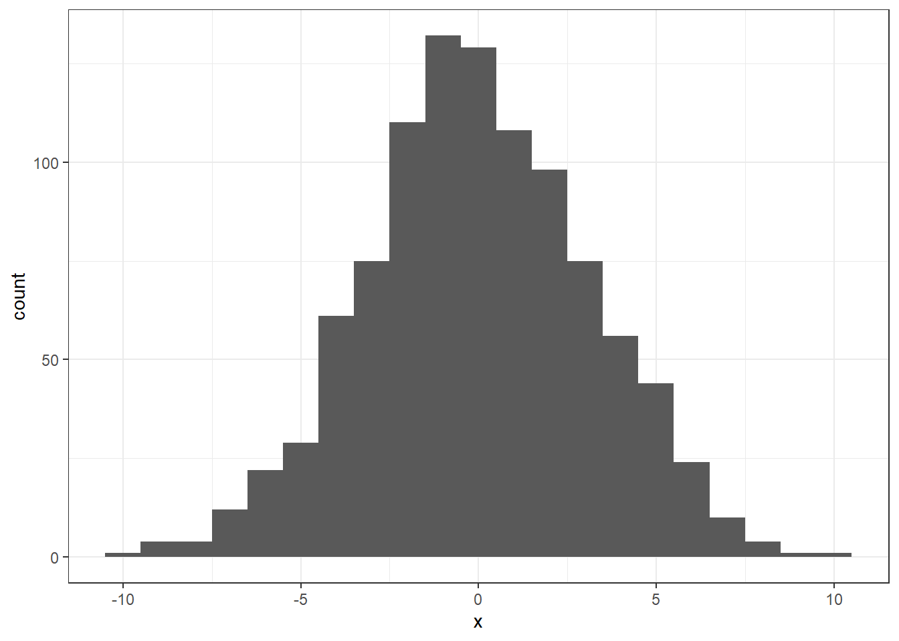

## Solutions to Questions


Below you will find the solutions to the questions for the Activities for this chapter. Only look at them after giving the questions a good try and speaking to the tutor about any issues.

### InClass Activities

#### Step 1


```r
library("tidyverse")
set.seed(1409)

dat <- read_csv("perm_data.csv") %>% 
  mutate(subj_id = row_number())
```

**Note:** The data for this activity was created in exactly the same fashion as we saw in the PreClass Activity Skill 1.  If you wanted to create your own datasets this is the code we used.


```r
dat <- tibble(group = rep(c("A", "B"), each = 50),
               Y = c(rnorm(50, 100, 15),
                     rnorm(50, 110, 15)))

write_csv(dat, "perm_data.csv")
```

[Return to Task](#Ch5InClassQueT1)

#### Step 2

**Step 2.1.1 - the basic dat pipeline**


```r
dat %>%
  group_by(group) %>%
  summarise(m = mean(Y))
```

<div class="kable-table">

<table>
 <thead>
  <tr>
   <th style="text-align:left;"> group </th>
   <th style="text-align:right;"> m </th>
  </tr>
 </thead>
<tbody>
  <tr>
   <td style="text-align:left;"> A </td>
   <td style="text-align:right;"> 101.4993 </td>
  </tr>
  <tr>
   <td style="text-align:left;"> B </td>
   <td style="text-align:right;"> 108.8877 </td>
  </tr>
</tbody>
</table>

</div>


**Step 2.1.2 - using `pivot_wider()` to separate the groups**

```r
dat %>%
  group_by(group) %>%
  summarise(m = mean(Y)) %>%
  pivot_wider(names_from = "group", values_from = "m")
```

<div class="kable-table">

<table>
 <thead>
  <tr>
   <th style="text-align:right;"> A </th>
   <th style="text-align:right;"> B </th>
  </tr>
 </thead>
<tbody>
  <tr>
   <td style="text-align:right;"> 101.4993 </td>
   <td style="text-align:right;"> 108.8877 </td>
  </tr>
</tbody>
</table>

</div>

**Step 2.1.3 - `mutate()` the column of mean differences**

```r
dat %>%
  group_by(group) %>%
  summarise(m = mean(Y)) %>%
  pivot_wider(names_from = "group", values_from = "m") %>%
  mutate(diff = A - B)
```

<div class="kable-table">

<table>
 <thead>
  <tr>
   <th style="text-align:right;"> A </th>
   <th style="text-align:right;"> B </th>
   <th style="text-align:right;"> diff </th>
  </tr>
 </thead>
<tbody>
  <tr>
   <td style="text-align:right;"> 101.4993 </td>
   <td style="text-align:right;"> 108.8877 </td>
   <td style="text-align:right;"> -7.388401 </td>
  </tr>
</tbody>
</table>

</div>

**Step 2.1.4 - `pull()` out the difference**

```r
dat %>%
  group_by(group) %>%
  summarise(m = mean(Y)) %>%
  pivot_wider(names_from = "group", values_from = "m") %>%
  mutate(diff = A - B) %>%
  pull(diff)
```

```
## [1] -7.388401
```


* As such $D_{orig}$ = -7.39

**Step 2.2 - setting up the `calc_diff()` function**

```r
calc_diff <- function(x) {
  x %>%
    group_by(group) %>%
    summarise(m = mean(Y)) %>%
    pivot_wider(names_from = "group", values_from = "m") %>%
    mutate(diff = A - B) %>%
    pull(diff)
}
```

**Step 2.3 - Calculating d_orig using calc_diff()**

```r
d_orig <- calc_diff(dat)
is_tibble(d_orig)
is_numeric(d_orig)
```

```
## [1] FALSE
## [1] TRUE
```

[Return to Task](#Ch5InClassQueT2)

#### Step 3


```r
permute <- function(x) {
  x %>%
    mutate(group = sample(group))
}

permute(dat)
```

<div class="kable-table">

<table>
 <thead>
  <tr>
   <th style="text-align:left;"> group </th>
   <th style="text-align:right;"> Y </th>
   <th style="text-align:right;"> subj_id </th>
  </tr>
 </thead>
<tbody>
  <tr>
   <td style="text-align:left;"> A </td>
   <td style="text-align:right;"> 112.98233 </td>
   <td style="text-align:right;"> 1 </td>
  </tr>
  <tr>
   <td style="text-align:left;"> A </td>
   <td style="text-align:right;"> 90.99374 </td>
   <td style="text-align:right;"> 2 </td>
  </tr>
  <tr>
   <td style="text-align:left;"> B </td>
   <td style="text-align:right;"> 89.24606 </td>
   <td style="text-align:right;"> 3 </td>
  </tr>
  <tr>
   <td style="text-align:left;"> B </td>
   <td style="text-align:right;"> 110.44834 </td>
   <td style="text-align:right;"> 4 </td>
  </tr>
  <tr>
   <td style="text-align:left;"> A </td>
   <td style="text-align:right;"> 118.46742 </td>
   <td style="text-align:right;"> 5 </td>
  </tr>
  <tr>
   <td style="text-align:left;"> A </td>
   <td style="text-align:right;"> 103.99662 </td>
   <td style="text-align:right;"> 6 </td>
  </tr>
  <tr>
   <td style="text-align:left;"> A </td>
   <td style="text-align:right;"> 100.23478 </td>
   <td style="text-align:right;"> 7 </td>
  </tr>
  <tr>
   <td style="text-align:left;"> B </td>
   <td style="text-align:right;"> 94.08834 </td>
   <td style="text-align:right;"> 8 </td>
  </tr>
  <tr>
   <td style="text-align:left;"> B </td>
   <td style="text-align:right;"> 94.83061 </td>
   <td style="text-align:right;"> 9 </td>
  </tr>
  <tr>
   <td style="text-align:left;"> A </td>
   <td style="text-align:right;"> 92.45023 </td>
   <td style="text-align:right;"> 10 </td>
  </tr>
  <tr>
   <td style="text-align:left;"> B </td>
   <td style="text-align:right;"> 94.86514 </td>
   <td style="text-align:right;"> 11 </td>
  </tr>
  <tr>
   <td style="text-align:left;"> A </td>
   <td style="text-align:right;"> 102.17296 </td>
   <td style="text-align:right;"> 12 </td>
  </tr>
  <tr>
   <td style="text-align:left;"> A </td>
   <td style="text-align:right;"> 102.62185 </td>
   <td style="text-align:right;"> 13 </td>
  </tr>
  <tr>
   <td style="text-align:left;"> A </td>
   <td style="text-align:right;"> 96.82137 </td>
   <td style="text-align:right;"> 14 </td>
  </tr>
  <tr>
   <td style="text-align:left;"> A </td>
   <td style="text-align:right;"> 84.18164 </td>
   <td style="text-align:right;"> 15 </td>
  </tr>
  <tr>
   <td style="text-align:left;"> B </td>
   <td style="text-align:right;"> 108.37726 </td>
   <td style="text-align:right;"> 16 </td>
  </tr>
  <tr>
   <td style="text-align:left;"> B </td>
   <td style="text-align:right;"> 87.84597 </td>
   <td style="text-align:right;"> 17 </td>
  </tr>
  <tr>
   <td style="text-align:left;"> A </td>
   <td style="text-align:right;"> 109.07707 </td>
   <td style="text-align:right;"> 18 </td>
  </tr>
  <tr>
   <td style="text-align:left;"> A </td>
   <td style="text-align:right;"> 77.66668 </td>
   <td style="text-align:right;"> 19 </td>
  </tr>
  <tr>
   <td style="text-align:left;"> A </td>
   <td style="text-align:right;"> 101.79243 </td>
   <td style="text-align:right;"> 20 </td>
  </tr>
  <tr>
   <td style="text-align:left;"> A </td>
   <td style="text-align:right;"> 100.96560 </td>
   <td style="text-align:right;"> 21 </td>
  </tr>
  <tr>
   <td style="text-align:left;"> B </td>
   <td style="text-align:right;"> 123.15635 </td>
   <td style="text-align:right;"> 22 </td>
  </tr>
  <tr>
   <td style="text-align:left;"> A </td>
   <td style="text-align:right;"> 87.69904 </td>
   <td style="text-align:right;"> 23 </td>
  </tr>
  <tr>
   <td style="text-align:left;"> A </td>
   <td style="text-align:right;"> 100.51099 </td>
   <td style="text-align:right;"> 24 </td>
  </tr>
  <tr>
   <td style="text-align:left;"> A </td>
   <td style="text-align:right;"> 111.80215 </td>
   <td style="text-align:right;"> 25 </td>
  </tr>
  <tr>
   <td style="text-align:left;"> B </td>
   <td style="text-align:right;"> 79.97282 </td>
   <td style="text-align:right;"> 26 </td>
  </tr>
  <tr>
   <td style="text-align:left;"> B </td>
   <td style="text-align:right;"> 98.53688 </td>
   <td style="text-align:right;"> 27 </td>
  </tr>
  <tr>
   <td style="text-align:left;"> B </td>
   <td style="text-align:right;"> 106.39774 </td>
   <td style="text-align:right;"> 28 </td>
  </tr>
  <tr>
   <td style="text-align:left;"> B </td>
   <td style="text-align:right;"> 98.01146 </td>
   <td style="text-align:right;"> 29 </td>
  </tr>
  <tr>
   <td style="text-align:left;"> B </td>
   <td style="text-align:right;"> 66.38682 </td>
   <td style="text-align:right;"> 30 </td>
  </tr>
  <tr>
   <td style="text-align:left;"> B </td>
   <td style="text-align:right;"> 111.36834 </td>
   <td style="text-align:right;"> 31 </td>
  </tr>
  <tr>
   <td style="text-align:left;"> B </td>
   <td style="text-align:right;"> 120.01310 </td>
   <td style="text-align:right;"> 32 </td>
  </tr>
  <tr>
   <td style="text-align:left;"> A </td>
   <td style="text-align:right;"> 132.58026 </td>
   <td style="text-align:right;"> 33 </td>
  </tr>
  <tr>
   <td style="text-align:left;"> A </td>
   <td style="text-align:right;"> 103.48150 </td>
   <td style="text-align:right;"> 34 </td>
  </tr>
  <tr>
   <td style="text-align:left;"> A </td>
   <td style="text-align:right;"> 95.12308 </td>
   <td style="text-align:right;"> 35 </td>
  </tr>
  <tr>
   <td style="text-align:left;"> A </td>
   <td style="text-align:right;"> 93.78817 </td>
   <td style="text-align:right;"> 36 </td>
  </tr>
  <tr>
   <td style="text-align:left;"> B </td>
   <td style="text-align:right;"> 96.87146 </td>
   <td style="text-align:right;"> 37 </td>
  </tr>
  <tr>
   <td style="text-align:left;"> A </td>
   <td style="text-align:right;"> 120.69336 </td>
   <td style="text-align:right;"> 38 </td>
  </tr>
  <tr>
   <td style="text-align:left;"> B </td>
   <td style="text-align:right;"> 100.29758 </td>
   <td style="text-align:right;"> 39 </td>
  </tr>
  <tr>
   <td style="text-align:left;"> B </td>
   <td style="text-align:right;"> 105.66415 </td>
   <td style="text-align:right;"> 40 </td>
  </tr>
  <tr>
   <td style="text-align:left;"> A </td>
   <td style="text-align:right;"> 93.11102 </td>
   <td style="text-align:right;"> 41 </td>
  </tr>
  <tr>
   <td style="text-align:left;"> B </td>
   <td style="text-align:right;"> 133.70746 </td>
   <td style="text-align:right;"> 42 </td>
  </tr>
  <tr>
   <td style="text-align:left;"> B </td>
   <td style="text-align:right;"> 107.09334 </td>
   <td style="text-align:right;"> 43 </td>
  </tr>
  <tr>
   <td style="text-align:left;"> B </td>
   <td style="text-align:right;"> 102.85333 </td>
   <td style="text-align:right;"> 44 </td>
  </tr>
  <tr>
   <td style="text-align:left;"> A </td>
   <td style="text-align:right;"> 126.57195 </td>
   <td style="text-align:right;"> 45 </td>
  </tr>
  <tr>
   <td style="text-align:left;"> B </td>
   <td style="text-align:right;"> 73.85866 </td>
   <td style="text-align:right;"> 46 </td>
  </tr>
  <tr>
   <td style="text-align:left;"> A </td>
   <td style="text-align:right;"> 110.33882 </td>
   <td style="text-align:right;"> 47 </td>
  </tr>
  <tr>
   <td style="text-align:left;"> B </td>
   <td style="text-align:right;"> 104.51367 </td>
   <td style="text-align:right;"> 48 </td>
  </tr>
  <tr>
   <td style="text-align:left;"> B </td>
   <td style="text-align:right;"> 103.16211 </td>
   <td style="text-align:right;"> 49 </td>
  </tr>
  <tr>
   <td style="text-align:left;"> A </td>
   <td style="text-align:right;"> 93.27530 </td>
   <td style="text-align:right;"> 50 </td>
  </tr>
  <tr>
   <td style="text-align:left;"> B </td>
   <td style="text-align:right;"> 85.33467 </td>
   <td style="text-align:right;"> 51 </td>
  </tr>
  <tr>
   <td style="text-align:left;"> A </td>
   <td style="text-align:right;"> 130.87269 </td>
   <td style="text-align:right;"> 52 </td>
  </tr>
  <tr>
   <td style="text-align:left;"> A </td>
   <td style="text-align:right;"> 108.25974 </td>
   <td style="text-align:right;"> 53 </td>
  </tr>
  <tr>
   <td style="text-align:left;"> A </td>
   <td style="text-align:right;"> 68.42739 </td>
   <td style="text-align:right;"> 54 </td>
  </tr>
  <tr>
   <td style="text-align:left;"> B </td>
   <td style="text-align:right;"> 106.10006 </td>
   <td style="text-align:right;"> 55 </td>
  </tr>
  <tr>
   <td style="text-align:left;"> A </td>
   <td style="text-align:right;"> 117.21891 </td>
   <td style="text-align:right;"> 56 </td>
  </tr>
  <tr>
   <td style="text-align:left;"> B </td>
   <td style="text-align:right;"> 117.56341 </td>
   <td style="text-align:right;"> 57 </td>
  </tr>
  <tr>
   <td style="text-align:left;"> B </td>
   <td style="text-align:right;"> 85.14176 </td>
   <td style="text-align:right;"> 58 </td>
  </tr>
  <tr>
   <td style="text-align:left;"> B </td>
   <td style="text-align:right;"> 102.72539 </td>
   <td style="text-align:right;"> 59 </td>
  </tr>
  <tr>
   <td style="text-align:left;"> A </td>
   <td style="text-align:right;"> 126.91223 </td>
   <td style="text-align:right;"> 60 </td>
  </tr>
  <tr>
   <td style="text-align:left;"> A </td>
   <td style="text-align:right;"> 102.36536 </td>
   <td style="text-align:right;"> 61 </td>
  </tr>
  <tr>
   <td style="text-align:left;"> B </td>
   <td style="text-align:right;"> 105.52819 </td>
   <td style="text-align:right;"> 62 </td>
  </tr>
  <tr>
   <td style="text-align:left;"> A </td>
   <td style="text-align:right;"> 103.59579 </td>
   <td style="text-align:right;"> 63 </td>
  </tr>
  <tr>
   <td style="text-align:left;"> B </td>
   <td style="text-align:right;"> 104.40565 </td>
   <td style="text-align:right;"> 64 </td>
  </tr>
  <tr>
   <td style="text-align:left;"> B </td>
   <td style="text-align:right;"> 112.82381 </td>
   <td style="text-align:right;"> 65 </td>
  </tr>
  <tr>
   <td style="text-align:left;"> B </td>
   <td style="text-align:right;"> 92.49548 </td>
   <td style="text-align:right;"> 66 </td>
  </tr>
  <tr>
   <td style="text-align:left;"> B </td>
   <td style="text-align:right;"> 94.80926 </td>
   <td style="text-align:right;"> 67 </td>
  </tr>
  <tr>
   <td style="text-align:left;"> B </td>
   <td style="text-align:right;"> 103.99790 </td>
   <td style="text-align:right;"> 68 </td>
  </tr>
  <tr>
   <td style="text-align:left;"> B </td>
   <td style="text-align:right;"> 118.17509 </td>
   <td style="text-align:right;"> 69 </td>
  </tr>
  <tr>
   <td style="text-align:left;"> A </td>
   <td style="text-align:right;"> 112.68365 </td>
   <td style="text-align:right;"> 70 </td>
  </tr>
  <tr>
   <td style="text-align:left;"> A </td>
   <td style="text-align:right;"> 133.41869 </td>
   <td style="text-align:right;"> 71 </td>
  </tr>
  <tr>
   <td style="text-align:left;"> A </td>
   <td style="text-align:right;"> 107.30286 </td>
   <td style="text-align:right;"> 72 </td>
  </tr>
  <tr>
   <td style="text-align:left;"> B </td>
   <td style="text-align:right;"> 130.67447 </td>
   <td style="text-align:right;"> 73 </td>
  </tr>
  <tr>
   <td style="text-align:left;"> A </td>
   <td style="text-align:right;"> 113.96922 </td>
   <td style="text-align:right;"> 74 </td>
  </tr>
  <tr>
   <td style="text-align:left;"> B </td>
   <td style="text-align:right;"> 125.83227 </td>
   <td style="text-align:right;"> 75 </td>
  </tr>
  <tr>
   <td style="text-align:left;"> B </td>
   <td style="text-align:right;"> 104.29092 </td>
   <td style="text-align:right;"> 76 </td>
  </tr>
  <tr>
   <td style="text-align:left;"> B </td>
   <td style="text-align:right;"> 95.67587 </td>
   <td style="text-align:right;"> 77 </td>
  </tr>
  <tr>
   <td style="text-align:left;"> B </td>
   <td style="text-align:right;"> 125.56749 </td>
   <td style="text-align:right;"> 78 </td>
  </tr>
  <tr>
   <td style="text-align:left;"> A </td>
   <td style="text-align:right;"> 108.77002 </td>
   <td style="text-align:right;"> 79 </td>
  </tr>
  <tr>
   <td style="text-align:left;"> B </td>
   <td style="text-align:right;"> 102.09267 </td>
   <td style="text-align:right;"> 80 </td>
  </tr>
  <tr>
   <td style="text-align:left;"> B </td>
   <td style="text-align:right;"> 96.55066 </td>
   <td style="text-align:right;"> 81 </td>
  </tr>
  <tr>
   <td style="text-align:left;"> A </td>
   <td style="text-align:right;"> 108.27278 </td>
   <td style="text-align:right;"> 82 </td>
  </tr>
  <tr>
   <td style="text-align:left;"> A </td>
   <td style="text-align:right;"> 126.31361 </td>
   <td style="text-align:right;"> 83 </td>
  </tr>
  <tr>
   <td style="text-align:left;"> B </td>
   <td style="text-align:right;"> 127.70411 </td>
   <td style="text-align:right;"> 84 </td>
  </tr>
  <tr>
   <td style="text-align:left;"> B </td>
   <td style="text-align:right;"> 127.58527 </td>
   <td style="text-align:right;"> 85 </td>
  </tr>
  <tr>
   <td style="text-align:left;"> B </td>
   <td style="text-align:right;"> 82.86026 </td>
   <td style="text-align:right;"> 86 </td>
  </tr>
  <tr>
   <td style="text-align:left;"> A </td>
   <td style="text-align:right;"> 132.58606 </td>
   <td style="text-align:right;"> 87 </td>
  </tr>
  <tr>
   <td style="text-align:left;"> A </td>
   <td style="text-align:right;"> 108.08821 </td>
   <td style="text-align:right;"> 88 </td>
  </tr>
  <tr>
   <td style="text-align:left;"> B </td>
   <td style="text-align:right;"> 81.97775 </td>
   <td style="text-align:right;"> 89 </td>
  </tr>
  <tr>
   <td style="text-align:left;"> B </td>
   <td style="text-align:right;"> 117.82785 </td>
   <td style="text-align:right;"> 90 </td>
  </tr>
  <tr>
   <td style="text-align:left;"> B </td>
   <td style="text-align:right;"> 86.61208 </td>
   <td style="text-align:right;"> 91 </td>
  </tr>
  <tr>
   <td style="text-align:left;"> A </td>
   <td style="text-align:right;"> 107.47836 </td>
   <td style="text-align:right;"> 92 </td>
  </tr>
  <tr>
   <td style="text-align:left;"> A </td>
   <td style="text-align:right;"> 94.00012 </td>
   <td style="text-align:right;"> 93 </td>
  </tr>
  <tr>
   <td style="text-align:left;"> A </td>
   <td style="text-align:right;"> 128.34191 </td>
   <td style="text-align:right;"> 94 </td>
  </tr>
  <tr>
   <td style="text-align:left;"> A </td>
   <td style="text-align:right;"> 101.94476 </td>
   <td style="text-align:right;"> 95 </td>
  </tr>
  <tr>
   <td style="text-align:left;"> A </td>
   <td style="text-align:right;"> 140.78313 </td>
   <td style="text-align:right;"> 96 </td>
  </tr>
  <tr>
   <td style="text-align:left;"> B </td>
   <td style="text-align:right;"> 122.38445 </td>
   <td style="text-align:right;"> 97 </td>
  </tr>
  <tr>
   <td style="text-align:left;"> A </td>
   <td style="text-align:right;"> 93.53927 </td>
   <td style="text-align:right;"> 98 </td>
  </tr>
  <tr>
   <td style="text-align:left;"> A </td>
   <td style="text-align:right;"> 93.72602 </td>
   <td style="text-align:right;"> 99 </td>
  </tr>
  <tr>
   <td style="text-align:left;"> A </td>
   <td style="text-align:right;"> 118.77979 </td>
   <td style="text-align:right;"> 100 </td>
  </tr>
</tbody>
</table>

</div>

[Return to Task](#Ch5InClassQueT3)

#### Step 4

**Step 4.1 - the pipeline**

```r
dat %>% permute() %>% calc_diff()
```

```
## [1] 7.232069
```


**Step 4.2 - creating nhd**

```r
nhd <- replicate(1000, dat %>% permute() %>% calc_diff())
```

**Step 4.3 - plotting nhd**

```r
ggplot(tibble(x = nhd), aes(x)) + geom_histogram(binwidth = 1)
```

<div class="figure" style="text-align: center">

<p class="caption">(\#fig:histogram)The simulated distribution of all possible differences</p>
</div>

[Return to Task](#Ch5InClassQueT4)

#### Step 5

**Step 5.1 - The logical vector**

* This code establishes all the values in nhd that are equal to or greater than the value in d_orig
* It returns all these values as TRUE and all other values as FALSE
* `abs()` tells the code to ignore the sign of the value (i.e. assumes everything is positive)


```r
lvec = abs(nhd) >= abs(d_orig)
```


**Step 5.2 - Sum up all the TRUE values**

* This gives the total number of values greater or equal to d_orig

```r
n_exceeding_orig <- sum(lvec)
```

**Step 5.3 - Calculate the probability**

* The probability of obtaining d_orig or greater is calculated by the number of values equal to or greater than d_orig, divided by the full size of nhd (or in other words, its length)


```r
p <- n_exceeding_orig / length(nhd)
```

* As such the probability of finding a value of $D_{orig}$ or larger was p = 0.016

To write up the sentence, with inline coding you would write:

* The difference between Group A and Group B (M = <code>&#096;r round(d_orig, 2)&#096;</code>) was found to be have a probability of p = <code>&#096;r p&#096;</code>. This means that the original mean difference was significant and the null hypothesis is rejected.

Which when knitted would produce:

* The difference between Group A and Group B (M = -7.39) was found to be have a probability of p = 0.016. This means that the original mean difference was significant and the null hypothesis is rejected.

[Return to Task](#Ch5InClassQueT5)

<span style="font-size: 22px; font-weight: bold; color: var(--purple);">Chapter Complete!</span>
