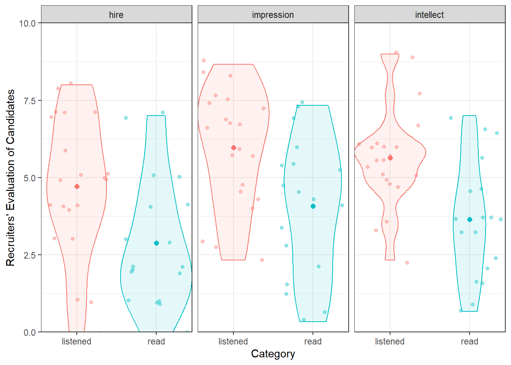

# NHST: Two-Sample t-test

## Overview


In the previous chapter we looked at the situation where you had gathered one sample of data (from one group of participants) and you compared that one group to a known value, e.g. a standard value. An extension of this design is where you gather data from two samples. **Two-sample** designs are very common in Psychology as often we want to know whether there is a difference between groups on a particular variable. Today we will look at this scenario more closely through the $t$-test analysis. 

**Comparing the Means of Two Samples**

First thing to note is that there are different types of two-sample designs depending on whether or not the two groups are independent (e.g., different participants in different conditions) or not (e.g., same participants in different conditions). In today's chapter we will focus on **independent samples**, which typically means that the observations in the two groups are unrelated - usually meaning different people.  In the next chapter, you will examine cases where the observations in the two groups are from pairs (**paired samples**) - most often the same people, but could also be a matched-pairs design.


<!-- 
<div class='webex-solution'><button>Thinking Cap Point - All the different names for one thing!</button>
 -->
<!-- ```{block, type ="info"} -->
<!-- Here is a very brief summary: -->

<!-- * independent and between-subjects design typically mean the same thing - different participants in different conditions. -->
<!-- * within-subjects, dependent samples, paired samples, and repeated measures tend to mean the same participants in all conditions -->
<!-- * matched-pairs design means different people in different conditions but you have matched participants across the conditions so that they are effectively the same person (e.g. age, IQ, Social Economic Status, etc). These designs are analysed as though they were a within-subjects design. -->
<!-- * mixed design is when there is a combination of within-subjects and between-subjects designs in the one experiment. For example, say you are looking at attractiveness and dominance of male and female faces. Everyone might see both male and female faces (within) but half of the participants do ratings of attractiveness and half do ratings of trustworthiness (between).  -->
<!-- * The paper we are looking at in this InClass activity technically uses a mixed design at times but we will use the between-subjects element to show you how to run independent t-tests. -->

<!-- Spend some time when reading articles to really figure out the design they are using. -->
<!-- ``` -->
<!-- 
</div>
   -->
<!-- <br> -->


## Background of data: Speech as indicator of intellect

For this lab we will be revisiting the data from Schroeder and Epley (2015), which you first encountered as part of the homework for Chapter 5. You can take a look at the Psychological Science article here:

Schroeder, J. and Epley, N. (2015). <a href = "https://doi.org/10.1177/0956797615572906" target = "_blank">The sound of intellect: Speech reveals a thoughtful mind, increasing a job candidate's appeal.</a> *Psychological Science, 26, 277--891*.

The abstract from this article explains more about the different experiments conducted (we will be specifically looking at the dataset from Experiment 4, courtesy of the <a href = "https://sites.trinity.edu/osl/data-sets-and-activities/t-test-activities" target = "_blank">Open Stats Lab</a>):

"*A person's mental capacities, such as intellect, cannot be observed directly and so are instead inferred from indirect cues. We predicted that a person's intellect would be conveyed most strongly through a cue closely tied to actual thinking: his or her voice. Hypothetical employers (Experiments 1-3b) and professional recruiters (Experiment 4) watched, listened to, or read job candidates' pitches about why they should be hired. These evaluators (the employers) rated a candidate as more competent, thoughtful, and intelligent when they heard a pitch rather than read it and, as a result, had a more favorable impression of the candidate and were more interested in hiring the candidate. Adding voice to written pitches, by having trained actors (Experiment 3a) or untrained adults (Experiment 3b) read them, produced the same results. Adding visual cues to audio pitches did not alter evaluations of the candidates. For conveying one's intellect, it is important that one's voice, quite literally, be heard.*"

To recap on Experiment 4, 39 professional recruiters from Fortune 500 companies evaluated job pitches of M.B.A. candidates (Masters in Business Administration) from the University of Chicago Booth School of Business. The methods and results appear on pages 887--889 of the article if you want to look at them specifically for more details. The original data, in **wide** format, can be found at the <a href = "https://drive.google.com/open?id=0Bz-rhZ21ShvOei1MM24xNndnQ00" target = "_blank">Open Stats Lab</a> website for later self-directed learning. Today however, we will be working with a modified version in "tidy" format which can be [downloaded from here](data/06-s01/inclass/ch6-inclass-data.zip). If you are unsure about tidy format, refer back to the activities of Chapter 2.


## The Two-Sample t-test

The overall goal today is to learn about running a $t$-test on between-subjects data, as well as learning about analysing actual data along the way. As such, our task today is to reproduce a figure and the results from the article (p. 887-888). The two packages you will need are `tidyverse`, which we have used a lot, and `broom`, which is new to you, but will become your friend. One of the main functions we use in broom is `broom::tidy()` - this is an incredibly useful function that converts the output of an inferential test in R from a combination of text and lists, that are really hard to work with - technically called `objects` - into a tibble that you are very familiar with and that you can then use much more easily. We will show you how to use this function today and then ask you to use it over the coming chapters.


### Task 1: Evaluators {#Ch6InClassQueT1}

1. Open a new R Markdown file and use code to call `broom` and `tidyverse` into your library. 

Note: Order is important when calling multiple libraries - if two libraries have a function named the same thing, R will use the function from the library loaded in last. We recommend calling libraries in an order that `tidyverse` is called last as the functions in that library are used most often.

2. The file called `evaluators.csv` contains the demographics of the 39 raters. After downloading and unzipping the data, and of course setting the working directory, load in the information from this file and store it in a tibble called `evaluators`.

3.  Now, use code to:
    i. calculate the overall mean and standard deviation of the age of the evaluators. 
    ii. count how many male and how many female evaluators were in the study. 
    
Note: Probably easier doing this task in separate lines of code. There are NAs in the data so you will need to include a call to `na.rm = TRUE`.


<div class='webex-solution'><button>Helpful Hint</button>

<div class="info">
<ul>
<li>Remember to load the libraries you need!</li>
<li>Also make sure you’ve downloaded and saved the data in the folder
you’re working from.</li>
<li>You can use <code>summarise()</code> and <code>count()</code> or a
pipeline with <code>group_by()</code> to complete this task.</li>
<li>When analysing the number of male and female evaluators, it isn’t
initially clear that ‘1’ represents males and ‘2’ represents
females.</li>
<li>We can use <code>recode()</code> to convert the numeric names to
indicate something more meaningful. Have a look at<code>?recode</code>
to see if you can work out how to use it. It’ll help to use
<code>mutate()</code> to create a new variable to <code>recode()</code>
the numeric names for evaluators.</li>
<li>This website is also incredibly useful and one to save for anytime
you need to use recode():
<a href="https://debruine.github.io/posts/recode/" target = "_blank">https://debruine.github.io/posts/recode/</a></li>
<li>For your own analysis and future reproducible analyses, it’s a good
idea to make these representations clearer to others.</li>
</ul>
</div>

</div>
  
<br>


<span style="font-size: 22px; font-weight: bold; color: var(--green);">Quickfire Questions</span> 

Fill in the below answers to check that your calculations are correct:

* What was the mean age of the evaluators in the study? Type in your answer to one decimal place: <input class='webex-solveme nospaces' size='4' data-answer='["30.9"]'/>
* What was the standard deviation of the age of the evaluators in the study? Type in your answer to two decimal places: <input class='webex-solveme nospaces' size='4' data-answer='["6.24"]'/>
* How many participants were noted as being female: <input class='webex-solveme nospaces' size='2' data-answer='["30"]'/>
* How many participants were noted as being male: <input class='webex-solveme nospaces' size='1' data-answer='["4"]'/>

<span style="font-size: 22px; font-weight: bold; color: var(--pink);">Thinking Cap Point</span>

The paper claims that the mean age of the evaluators was 30.85 years (SD = 6.24) and that there were 9 male and 30 female evaluators. Do you agree? Why might there be differences?


<div class='webex-solution'><button>Explain This - Why is there a discrepancy?</button>

<div class="info">
<p>This paper claimed there were 9 males. However, looking at your
results you can see only 4 males, with 5 NA entries making up the rest
of the participant count. It looks like the NA and male entries have
been combined! That information might not be clear to a person
re-analysing the data.</p>
<p>This is why it’s important to have reproducible data analyses for
others to examine. Having another pair of eyes examining your data can
be very beneficial in spotting any discrepancies - this allows for
critical evaluation of analyses and results and improves the quality of
research being published. All the more reason to emphasize the
importance of conducting replication studies!</p>
</div>

</div>
 

### Task 2: Ratings {#Ch6InClassQueT2}

We are now going to calculate an overall **intellect** rating given by each evaluator. To break that down a bit, we are going to calculate how intellectual the evaluators (the raters) thought candidates were overall, depending on whether the evaluators **read** or **listened** to the candidates' resume pitches. This is calculated by averaging the ratings of `competent`, `thoughtful` and `intelligent` for each evaluator held within `ratings.csv`. 

Note: We are not looking at ratings to individual candidates; we are looking at overall ratings for each evaluator. This is a bit confusing but makes sense if you stop to think about it a little. You can think about it in terms of "do raters rate differently depending on whether they read or listen to a resume pitch".

We will then combine the overall **intellect** rating with the overall **impression** ratings and overall **hire** ratings for each evaluator, all ready found in `ratings.csv`. In the end we will have a new tibble - let's call it `ratings2` - which has the below structure:

* eval_id shows the evaluator ID. Each evaluator has a different ID. So all the 1's are the same evaluator.
* Category shows the scale that they were rating on - intellect, hire, impression
* Rating shows the overall rating given by that evaluator on a given scale.
* condition shows whether that evaluator listened to (e.g., evaluators 1, 2 and 3), or read (e.g., evaluator 4) the resume.

<div class="kable-table">

| eval_id|Category   | Rating|condition |
|-------:|:----------|------:|:---------|
|       1|hire       |  6.000|listened  |
|       1|impression |  7.000|listened  |
|       1|intellect  |  6.000|listened  |
|       2|hire       |  4.000|listened  |
|       2|impression |  4.667|listened  |
|       2|intellect  |  5.667|listened  |
|       3|hire       |  5.000|listened  |
|       3|impression |  8.333|listened  |
|       3|intellect  |  6.000|listened  |
|       4|hire       |  4.000|read      |
|       4|impression |  4.667|read      |
|       4|intellect  |  3.333|read      |

</div>

The following steps describe how to create the above tibble, but you might want to have a bash yourself without reading them first. The trick when doing data analysis and data wrangling is to first think about what you want to achieve - the end goal - and then what function do I need to use. You know what you want to end up with - the above table - now how do you get there?

Steps 1-3 calculate the new `intellect` rating. Steps 4 + 5 combine this rating to all other information.

1. Load the data found in `ratings.csv` into a tibble called `ratings`. 

2. `filter()` only the relevant variables (**thoughtful**, **competent**, **intelligent**) into a new tibble (call it what you like - in the solutions we use `iratings`), and calculate a mean `Rating` for each evaluator.  

3. Add on a new column called `Category` where every entry is the word `intellect`. This tells us that every number in this tibble is an intellect rating.  

4. Now create a new tibble called `ratings2` and filter into it just the **impression** and **hire** ratings from the original `ratings` tibble. Next, bind this tibble with the tibble you created in step 3 to bring together the intellect, impression, and hire ratings, in `ratings2`.  

5. Join `ratings2` with the `evaluator` tibble that we created in Task 1. Keep only the necessary columns as shown above and arrange by Evaluator and Category.  

Don't forget to use the hints below or the solution at the end of the Chapter if you are stuck. Take this one step at a time.


<div class='webex-solution'><button>Helpful Hint</button>

<div class="info">
<ol style="list-style-type: decimal">
<li><p>Make sure you’ve downloaded and saved the data into the folder
you’re working from.</p></li>
<li><p><code>filter(Category %in% c())</code> might work and then use
<code>group_by()</code> and <code>summarize()</code> to calculate a mean
<code>Rating</code> for each evaluator.</p></li>
<li><p>Use <code>mutate()</code> to create a new column.</p></li>
<li><p><code>bind_rows()</code> from Chapter 2 will help you to combine
these variables from two separate tibbles.</p></li>
<li><p>Use <code>inner_join()</code> with the common column in both
tibbles. <code>select()</code> and <code>arrange()</code> will help you
here, too.</p></li>
</ol>
</div>

</div>

<br>


### Task 3: Creating a Figure {#Ch6InClassQueT3}

To recap, we now have `ratings2` which contains an overall `Rating` score for each evaluator on the three `Category` (within: hire, impression, intellect) depending on which `condition` that evaluator was in (between: listened or read). Great! Now we have all the information we need to replicate Figure 7 in the article (page 888), shown here:

<div class="figure" style="text-align: center">

<p class="caption">(\#fig:img-lab6-figure7)Figure 7 from Schroeder and Epley (2015) which you should try to replicate.</p>
</div>

Replace the `NULL`s below to create a very basic version of this figure.


```r
group_means <- group_by(ratings2, NULL, NULL) %>%
  summarise(Rating = mean(Rating))

ggplot(group_means, aes(NULL, NULL, fill = NULL)) +
  geom_col(position = "dodge")
```

<span style="font-size: 22px; font-weight: bold; color: var(--pink);">Thinking Cap Point</span>

**Improve Your Figure:** How could you improve this plot. What other `geom_()` options could you try? Are bar charts that informative or would something else be better? How would you add or change the labels of your plot? Could you change the colours in your figure?

Next, have a look at the possible solution below to see a **modern** way of presenting this information. There are some new functions in this solution that you should play about with to understand what they do. Remember it is a layering system, so remove lines and see what happens. Note how in the solution the Figure shows the raw data points as well as the means in each condition; this gives a better impression of the true data as just showing the means can be misleading. You can continue your further exploration of visualisations by reading this paper later when you have a chance: <a href = "https://doi.org/10.1371/journal.pbio.1002128" target = "_blank">Weissberger et al., 2015, Beyond Bar and Line Graphs: Time for a New Data Presentation Paradigm</a>


<div class='webex-solution'><button>Solution and Possible Alternative</button>


Filling in the code as below will create a basic figure as shown:


```r
group_means <- ratings2 %>%
  group_by(condition, Category) %>%
  summarise(Rating = mean(Rating))
```

```
## `summarise()` has grouped output by 'condition'. You can override using the
## `.groups` argument.
```

```r
ggplot(group_means, aes(Category, Rating, fill = condition)) + 
  geom_col(position = "dodge")
```

<div class="figure" style="text-align: center">

<p class="caption">(\#fig:ch6-fig7-solution)A basic solution to Figure 7</p>
</div>

Or alternatively, for a more modern presentation of the data:


```r
group_means <- ratings2 %>%
  group_by(condition, Category) %>%
  summarise(Rating = mean(Rating))
```

```
## `summarise()` has grouped output by 'condition'. You can override using the
## `.groups` argument.
```

```r
ggplot(ratings2, aes(condition, Rating, color = condition)) +
  geom_jitter(alpha = .4) +
  geom_violin(aes(fill = condition), alpha = .1) +
  facet_wrap(~Category) +
  geom_point(data = group_means, size = 2) +
  labs(x = "Category", y = "Recruiters' Evaluation of Candidates") +
  coord_cartesian(ylim = c(0, 10), expand = FALSE) +
  guides(color = "none", fill = "none") +
  theme_bw()
```

<div class="figure" style="text-align: center">

<p class="caption">(\#fig:ch6-fig7-possible)A possible alternative to Figure 7</p>
</div>

</div>


### Task 4: t-tests {#Ch6InClassQueT4}

Brilliant! So far we have checked the descriptives and the visualisations, and the last thing now is to check the inferential tests; the t-tests. You should still have `ratings2` stored from Task 2. From this tibble, let's reproduce the **t-test** results from the article and at the same time show you how to run a t-test. You can refer back to the lectures to understand the maths of a **between-subjects t-test**, but essentially it is a measure between the difference in means over the variance about those means.

Here is a paragraph from the paper describing the results (p. 887):

"*The pattern of evaluations by professional recruiters replicated the pattern observed in Experiments 1 through 3b (see Fig. 7). In particular, the recruiters believed that the job candidates had greater intellect---were more competent, thoughtful, and intelligent---when they listened to pitches (M = 5.63, SD = 1.61) than when they read pitches (M = 3.65, SD = 1.91), t(37) = 3.53, p < .01, 95% CI of the difference = [0.85, 3.13], d = 1.16. The recruiters also formed more positive impressions of the candidates---rated them as more likeable and had a more positive and less negative impression of them---when they listened to pitches (M = 5.97, SD = 1.92) than when they read pitches (M = 4.07, SD = 2.23), t(37) = 2.85, p < .01, 95% CI of the difference = [0.55, 3.24], d = 0.94. Finally, they also reported being more likely to hire the candidates when they listened to pitches (M = 4.71, SD = 2.26) than when they read the same pitches (M = 2.89, SD = 2.06), t(37) = 2.62, p < .01, 95% CI of the difference = [0.41, 3.24], d = 0.86.*"

We are going to run the t-tests for Intellect, Hire and Impression; each time comparing evaluators overall ratings for the listened group versus overall ratings for the read group to see if there was a significant difference between the two conditions: i.e., did the evaluators who **listened** to pitches give a significant higher or lower rating than evaluators that **read** pitches. 

In terms of hypotheses, we could phrase the null hypothesis for these tests as there is no significant difference between overall ratings on the {insert trait} scale between evaluators who listened to resume pitches and evaluators who read the resume pitches ($H_0: \mu_1 = \mu2$). Alternatively, we could state it as there will be a significant difference between overall ratings on the {insert trait} scale between evaluators who listened to resume pitches and evaluators who read the resume pitches ($H_1: \mu_1 \ne \mu2$).

To clarify, we are going to run three between-subjects t-tests in total; one for intellect ratings; one for hire ratings; one for impression ratings. We will show you how to run the t-test on intellect ratings and then ask you to do the remaining two t-tests yourself.

To run this analysis on the intellect ratings you will need the function `t.test()` and you will use `broom::tidy()` to pull out the results from each t-test into a tibble. Below, we show you how to create the group means and then run the t-test for intellect. Run these lines and have a look at what they do.

1. First we calculate the group means:


```r
group_means <- ratings2 %>%
  group_by(condition, Category) %>%
  summarise(m = mean(Rating), sd = sd(Rating))
```

```
## `summarise()` has grouped output by 'condition'. You can override using the
## `.groups` argument.
```

2. And we can call them and look at them by typing:

```r
group_means
```

<div class="kable-table">

|condition |Category   |        m|       sd|
|:---------|:----------|--------:|--------:|
|listened  |hire       | 4.714286| 2.261479|
|listened  |impression | 5.968254| 1.917477|
|listened  |intellect  | 5.634921| 1.608674|
|read      |hire       | 2.888889| 2.054805|
|read      |impression | 4.074074| 2.233306|
|read      |intellect  | 3.648148| 1.911343|

</div>

3. Now to just look at intellect ratings we need to filter them into a new tibble:

```r
intellect <- filter(ratings2, Category == "intellect")
```

4. And then we run the actual t-test and tidy it into a table.
    * `t.test()` requires two vectors as input
    * `pull()` will pull out a single column from a tibble, e.g. Rating from intellect
    * `tidy()` takes information from a test and turns it into a tibble. Try running the t.test with and without piping into `tidy()` to see what it does differently.
 

```r
intellect_t <- t.test(intellect %>% 
                        filter(condition == "listened") %>% 
                        pull(Rating),
                      intellect %>% 
                        filter(condition == "read") %>% 
                        pull(Rating),
                      var.equal = TRUE) %>%
  tidy()
```

Now lets look at the `intellect_t`tibble we have created (assuming you piped into `tidy()`): 

<div style="border: 0px;overflow-x: scroll; width:100%; "><table class="table" style="margin-left: auto; margin-right: auto;">
<caption>(\#tab:ch6-task4-table)(\#tab:ch6-task4-table)The t-test output of those in the intellect condition.</caption>
 <thead>
  <tr>
   <th style="text-align:right;"> estimate </th>
   <th style="text-align:right;"> estimate1 </th>
   <th style="text-align:right;"> estimate2 </th>
   <th style="text-align:right;"> statistic </th>
   <th style="text-align:right;"> p.value </th>
   <th style="text-align:right;"> parameter </th>
   <th style="text-align:right;"> conf.low </th>
   <th style="text-align:right;"> conf.high </th>
   <th style="text-align:left;"> method </th>
   <th style="text-align:left;"> alternative </th>
  </tr>
 </thead>
<tbody>
  <tr>
   <td style="text-align:right;"> 1.987 </td>
   <td style="text-align:right;"> 5.635 </td>
   <td style="text-align:right;"> 3.648 </td>
   <td style="text-align:right;"> 3.526 </td>
   <td style="text-align:right;"> 0.001 </td>
   <td style="text-align:right;"> 37 </td>
   <td style="text-align:right;"> 0.845 </td>
   <td style="text-align:right;"> 3.128 </td>
   <td style="text-align:left;"> Two Sample t-test </td>
   <td style="text-align:left;"> two.sided </td>
  </tr>
</tbody>
</table></div>
<br>

From the tibble, `intellect_t`, you can see that you ran a Two Sample t-test (meaning between-subjects) with a two-tailed hypothesis test ("two.sided"). The mean for the listened condition, `estimate1`, was 5.635, whilst the mean for the read condition, `estimate2` was 3.648 - compare these to the means in `group_means` as a sanity check. So overall there was a difference between the two means of 1.987. The degrees of freedom for the test, `parameter`, was 37. The observed t-value, `statistic`, was 3.526, and it was significant as the p-value, `p.value`, was p = 0.0011, which is lower than the field standard Type 1 error rate of $\alpha = .05$. 

As you will know from your lectures, a t-test is presented as t(df) = t-value, p = p-value. As such, this t-test would be written up as: t(37) = 3.526, p = 0.001.

Thinking about interpretation of this finding, as the effect was significant, we can reject the null hypothesis that there is no significant difference between mean ratings of those who listened to resumes and those who read the resumes, for intellect ratings. We can go further than that and say that the overall intellect ratings for those that listened to the resume was significantly higher (mean diff = 1.987) than those who read the resumes, t(37) = 3.526, p = 0.001, and as such we accept the alternative hypothesis. This would suggest that hearing people speak leads evaluators to rate the candidates as more intellectual than when you merely read the words they have written.

**Now Try:**

1. Running the remaining t-tests for `hire` and for `impression`. Store them in tibbles called `hire_t` and `impress_t` respectively.  

2. Bind the rows of `intellect_t`, `hire_t` and `impress_t` to create a table of the three t-tests called `results`. It should look like this:


<div style="border: 0px;overflow-x: scroll; width:100%; "><table class="table" style="margin-left: auto; margin-right: auto;">
<caption>(\#tab:lab6-task4-table2)(\#tab:lab6-task4-table2)Output of all three t-tests</caption>
 <thead>
  <tr>
   <th style="text-align:left;"> Category </th>
   <th style="text-align:right;"> estimate </th>
   <th style="text-align:right;"> estimate1 </th>
   <th style="text-align:right;"> estimate2 </th>
   <th style="text-align:right;"> statistic </th>
   <th style="text-align:right;"> p.value </th>
   <th style="text-align:right;"> parameter </th>
   <th style="text-align:right;"> conf.low </th>
   <th style="text-align:right;"> conf.high </th>
   <th style="text-align:left;"> method </th>
   <th style="text-align:left;"> alternative </th>
  </tr>
 </thead>
<tbody>
  <tr>
   <td style="text-align:left;"> intellect </td>
   <td style="text-align:right;"> 1.987 </td>
   <td style="text-align:right;"> 5.635 </td>
   <td style="text-align:right;"> 3.648 </td>
   <td style="text-align:right;"> 3.526 </td>
   <td style="text-align:right;"> 0.001 </td>
   <td style="text-align:right;"> 37 </td>
   <td style="text-align:right;"> 0.845 </td>
   <td style="text-align:right;"> 3.128 </td>
   <td style="text-align:left;"> Two Sample t-test </td>
   <td style="text-align:left;"> two.sided </td>
  </tr>
  <tr>
   <td style="text-align:left;"> hire </td>
   <td style="text-align:right;"> 1.825 </td>
   <td style="text-align:right;"> 4.714 </td>
   <td style="text-align:right;"> 2.889 </td>
   <td style="text-align:right;"> 2.620 </td>
   <td style="text-align:right;"> 0.013 </td>
   <td style="text-align:right;"> 37 </td>
   <td style="text-align:right;"> 0.414 </td>
   <td style="text-align:right;"> 3.237 </td>
   <td style="text-align:left;"> Two Sample t-test </td>
   <td style="text-align:left;"> two.sided </td>
  </tr>
  <tr>
   <td style="text-align:left;"> impression </td>
   <td style="text-align:right;"> 1.894 </td>
   <td style="text-align:right;"> 5.968 </td>
   <td style="text-align:right;"> 4.074 </td>
   <td style="text-align:right;"> 2.851 </td>
   <td style="text-align:right;"> 0.007 </td>
   <td style="text-align:right;"> 37 </td>
   <td style="text-align:right;"> 0.548 </td>
   <td style="text-align:right;"> 3.240 </td>
   <td style="text-align:left;"> Two Sample t-test </td>
   <td style="text-align:left;"> two.sided </td>
  </tr>
</tbody>
</table></div>
<br>

<span style="font-size: 22px; font-weight: bold; color: var(--green);">Quickfire Questions</span> 

* Check your results for `hire`. Enter the mean estimates and t-test results (means and t-value to 2 decimal places, p-value to 3 decimal places):

    + Mean `estimate1` (listened condition) = <input class='webex-solveme nospaces' size='4' data-answer='["4.71"]'/>   
    
    + Mean `estimate2` (read condition) = <input class='webex-solveme nospaces' size='4' data-answer='["2.89"]'/>  
    
    + t(<input class='webex-solveme nospaces' size='2' data-answer='["37"]'/>) = <input class='webex-solveme nospaces' size='4' data-answer='["2.62"]'/>, p = <input class='webex-solveme nospaces' size='5' data-answer='["0.013",".013"]'/>
    
    + Looking at this result, True or False, this result is significant at $\alpha = .05$? <select class='webex-select'><option value='blank'></option><option value='answer'>TRUE</option><option value=''>FALSE</option></select>

* Check your results for `impression`. Enter the mean estimates and t-test results (means and t-value to 2 decimal places, p-value to 3 decimal places):

    + Mean`estimate1` (listened condition) = <input class='webex-solveme nospaces' size='4' data-answer='["5.97"]'/>  

    + Mean `estimate2` (read condition) = <input class='webex-solveme nospaces' size='4' data-answer='["4.07"]'/>    
    + t(<input class='webex-solveme nospaces' size='2' data-answer='["37"]'/>) = <input class='webex-solveme nospaces' size='4' data-answer='["2.85"]'/>, p = <input class='webex-solveme nospaces' size='5' data-answer='["0.007",".007"]'/> 
    
     + Looking at this result, True or False, this result is significant at $\alpha = .05$? <select class='webex-select'><option value='blank'></option><option value='answer'>TRUE</option><option value=''>FALSE</option></select>
    

<div class='webex-solution'><button>Helpful Hint</button>

<div class="info">
<p>Your t-test answers should have the following structure:</p>
<p><code>t(degrees of freedom) = t-value, p = p-value</code>,</p>
<p>where:</p>
<ul>
<li>degrees of freedom = <code>parameter</code>,</li>
<li>t-value = <code>statistic</code>,</li>
<li>and p-value = <code>p.value</code>.</li>
</ul>
<p>Remember that if a result has a p-value lower (i.e. smaller) than or
equal to the alpha level then it is said to be significant.</p>
</div>

</div>
  
<br>

So to recap, we looked at the data from Schroeder and Epley (2015), both the descriptives and inferentials, we plotted a figure, and we confirmed that, as in the paper, there are significant differences in each of the three rating categories (hire, impression and intellect), with the listened condition receiving a higher rating than the read condition on each rating. All in, our interpretation would be that people rate you higher when they hear you speak your resume as opposed to them just reading your resume!

<!-- Also, if you have more time, you might want to visit this website that will give you a better understanding of the relationship between the $t$ distribution and the normal distribution: <a href="https://gallery.shinyapps.io/tdist/" target = "_blank">gallery.shinyapps.io/tdist</a> -->
