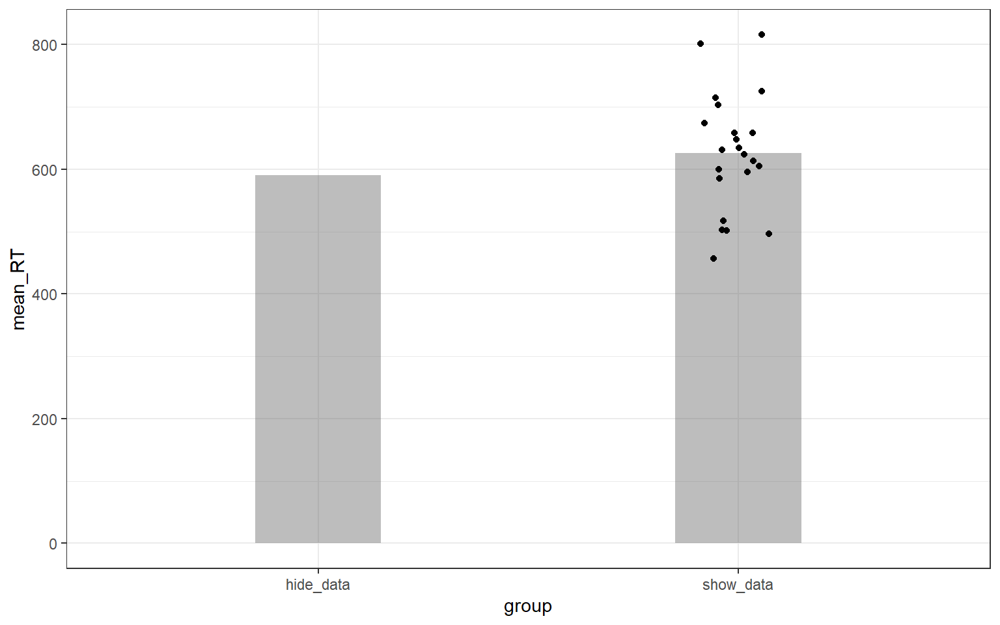

## PreClass Activity 2 (Additional)

### A short blog on Barplots

The data used in this preclass allows us to show you something that you might find interesting. As we mentioned back in lab 3 on visualisation, the barplot is becoming less frequently used, as summarised in this blog: <a href="https://garstats.wordpress.com/2016/03/09/one-simple-step-to-improve-statistical-inferences/" target = "_blank">One simple step to improve statistical inferences</a>. The data we have used today demonstrate the point that a simple barplot can actually be somewhat misleading about the data. Have a look at the figure below. Both bars represent the data from our 22 NS participants. The column on the left, `hide_data`, is a standard representation (albeit without error bars) whereas the column on the right, `show_data`, demonstrates the issue. Looking at the column on the left, the assumption is that all the data is around the peak of the column. However, looking at the column on the right, we can see that this is not the case and there are participants both above and below the mean by approximately 100 ms. This misleading perception, when the data is hidden, was tested and shown to exist in participants viewing these figures by <a href="https://link.springer.com/article/10.3758/s13423-012-0247-5" target = "_blank">Newman and Scholl (2012)</a> which you can read up on if you like. The main thing to keep in mind is that barplots can be misleading and displaying the individual data may be more informative. 

(\#fig:ch6-preclass-blog-figure)How representative are barplots of the actual spread of the data!

That's all there is to this short and sweet blog on showing more information than a basic barchart. The function we use to do this is called `geom_jitter()` and it gets added to a visualisation pipeline just like other `geom_?()`s that we have used. Look out for it in the coming labs. 

