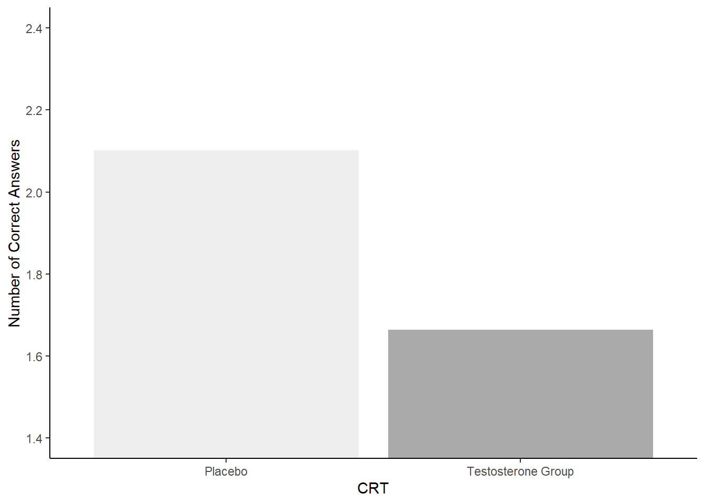

## Solutions to Questions


Below you will find the solutions to the questions for the Activities for this chapter. Only look at them after giving the questions a good try and speaking to the tutor about any issues.

### PreClass Activities

#### PreClass Task 1

```r
ns_data <- tibble(participant = 1:22,
                  valid_rt = c(631.2,800.8,595.4,502.6,604.5,
                               516.9,658.0,502.0,496.7,600.3,
                               714.6,623.7,634.5,724.9,815.7,
                               456.9,703.4,647.5,657.9,613.2,
                               585.4,674.1))
```

[Return to Task](#Ch6PreClassQueT1)

#### PreClass Task 2

```r
woods_mean <- 590

n_participants <- ns_data %>%
  filter(valid_rt > woods_mean) %>%
  nrow()
```

* Giving an n_participants value of 16

[Return to Task](#Ch6PreClassQueT2)

#### PreClass Task 3

* You can use the density function:

```r
sum(dbinom(n_participants:nrow(ns_data), nrow(ns_data), .5))
```

```
## [1] 0.0262394
```

* Or, the cumulative probability function:

```r
pbinom(n_participants - 1L, nrow(ns_data), .5, lower.tail = FALSE)
```

```
## [1] 0.0262394
```

* Or, If you were to plug in the numbers directly into the code:

```r
sum(dbinom(16:22,22, .5))
```

```
## [1] 0.0262394
```

* Or, finally, remembering we need to specify a value lower than our minimum participant number as `lower.tail = FALSE`.

```r
pbinom(15, 22, .5, lower.tail = FALSE)
```

```
## [1] 0.0262394
```

It is better practice to use the first two solutions, which pull the values straight from ns_data, as you run the risk of entering an error into your code if you plug in the values manually.

[Return to Task](#Ch6PreClassQueT3)

#### PreClass Task 4

* For `ns_data_mean` use `summarise()` to calculate the mean and then `pull()` the value.
* For `ns_data_sd` use `summarise()` to calculate the sd and then `pull()` the value.

```r
# the mean
ns_data_mean <- ns_data %>%
  summarise(m = mean(valid_rt)) %>%
  pull(m)  

# the sd
ns_data_sd <- ns_data %>%
  summarise(sd = sd(valid_rt)) %>%
  pull(sd)
```

**NOTE:** You could print them out on the screen if you wanted to "\\n" is the end of line symbol so that they print on different lines


```r
cat("The mean number of hours was", ns_data_mean, "\n")
cat("The standard deviation was", ns_data_sd, "\n")
```

```
## The mean number of hours was 625.4636 
## The standard deviation was 94.30693
```

[Return to Task](#Ch6PreClassQueT4)

#### PreClass Task 5

```r
t_obs <- (ns_data_mean - woods_mean) / (ns_data_sd / sqrt(nrow(ns_data)))
```

* Giving a t_obs value of 1.7638067

[Return to Task](#Ch6PreClassQueT5)

#### PreClass Task 6

If using values straight from ns_data, and multiplying by 2 for a two-tailed test, you would do the following:

```r
pval <- pt(abs(t_obs), nrow(ns_data) - 1L, lower.tail = FALSE) * 2L
```

* Giving a pval of 0.0923092

But you can also get the same answer by plugging the values in yourself - though this method runs the risk of error and you are better off using the first calculation as those values come straight from ns_data. :

```r
pval2 <- pt(t_obs, 21, lower.tail = FALSE) * 2
```

* Giving a pval of 0.0923092

[Return to Task](#Ch6PreClassQueT6)

#### PreClass Task 7

The t-test would be run as follows, with the output shown below:


```r
t.test(pull(ns_data, valid_rt), mu = woods_mean)
```

```
## 
## 	One Sample t-test
## 
## data:  pull(ns_data, valid_rt)
## t = 1.7638, df = 21, p-value = 0.09231
## alternative hypothesis: true mean is not equal to 590
## 95 percent confidence interval:
##  583.6503 667.2770
## sample estimates:
## mean of x 
##  625.4636
```

[Return to Task](#Ch6PreClassQueT7)

#### PreClass Task 8

According to the one-sample t-test these participants are responding in a similar manner as the participants from the original study, and as such, we may be inclined to assume that the recruitment process of our pilot experiment is working well.

However, according to the binomial test the participants are responding differently from the original sample. So which test result should you take as the finding? 

Keep in mind that the binomial test is very rough and categorises participants into yes or no. The one-sample t-test uses much more of the available data and to some degree would give a more accurate answer. However, the fact that two tests give really different answers may give you reason to question whether or not the results are stable and potentially you should look to gather a larger sample to get a more accurate representation of the population.

[Return to Task](#Ch6PreClassQueT8)


### InClass Activities

#### InClass Task 1


```r
library("tidyverse")
library("broom") # you'll need broom::tidy() later

evaluators <- read_csv("evaluators.csv")

evaluators %>%
  summarize(mean_age = mean(age, na.rm = TRUE))

evaluators %>%
  count(sex)

# If using `recode()`:
evaluators %>%
  count(sex) %>%
  mutate(sex_names = recode(sex, "1" = "male", "2" = "female"))
```

* The mean age of the evaluators was 30.9
* The standard deviatoin of the age of the evaluators was 6.24
* There were 4 males and `e_count %>% filter(sex_names == "female") %>% pull(n)` females, with 5 people not stating a sex.


[Return to Task](#Ch6InClassQueT1)

#### InClass Task 2

* load in the data

```r
ratings <- read_csv("ratings.csv")
```

1. First pull out the ratings associated with intellect

```r
iratings <- ratings %>%
  filter(Category %in% c("competent", "thoughtful", "intelligent"))
```

2. Next calculate means for each evaluator

```r
imeans <- iratings %>%
  group_by(eval_id) %>%
  summarise(Rating = mean(Rating))
```

3. Mutate on the Category variable. This way we can combine with 'impression' and 'hire' into a single table which will be very useful!

```r
imeans2 <- imeans %>%
  mutate(Category = "intellect")
```

And then combine all the information in to one single tibble.

```r
ratings2 <- ratings %>%
  filter(Category %in% c("impression", "hire")) %>%
  bind_rows(imeans2) %>%
  inner_join(evaluators, "eval_id") %>%
  select(-age, -sex) %>%
  arrange(eval_id, Category)
```

[Return to Task](#Ch6InClassQueT3)

#### InClass Task 4

1. First we calculate the group means:


```r
group_means <- ratings2 %>%
  group_by(condition, Category) %>%
  summarise(m = mean(Rating), sd = sd(Rating))
```

```
## `summarise()` has grouped output by 'condition'. You can override using the `.groups` argument.
```

2. And we can call them and look at them by typing:

```r
group_means
```

3. Now to just look at intellect ratings we need to filter them into a new tibble:

```r
intellect <- filter(ratings2, Category == "intellect")
```

4. And then we run the actual t-test and tidy it into a table.
    * `t.test()` requires two vectors as input
    * `pull()` will pull out a single column from a tibble, e.g. Rating from intellect
    * `tidy()` takes information from a test and turns it into a table. Try running the t.test with and without piping into `tidy()` to see what it does differently.
 

```r
intellect_t <- t.test(intellect %>% filter(condition == "listened") %>% pull(Rating),
                      intellect %>% filter(condition == "read") %>% pull(Rating),
                      var.equal = TRUE) %>%
  tidy()
```

5. Now we repeat for HIRE and IMPRESSION

```r
hire <- filter(ratings2, Category == "hire")
hire_t <- t.test(hire %>% filter(condition == "listened") %>% pull(Rating),
                      hire %>% filter(condition == "read") %>% pull(Rating),
                 var.equal = TRUE) %>%
  tidy()
```

6. And for Impression

```r
impress <- filter(ratings2, Category == "impression")
impress_t <- t.test(impress %>% filter(condition == "listened") %>% pull(Rating),
                    impress %>% filter(condition == "read") %>% pull(Rating),
                    var.equal = TRUE) %>%
  tidy()
```

7. Before combining all into one table showing all three t-tests

```r
results <- bind_rows("hire" = hire_t, 
                     "impression" = impress_t,
                     "intellect" = intellect_t, .id = "id")

results
```

[Return to Task](#Ch6InClassQueT4)

#### Going Further with your coding

**An alternative solution to Task 4:** There is actually a quicker way to do this analysis of three t-tests which you can have a look at below if you have the time. This uses very advanced coding with some functions we won't really cover in this book. Do not worry if you can't quite follow it though; the main thing is to understand what we covered in the main chapter activities - the outcome is the same.


```r
ratings2 %>%
  group_by(Category) %>%
  nest() %>%
  mutate(ttest = map(data, function(x) {
    t.test(Rating ~ condition, x, var.equal = TRUE) %>% 
      tidy()
  })) %>%
  select(Category, ttest) %>%
  unnest(cols = c(ttest))
```

<div class="kable-table">

<table>
 <thead>
  <tr>
   <th style="text-align:left;"> Category </th>
   <th style="text-align:right;"> estimate </th>
   <th style="text-align:right;"> estimate1 </th>
   <th style="text-align:right;"> estimate2 </th>
   <th style="text-align:right;"> statistic </th>
   <th style="text-align:right;"> p.value </th>
   <th style="text-align:right;"> parameter </th>
   <th style="text-align:right;"> conf.low </th>
   <th style="text-align:right;"> conf.high </th>
   <th style="text-align:left;"> method </th>
   <th style="text-align:left;"> alternative </th>
  </tr>
 </thead>
<tbody>
  <tr>
   <td style="text-align:left;"> hire </td>
   <td style="text-align:right;"> 1.825397 </td>
   <td style="text-align:right;"> 4.714286 </td>
   <td style="text-align:right;"> 2.888889 </td>
   <td style="text-align:right;"> 2.620100 </td>
   <td style="text-align:right;"> 0.0126745 </td>
   <td style="text-align:right;"> 37 </td>
   <td style="text-align:right;"> 0.4137694 </td>
   <td style="text-align:right;"> 3.237024 </td>
   <td style="text-align:left;"> Two Sample t-test </td>
   <td style="text-align:left;"> two.sided </td>
  </tr>
  <tr>
   <td style="text-align:left;"> impression </td>
   <td style="text-align:right;"> 1.894180 </td>
   <td style="text-align:right;"> 5.968254 </td>
   <td style="text-align:right;"> 4.074074 </td>
   <td style="text-align:right;"> 2.850766 </td>
   <td style="text-align:right;"> 0.0070911 </td>
   <td style="text-align:right;"> 37 </td>
   <td style="text-align:right;"> 0.5478846 </td>
   <td style="text-align:right;"> 3.240475 </td>
   <td style="text-align:left;"> Two Sample t-test </td>
   <td style="text-align:left;"> two.sided </td>
  </tr>
  <tr>
   <td style="text-align:left;"> intellect </td>
   <td style="text-align:right;"> 1.986773 </td>
   <td style="text-align:right;"> 5.634921 </td>
   <td style="text-align:right;"> 3.648148 </td>
   <td style="text-align:right;"> 3.525933 </td>
   <td style="text-align:right;"> 0.0011444 </td>
   <td style="text-align:right;"> 37 </td>
   <td style="text-align:right;"> 0.8450652 </td>
   <td style="text-align:right;"> 3.128480 </td>
   <td style="text-align:left;"> Two Sample t-test </td>
   <td style="text-align:left;"> two.sided </td>
  </tr>
</tbody>
</table>

</div>

### Test Yourself Activities

#### Assignment Task 1A: Libraries


```r
library(broom)
library(tidyverse)
```

[Return to Task](#Ch6AssignQueT1)

#### Assignment Task 1B: Loading in the data

* Use `read_csv()` to read in data!


```r
crt <- read_csv("data/06-s01/homework/CRT_Data.csv")
```


```r
crt <- read_csv("CRT_Data.csv")
```

[Return to Task](#Ch6AssignQueT1)

#### Assignment Task 2: Selecting only relevant columns

The key columns are:

* ID
* Treatment
* CorrectAnswers

Creating `crt2` which is a tibble with 3 columns and 243 rows.


```r
crt2 <- select(crt, ID, Treatment, CorrectAnswers)
```

[Return to Task](#Ch6AssignQueT2)

#### Assignment Task 3: Verify the number of subjects in each group

The Participants section of the article contains the following statement:

**243 men (mostly college students; for demographic details, see Table S1 in the Supplemental Material available online) were randomly administered a topical gel containing either testosterone (n = 125) or placebo (n = 118).**

In the t3 code block below, replace the `NULLs` with lines of code to calculate:

1. The number of men in each Treatment. This should be a tibble/table called `cond_counts` containing a column called `Treatment` showing the two groups and a column called `n` which shows the number of men in each group.

2. The total number of men in the sample. This should be a single value, not a tibble/table, and should be stored in `n_men`. 

You know the answer to both of these tasks already. Make sure that your code gives the correct answer!

For `cond_counts`, you could do:


```r
cond_counts <- crt2 %>% group_by(Treatment) %>% summarise(n = n())
```
Or alternatively

```r
cond_counts <- crt2 %>% count(Treatment)
```

For `n_men`, you could do:

```r
n_men <- crt2 %>% summarise(n = n()) %>% pull(n)
```
Or alternatively

```r
n_men <- nrow(crt2)
```

**Solution:**

When formatted with inline R code as below:

**<code>&#096;r n_men&#096;</code> men (mostly college students; for demographic details, see Table S1 in the Supplemental Material available online) were randomly administered a topical gel containing either testosterone (n = <code>&#096;r cond_counts %>% filter(Treatment == 1) %>% pull(n)&#096;</code>) or placebo (n = <code>&#096;r cond_counts %>% filter(Treatment == 0) %>% pull(n)&#096;</code>).**

should give:

**243 men (mostly college students; for demographic details, see Table S1 in the Supplemental Material available online) were randomly administered a topical gel containing either testosterone (n = 125) or placebo (n = 118).**

[Return to Task](#Ch6AssignQueT3)

#### Assignment Task 4: Reproduce Figure 2A

You could produce a good representation of Figure 2A with the following approach:


```r
crt_means <- crt2 %>% 
  group_by(Treatment) %>% 
  summarise(m = mean(CorrectAnswers), sd = sd(CorrectAnswers)) %>%
  mutate(Treatment = recode(Treatment, "0" = "Placebo", "1" = "Testosterone Group"))

ggplot(crt_means, aes(Treatment, m, fill = Treatment)) + 
  geom_col() + 
  theme_classic() + 
  labs(x = "CRT", y = "Number of Correct Answers") +
  guides(fill = "none") +
  scale_fill_manual(values = c("#EEEEEE","#AAAAAA")) +
  coord_cartesian(ylim = c(1.4,2.4), expand = TRUE)
```

<div class="figure" style="text-align: center">

<p class="caption">(\#fig:t4)A representation of Figure 2A</p>
</div>

[Return to Task](#Ch6AssignQueT4)

#### Assignment Task 5: Interpreting your Figure

Option 3 is the correct answer given that:

The Testosterone group (M = 1.66, SD = 1.18) would appear to have fewer correct answers on average than the Placebo group (M = 2.10, SD = 1.02) on the Cognitive Reflection Test suggesting that testosterone does in fact inhibit the ability to override incorrect intuitive judgements with the correct response. 


```r
answer_t5 <- 3
```

[Return to Task](#Ch6AssignQueT5)

#### Assignment Task 6: t-test

You need to pay attention to the order when using this first approach, making sure that the **0** group are entered first. This will put the Placebo groups as Estimate1 in the output. In reality it does not change the values, but the key thing is that if you were to pass this code on to someone, and they expect Placebo to be Estimate1, then you need to make sure you coded it that way.


```r
t_table <- t.test(crt2 %>% filter(Treatment == 0) %>% pull(CorrectAnswers),
                  crt2 %>% filter(Treatment == 1) %>% pull(CorrectAnswers),
                  var.equal = TRUE) %>%
  tidy()
```

* Alternatively, you could use what is known as the formula approach as shown below. Here you state the `DV ~ IV` and you say the name of the tibble in `data = ...`. You just need to make sure that the columns you state as the DV and the IV are actually in the tibble!


```r
t_table <- t.test(CorrectAnswers ~ Treatment, data = crt2, var.equal = TRUE) %>% tidy()
```

[Return to Task](#Ch6AssignQueT6)

#### Assignment Task 7: Reporting results

* The degrees of freedom (df) is found under `parameter`

```r
t_df <- t_table$parameter
```

* An alternative option for this would be as follows, using the `pull()` method. This would work for B to D as well


```r
t_df <- t_table %>% pull(parameter)
```


* The t-value is found under `statistic`

```r
t_value <- t_table$statistic %>% round(3)
```

* The p-value is found under `p.value`

```r
p_value <- t_table$p.value %>% round(3)
```

* The absolute difference between the two means can be calculated as follows:

```r
t_diff <- (t_table$estimate1 - t_table$estimate2) %>% round(3) %>% abs()
```

If you have completed t7A to t7D accurately, then when knitted, Option 4 would be stated as such

**The testosterone group performed significantly worse (0.438 fewer correct answers) than the placebo group, t(241) = 3.074, p = 0.002**

and would therefore be the correct answer! 


```r
answer_t7e <- 4
```

[Return to Task](#Ch6AssignQueT7)

<span style="font-size: 22px; font-weight: bold; color: var(--purple);">Chapter Complete!</span>
