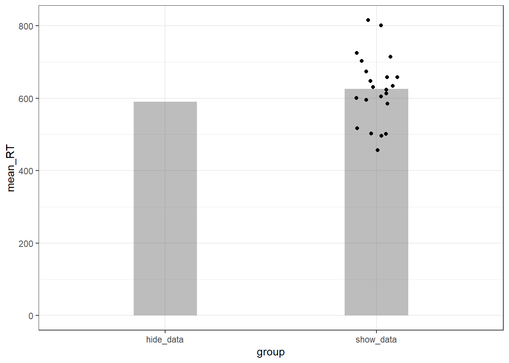
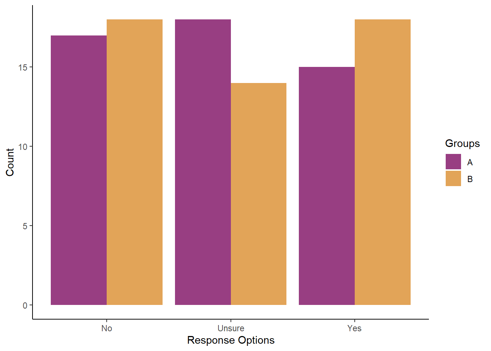

## Additional Material

Below is some additional material that might help you understand the tests in this Chapter a bit more as well as some additional ideas.


### More on `t.test()` - vectors vs. formula {-}

A quick note on running the t-test in two different ways. In the lab we showed you how to run a t-test on a between-subjects design. This is the Welch's t-test version of the code from the lab:


```r
t_table <- t.test(crt2 %>% filter(Treatment == 0) %>% pull(CorrectAnswers),
                  crt2 %>% filter(Treatment == 1) %>% pull(CorrectAnswers),
                  var.equal = FALSE) %>%
  tidy()
```

This is sometimes referred to as the vector approach, and what the code is doing is taking each groups' data as a vector input.  For example, if you were to just look at the data for the Treatment 0 group then that line of code:


```r
crt2 %>% filter(Treatment == 0) %>% pull(CorrectAnswers)
```

shows just these values:


```
##   [1] 2 2 3 3 3 2 1 0 2 0 2 1 3 2 2 3 1 3 2 3 2 0 2 3 3 3 3 2 2 2 3 0 3 3 3 0 0
##  [38] 3 3 1 3 1 2 3 3 1 3 3 3 3 2 3 2 2 2 2 3 3 1 3 1 0 3 1 3 1 2 3 3 0 2 2 2 3
##  [75] 1 2 3 0 3 1 1 3 3 0 1 0 3 2 2 3 1 3 3 2 3 1 3 2 3 3 3 3 3 3 2 3 3 2 2 0 3
## [112] 0 1 2 2 3 3 3
```

And likewise the Treatment 1 line of code just gives these values:


```
##   [1] 2 0 0 1 3 0 0 2 2 3 1 3 3 1 0 2 1 0 0 3 2 0 3 0 3 3 3 0 2 0 3 3 3 1 0 0 1
##  [38] 2 3 2 2 2 3 3 1 0 3 0 1 1 1 0 0 1 2 3 3 0 2 2 3 3 2 3 3 3 3 3 3 1 2 3 1 1
##  [75] 2 3 3 0 2 2 1 1 2 3 0 0 3 0 1 2 0 0 0 0 3 1 3 2 2 2 1 2 3 3 0 3 1 0 1 2 0
## [112] 2 2 2 3 2 3 3 3 0 3 0 1 2 3
```

And the `t.test()` function is just saying this is group 1's data, this is group 2's data, and I am comparing them. However the eagle-eyed of you will have seen in the solution an alternative code, that looks like:


```r
t_table <- t.test(CorrectAnswers ~ Treatment, data = crt2, var.equal = FALSE) %>% tidy()
```

This is the formula method and if you look at the structure of `crt2` (the first 6 rows are shown below) you get an idea of how the formula approach works:

<div class="kable-table">

<table>
 <thead>
  <tr>
   <th style="text-align:right;"> ID </th>
   <th style="text-align:right;"> Treatment </th>
   <th style="text-align:right;"> CorrectAnswers </th>
  </tr>
 </thead>
<tbody>
  <tr>
   <td style="text-align:right;"> 11 </td>
   <td style="text-align:right;"> 1 </td>
   <td style="text-align:right;"> 2 </td>
  </tr>
  <tr>
   <td style="text-align:right;"> 12 </td>
   <td style="text-align:right;"> 1 </td>
   <td style="text-align:right;"> 0 </td>
  </tr>
  <tr>
   <td style="text-align:right;"> 13 </td>
   <td style="text-align:right;"> 1 </td>
   <td style="text-align:right;"> 0 </td>
  </tr>
  <tr>
   <td style="text-align:right;"> 14 </td>
   <td style="text-align:right;"> 1 </td>
   <td style="text-align:right;"> 1 </td>
  </tr>
  <tr>
   <td style="text-align:right;"> 15 </td>
   <td style="text-align:right;"> 1 </td>
   <td style="text-align:right;"> 3 </td>
  </tr>
  <tr>
   <td style="text-align:right;"> 16 </td>
   <td style="text-align:right;"> 1 </td>
   <td style="text-align:right;"> 0 </td>
  </tr>
</tbody>
</table>

</div>

The formula approach works as `t.test(DV ~ IV, data = my_data)` where:

* DV is the name of the column with your responses (e.g. mean reaction time)
* IV is the name of the column with your groups (in categorical form - e.g. 1 vs 0)
* `~` means "by" or "based on" or "split up by". So test the DV based on the IV grouping
* and my_data is the name of your tibble.

Whichever approach you use, the observed t-value, p-value, and df (parameter) should be the same! What might change is what the t-test considers as group 1 and what it considers group 2. And from your knowledge of the t-test formula, this will affect whether your t-test is positive or negative.  For example:


```r
t_table <- t.test(crt2 %>% filter(Treatment == 0) %>% pull(CorrectAnswers),
                  crt2 %>% filter(Treatment == 1) %>% pull(CorrectAnswers),
                  var.equal = FALSE) %>%
  tidy()
```

Gives the t-value of t = 3.09, whereas if you switch the order of inputting the Treatment groups as such:


```r
t_table <- t.test(crt2 %>% filter(Treatment == 1) %>% pull(CorrectAnswers),
                  crt2 %>% filter(Treatment == 0) %>% pull(CorrectAnswers),
                  var.equal = FALSE) %>%
  tidy()
```

You get a t-value of t = -3.09. Same value (or magnitude) just one is positive and the other is negative, because the order of who is Group 1 and who is group 2 is switched.  And just for comparion, the formula approach:


```r
t_table <- t.test(CorrectAnswers ~ Treatment, data = crt2, var.equal = FALSE) %>% tidy()
```

Gives a t-value of t = 3.09. So again the same magnitude but you are not controlling who is Group 1 and who is Group 2.

Long story short is that both methods, if used appropriately, run the same analysis. The benefit of the vector approach is that you can dictate in your analysis who is Group 1 and who is Group 2. And that is really the only difference.

### Misleading and Appropriate Barplots {-}

**Misleading Barplots**

The data used in the PreClass activities allows us to show you something that you might find interesting. As we mentioned back in Chapter 3 on visualisation, the barplot is becoming less frequently used, as summarised in this blog: <a href="https://garstats.wordpress.com/2016/03/09/one-simple-step-to-improve-statistical-inferences/" target = "_blank">One simple step to improve statistical inferences</a>. The data we have used today demonstrate the point that a simple barplot can actually be somewhat misleading about the data. Have a look at the figure below. Both bars represent the data from our 22 Normal Sleep participants. The column on the left, `hide_data`, is a standard representation (albeit without error bars) whereas the column on the right, `show_data`, demonstrates the issue. Looking at the column on the left, the assumption is that all the data is around the peak of the column. However, looking at the column on the right, we can see that this is not the case and there are participants both above and below the mean by approximately 100 ms. This misleading perception, when the data is hidden, was tested and shown to exist in participants viewing these figures by <a href="https://link.springer.com/article/10.3758/s13423-012-0247-5" target = "_blank">Newman and Scholl (2012)</a> which you can read up on if you like. 

<div class="figure" style="text-align: center">

<p class="caption">(\#fig:ch6-preclass-blog-figure)How representative are barplots of the actual spread of the data!</p>
</div>

The function we use to show the data points is `geom_jitter()` and it gets added to a visualisation pipeline just like other `geom_?()`s that we have used; your code will look like something like this:


```r
ggplot(my_data, aes(x = my_x_variable, y = my_y_variable)) +
  geom_col() +
  geom_jitter(width = .1)
```

Look out for it in the coming chapters but the main thing to keep in mind is that barplots can be misleading and displaying the individual data may be more informative - particularly when the response measured creates a spread of data.

**Appropriate Barplots**

That said, barplots do have their place in data analysis and research methods. The best time to use a barplot is when the value is a count - i.e. when the value had no variability in it.  A great example of this is in observational research using categorical data. Think about the table we simulated for the chi-squre data as part of the Additional Materials in Chapter 5. Here is that table again:


<table>
<caption>(\#tab:lab6-additional-chi-table)Cross-Tabulation Table of Simulated Data from Chapter 5 Additional Materials</caption>
 <thead>
  <tr>
   <th style="text-align:center;"> Groups </th>
   <th style="text-align:center;"> No </th>
   <th style="text-align:center;"> Unsure </th>
   <th style="text-align:center;"> Yes </th>
   <th style="text-align:center;"> Total </th>
  </tr>
 </thead>
<tbody>
  <tr>
   <td style="text-align:center;"> A </td>
   <td style="text-align:center;"> 17 </td>
   <td style="text-align:center;"> 18 </td>
   <td style="text-align:center;"> 15 </td>
   <td style="text-align:center;"> 50 </td>
  </tr>
  <tr>
   <td style="text-align:center;"> B </td>
   <td style="text-align:center;"> 18 </td>
   <td style="text-align:center;"> 14 </td>
   <td style="text-align:center;"> 18 </td>
   <td style="text-align:center;"> 50 </td>
  </tr>
</tbody>
</table>

We have two groups with three possible responses and each participants can only give one response. What that means, for example, is that there is no variation in the number of people who in Group A said No - it is exactly 17 people. Likewise, exactly 14 people in Group B said unsure. So here a barplot actually makes sense to use as it accurately reflects the value in that group/condition and no data is hidden. The plot for the above table might look like this:

<div class="figure" style="text-align: center">

<p class="caption">(\#fig:lab6-additional-figure)A barplot works well with categorical data</p>
</div>

In short, the main message about any visualisation is about accurately and clearly conveying that information to your reader. If there is a spread of data within a variable then try to show that more clearly with error bars and data points, perhaps even using a violin plot instead of a barplot. If however there is no spread of data within a variable then a barplot works well.

### Analysing chi-squares {-}

Finally, to round of this additional material, we thought it might be handy to show how to run a chi-square analysis. We cover the chi-square more in lectures but adding it here might help some people. We won't really look at the hand calculations, but you will know that the formula for the chi-square is:

$x_c^2 = \sum\frac{(O_i - E_i)^2}{E_i}$

* where $x_c^2$ is the chi-square symbol - often simplified to $x_2$
* $O_i$ is the observed value of group {i} and
* $E_i$ is the expected value of group {i}

And we can use the data from above to show how to quickly run the chi-square analysis on the table. First we need to tidy up the table to get rid of the `Groups` and `Total` columns, leaving us with a tibble called `chi_table` that has this structure:


<table>
<caption>(\#tab:lab6-additional-chi-table-2)Cross-Tabulation Table Data for analysis</caption>
 <thead>
  <tr>
   <th style="text-align:center;"> No </th>
   <th style="text-align:center;"> Unsure </th>
   <th style="text-align:center;"> Yes </th>
  </tr>
 </thead>
<tbody>
  <tr>
   <td style="text-align:center;"> 17 </td>
   <td style="text-align:center;"> 18 </td>
   <td style="text-align:center;"> 15 </td>
  </tr>
  <tr>
   <td style="text-align:center;"> 18 </td>
   <td style="text-align:center;"> 14 </td>
   <td style="text-align:center;"> 18 </td>
  </tr>
</tbody>
</table>

Now to analyse the data we use the `chisq.test()` function. There are really only two arguments you need to think about:

* your data - for us stored in `chi_table`
* and whether to set `correct` as **TRUE** or **FALSE**. This is Yates' Continuity Correction. The default is set as TRUE but a lot of people set it as FALSE so we will select that today.

And we run the analysis as such:


```r
chisq_result <- chisq.test(chi_table, correct = FALSE) %>% tidy()
```

Giving the following result:

<table>
<caption>(\#tab:lab6-additional-chi-table-red)Chi-Square Result</caption>
 <thead>
  <tr>
   <th style="text-align:center;"> statistic </th>
   <th style="text-align:center;"> p.value </th>
   <th style="text-align:center;"> parameter </th>
   <th style="text-align:center;"> method </th>
  </tr>
 </thead>
<tbody>
  <tr>
   <td style="text-align:center;"> 0.8012987 </td>
   <td style="text-align:center;"> 0.6698849 </td>
   <td style="text-align:center;"> 2 </td>
   <td style="text-align:center;"> Pearson's Chi-squared test </td>
  </tr>
</tbody>
</table>

And could be written up as $x_c^2$(df = 2, N = 100) = 0.8, p = 0.67. And if you wanted to check the output and calculate the data by hand, or needed to do further analysis, you can see the expected values by doing the analysis but not tidying it, as follows:


```r
chisq_untidy <- chisq.test(chi_table, correct = FALSE)

chisq_untidy$expected
```

```
##        No Unsure  Yes
## [1,] 17.5     16 16.5
## [2,] 17.5     16 16.5
```

And if you wanted the expected values for just one of the groups - say the second group, Group B:


```r
chisq_untidy$expected[2,]
```

```
##     No Unsure    Yes 
##   17.5   16.0   16.5
```

Or even just the observed values to check you entered the data correctly:


```r
chisq_untidy$observed
```

```
##      No Unsure Yes
## [1,] 17     18  15
## [2,] 18     14  18
```

We will leave that there but hopefully this gives you some additional insight into how to analyse a chi-square test.

<span style="font-size: 22px; font-weight: bold; color: var(--purple);">End of Additional Material!</span>
