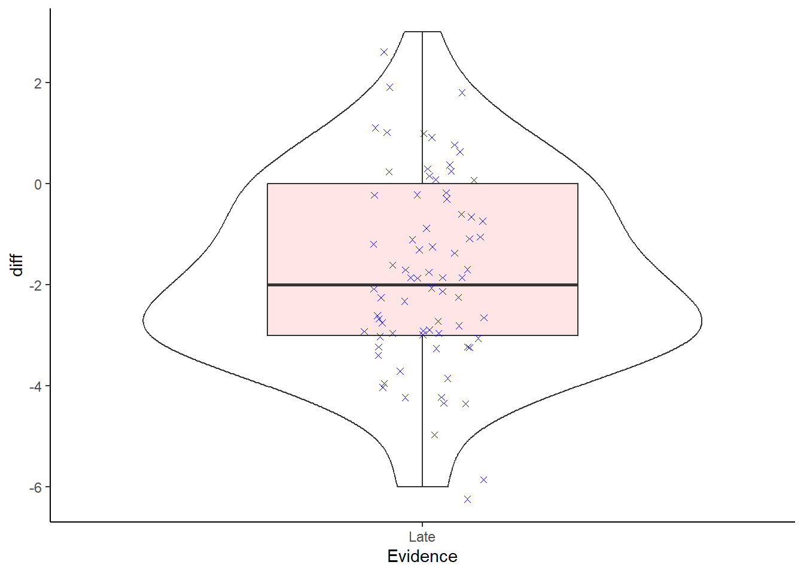

## The Paired-Sample t-test

Up to now we have covered the one-sample t-test and the between-subjects/two-sample t-test, and we have talked a little about the assumptions of the between-subjects t-test. We are now going to expand on that by looking at the final t-test we need to cover, the paired-sample/within-subject t-test; used when you have the same participants in both conditions, or you have two groups of people that are very closely matched on various demographics such as age, IQ, verbal acuity, etc. 

In exploring the paired-sample t-test we will also look more at checking the assumptions of t-tests. If you refer back to the earlier activities you will know that many of the assumptions of the different t-tests are largely similar (apart from equal variance, for example), so by looking at these assumption check here you can apply them to other tests.

For this activity we will look at a replication of Furnham (1986) that the School of Psychology & Neuroscience, University of Glasgow, carried out in 2016-2017. It would be worth familiarising yourself with the original study at some point for more information regarding the concepts of the study, but it is not essential in order to complete the exercises: <a href="http://www.tandfonline.com/doi/abs/10.1080/00221309.1986.9711045" target = "_blank">Furnham, A. (1986), The Robustness of the Recency Effect: Studies Using Legal Evidence</a>. We will explain a little about the study before carrying out some tasks to check the assumptions and to analyse the data.

### Data Set: Juror Decision Making

The research question in this experiment is: Does the order of information affect juror judgments of guilt or innocence? Thus, the overall aim of the original experiment was to investigate whether the decision a jury member makes about the innocence or guilt of a defendant could be influenced by something as simple as *when crucial evidence is presented during a trial*. During the experiment participants (Level 2 Psychology students) listened to a series of recordings that recreated the 1804 trial of a man known as Joseph Parker who was accused of assuming two identities and marrying two women; i.e. bigamy. Each participant listened to the same recordings of evidence, presented by both prosecution and defense witnesses, and were asked to judge how guilty they thought Mr. Parker was at 14 different time points during the experiment on a scale of 1 to 9: 1 being innocent and 9 being guilty. The 14 time points came immediately after certain pieces of evidence.

The manipulation in the experiment was that the order of evidence was altered so that half the participants received one order of evidence and the other half received the second order of evidence. Key to the order change was the time at which a *critical* piece of evidence was presented. This critical evidence proved that the defendant was innocent. The **Middle** group heard this evidence at Timepoint 9 of the trial whereas the **Late** group heard this evidence at Timepoint 13. You will have an opportunity to look at all the data in due course but, for today's exercise, we will only focus on the **Late** group.

In this exercise, your task is to analyse the data to examine whether the participants' ratings of guilt significantly changed **before** and **after** the presentation of the critical evidence in the **Late** condition. If the critical evidence, which proved the defendant's innocence, had the desired effect then you should see a significant drop in ratings of guilt after hearing this evidence (Timepoint 13) compared to before (Timepoint 12). Or in other words, **we hypothesised that there would be a significant decrease in ratings of guilt, caused by presentation of the critical evidence, from Timepoint 12 to Timepoint 13.**

### Task 1: Load the data {#Ch7InClassQueT1}

* [Download the data for this experiment from here](data/07-s01/inclass/ch7_inclass_data.zip).
* Unzip the data and save it into a folder you have access to and set that folder as your working directory. 
* Open a new R Markdown document.
* Today you will need the `broom` and `tidyverse` libraries. Load these in this order. Remember that the order you load in libraries matters.
* Using `read_csv()`, load in the data from the experiment contained in `GuiltJudgements.csv` and store it in a tibble called `ratings`.

### Task 2: Wrangle the data {#Ch7InClassQueT2}

As above, you are only interested in the 75 participants of the **Late** group here and only for **Timepoints 12 (rating before key evidence) and 13 (rating after key evidence)**. But having had a look at `ratings` you will see that the Timepoints are in `wide` format (columns `1` to `14` - each a different timepoint) and the `Evidence` column contains the `Middle` group as well. Let's do some wrangling to make the data look like it is shown in Table 7.1 below. The steps to do this are as follows:

1. `filter()` only those participants from the `Late` condition.

2. `select()` only the Timepoints 12 and 13.

3. `rename()` these Timepoints as Twelve and Thirteen as numerical names are hard to deal with.  

4. `pivot_longer()` to gather the data so that you have the below structure. (Note: here only the first four rows are shown as an example).  

5. Do this all as one pipe and store it in a tibble called `lates`. Your tibble, `lates` will have 150 rows and 4 columns.

Check that your table looks like the table below.

<table>
<caption>(\#tab:table)How your table should look from Task 2</caption>
 <thead>
  <tr>
   <th style="text-align:center;"> Participant </th>
   <th style="text-align:center;"> Evidence </th>
   <th style="text-align:center;"> Timepoint </th>
   <th style="text-align:center;"> GuiltRating </th>
  </tr>
 </thead>
<tbody>
  <tr>
   <td style="text-align:center;"> 1 </td>
   <td style="text-align:center;"> Late </td>
   <td style="text-align:center;"> Twelve </td>
   <td style="text-align:center;"> 7 </td>
  </tr>
  <tr>
   <td style="text-align:center;"> 1 </td>
   <td style="text-align:center;"> Late </td>
   <td style="text-align:center;"> Thirteen </td>
   <td style="text-align:center;"> 5 </td>
  </tr>
  <tr>
   <td style="text-align:center;"> 2 </td>
   <td style="text-align:center;"> Late </td>
   <td style="text-align:center;"> Twelve </td>
   <td style="text-align:center;"> 5 </td>
  </tr>
  <tr>
   <td style="text-align:center;"> 2 </td>
   <td style="text-align:center;"> Late </td>
   <td style="text-align:center;"> Thirteen </td>
   <td style="text-align:center;"> 3 </td>
  </tr>
</tbody>
</table>
  

<div class='webex-solution'><button>Helpful Hint</button>

<div class="info">
<ol style="list-style-type: decimal">
<li><p>You need to specify the column you want to filter from, stating
which variable (i.e. <code>Late</code>) that this column is ‘equal to’
(i.e. ‘==’)</p></li>
<li><p>Other than the two columns representing Timepoints 12 and 13,
there are two other columns you need to keep in order to identify the
participant and group. Use the table as a guide.</p></li>
<li><p>When renaming, first state the new variable name and then
designate this to the old variable name.
i.e. <code>rename(data, new_column_name = old_column_name)</code>. If
the old column is a number, put it in backticks, e.g. Five = backtick 5
backtick (but be sure to use `s).</p></li>
<li><p>The structure shown has two new columns: <code>Timepoint</code>
and <code>GuiltRating</code>, which are both created from columns Twelve
to Thirteen. You should state these new column names when using
<code>pivot_longer()</code>, as well as the columns you used to create
them. Think about completing this:
<code>cols = X:Y, names_to = "Where", values_to = "Where"</code></p></li>
</ol>
</div>

</div>

<br>

<span style="font-size: 22px; font-weight: bold; color: var(--green);">Quickfire Questions</span>  

* To check you have completed this Task correctly, enter the appropriate values into the boxes. 
    - This dataset has: <input class='webex-solveme nospaces' size='1' data-answer='["4"]'/> columns by <input class='webex-solveme nospaces' size='3' data-answer='["150"]'/> rows and <input class='webex-solveme nospaces' size='2' data-answer='["75"]'/> participants.
    
### Task 3: Look at the histogram for normality {#Ch7InClassQueT3}

We are now going to show you how to start checking data in terms of assumptions such as normality. We will do this through creating some visualisations of the data and thinking about what these visualisations tell us about the data. 
First we will create a **histogram** for each of the two timepoints to see if their individual distributions appear normally distributed. 

* Use your data visualisation skills to plot a histogram for each TimePoint. Have the two histograms side-by-side in the one figure and set the histogram binwidth to something reasonable for this experiment.


<div class='webex-solution'><button>Helpful Hint</button>

<div class="info">
<ol style="list-style-type: decimal">
<li><p>ggplot() + geom_?</p></li>
<li><p>A histogram only requires you to state <code>aes(x)</code> and
not <code>aes(x, y)</code>. We are examining the differences in guilt
rating scores across participants. Which column from <code>lates</code>
should be ‘x’? It should be your categorical Independent
Variable.</p></li>
<li><p><code>binwidth</code> is an argument you can specify within
<code>geom_histogram()</code> such as
<code>geom_historgram(binwidth = ...)</code>. Think about an appropriate
binwidth. Your guilt rating scale runs from 1 to 9 in increments of
1.</p></li>
<li><p>You have used something like <code>facet_?()</code> to display a
categorical variables (i.e. <code>Timepoint</code>) according to the
different levels it contains. You need to specify the variable you want
to use, using <code>~</code> before the variable name.</p></li>
<li><p>Beyond this point, you can think about adding appropriate labels
and color if you like.</p></li>
</ol>
</div>

</div>


### Task 4: A boxplot of outliers {#Ch7InClassQueT4}

We can also check for outliers in the different conditions. Outliers can obviously create skewed data and make the mean value misleading.

* Create a boxplot for each `Timepoint` by `GuiltRating` and check for outliers. 


<div class='webex-solution'><button>Helpful Hint</button>

<div class="info">
<ol style="list-style-type: decimal">
<li><p>This time when using <code>ggplot()</code> to create a boxplot,
you need to specify both ‘x’, which is the discrete/categorical
variable, and ‘y’, which is the continuous variable.</p></li>
<li><ul>
<li>geom_boxplot() - see Chapter 3 for an example.</li>
</ul></li>
</ol>
</div>

</div>

<br>

<span style="font-size: 22px; font-weight: bold; color: var(--green);">Quickfire Questions</span>  

* How many outliers do you see? <select class='webex-select'><option value='blank'></option><option value=''>0</option><option value='answer'>1</option><option value=''>2</option><option value=''>3</option><option value=''>too many to count</option></select>

Remember that outliers are normally represented as dots or stars beyond the whiskers of the boxplot. As you will see in the solution the data contains an outlier. We won't deal with outliers today, but it is good to be able to spot them at the moment. It would be worth thinking about how you could deal with outliers. There are numerous methods such as replacing with a given value or removing the participants. Remember though that this decision, how to deal with outliers, and any deviation from normality, should be considered and written down in advance as part of your preregistration protocol. 

### Task 5: The violin plot {#Ch7InClassQueT5}

Boxplots and histograms tell you slightly different information about the same data, which we will discuss in a minute, and you are developing your skills of plotting and interpreting them. But we have already introduced you to a new type of figure that we can combine the information from a boxplot and a histogram into the one figure. We do this using a **violin plot** and can be created using the `geom_violin()` function. 

* Take the code you've written above for the boxplot (Task 4) and add on `geom_violin` as another layer. You may need to rearrange your code (i.e., the boxplot and violin plot functions) so that the violin plots appear underneath the boxplot. Think layers of the visualisation!


<div class='webex-solution'><button>Helpful Hint</button>

<div class="info">
<ul>
<li><p><code>ggplot()</code> works on layers - the first layer (i.e.,
the first plot you call) is underneath the second layer. This means that
to get a boxplot showing on top of a violin plot, the violin must come
first (i.e., you need to call <code>geom_violin()</code> before you call
<code>geom_boxplot()</code>)</p></li>
<li><p>We have embellished the figure a little in the solution that you
can have a look at once you have the basics sorted. Things like adding a
<code>width</code> call to the boxplot, or an <code>alpha</code> call to
the violin.</p></li>
</ul>
</div>

</div>

<br>

Do you see how the violin plot relates to the histogram you created earlier? In your head, rotate your histograms so that the bars are pointing to the left and imagine there is a mirror-image of them (making a two-sided histogram). This should look similar to your violin plot. Be sure to be able to still locate the outlier in the `Thirteen` condition.

<span style="font-size: 22px; font-weight: bold; color: var(--pink);">HOLD ON!!!</span>

As you will know from your lectures on the assumptions of a paired-sample t-test, when dealing with a within-subjects design, and a paired t-test, normality is actually determined based on *the difference between the two conditions*. That is, we should in fact check that *the distribution of the scores of the difference between the two conditions is normally distributed*. We have been looking at it in terms of separate conditions, to some degree to show you the process of the visualisations, but to really follow the paired-sample t-test we need to look at the normality of the difference. The code below will create a violin and boxplot visualisation of the difference between the two conditions and you should now be able to understand this code. 

Have a look at the output, and at the code, and think about whether the scores of the difference between the two conditions is normally distributed. 

Note: In the code below, outliers will appear as red circles and individual data points will appear as blue Xs. Can you see what is controlling this? Why is this an important step? We will say why in a second, but it is worth thinking about yourself for a minute or two.


```r
lates %>% 
  spread(Timepoint, GuiltRating) %>%
  mutate(diff = Thirteen - Twelve) %>%
  ggplot(aes(x = Evidence, y = diff)) +
  geom_violin() +
  geom_boxplot(fill = "red", 
               width = .5, 
               alpha = .1, 
               outlier.colour = "red") +
  geom_jitter(color = "blue", 
              width = .1, 
              shape = 4) + 
  theme_classic()
```

<div class="figure" style="text-align: center">

<p class="caption">(\#fig:ch7-plot-vilplot)A violin and boxplot showing the distribution of the scores of the difference between the Thirteen and Twelve conditions. Individual participant data show as blue stars. Positive values would indicate that the rating in the Thirteen condition is higher than the rating in the Twelve condition. Oultiers will show as red circles.</p>
</div>


<span style="font-size: 22px; font-weight: bold; color: var(--pink);">Thinking Cap Point</span>

We have now checked our assumptions, but we sort of still need to make a decision regarding normality. Having had a look at the figures we have created, spend a few minutes thinking about whether the data is normally distributed or not. 

Also, think about why this data shows no outliers, but the individual conditions did show an outlier. Lastly, why is it important to code different presentations of outliers from the individual data points?


<div class='webex-solution'><button>Normal or not - Outliers vs Data Points - Answers</button>

<div class="info">
<p><strong>Is the data normally distributed or not?</strong></p>
<p>What you are looking for is a nice symmetry around the top and bottom
half of the violin and boxplot. You are looking for the median (thick
black line) to be roughly in the middle of the boxplot, and the whiskers
of the boxplot to be roughly equal length. If the median is closer to
the box’s lower values and the upper whisker is longer, then the data is
positively skewed. If the median is closer to the box’s higher values
and the lower whisker is longer, then the data is negatively skewed.</p>
<p>Also, you want the violin to have a bulge in the middle of the figure
and to taper off at the top and at the bottom. You also want to have
just one bulge on the violin (symbolising where most of the scores are).
Two bulges in the violin may be indicative of two different response
patterns or samples within the one dataset.</p>
<p>Now we need to make our judgement on normality. Remember that real
data will never have the textbook curve that the normal distribution
has. It will always be a bit messier than that and to some degree a
judgement call is needed or you need to use a test to compare your
sample distribution to the normal distribution. Tests such as the
Kolmogorov-Smirnov and the Shapiro-Wilks tests are sometimes recommended
to determine violation from a normal distribution. However, these last
two tests are not that reliable depending on sample size and often we
revert back to the judgement call. Again, it is really important that
steps are documented, so a future researcher can check and confirm the
process.</p>
<p>Overall, the data look normally distributed - at least visually
(albeit with a slight positive skew).</p>
<p><strong>Outliers vs Data Points?</strong></p>
<p>You have to be careful when using <code>geom_jitter()</code> to show
individual data points. You can overcomplicate a figure and if you have
a large number of participants then it might not make sense to include
the individual data points as it can just create a noisy figure. A
second point is that you want to make sure that your outliers are not
confused with individual data points; all outliers are data points, but
not all data points are outliers. So, in order not to confuse data and
outliers, you need to make sure you are properly controlling the colors
and shapes of different information in a figure. And be sure to explain
in the figure legend what each element shows.</p>
<p>Lastly, you will have noted that when we plotted the original
boxplots for the individual conditions, the <code>Thirteen</code> group
had an outlier. However, now when we plot the difference as a boxplot we
see no outliers. This is important and reinforces why you have to plot
the correct data in order to check the assumptions. The assumptions for
a paired-sample t-test is based on the <em>difference</em> between the
scores of individual participants. What we see here is that when we
calculate the difference of scores there is no outlier, even though the
original data point was an outlier. That is fine within consideration of
the assumption - as the assumption only looks at the difference. That
said, you might also want to check that the original outlier was an
acceptable value on the rating scale (e.g., between 1 and 9) and not
some wild value that has come about through bad data entry (e.g., a
rating of 13; say if the rating and the condition got mixed up
somehow).</p>
</div>

</div>

<br>

Great. We have run some data checks on the assumptions of the paired-sample t-test. We checked the data for normal distribution, using a violin plot and a boxplot, looking for skewed data and outliers. And from our understanding of the data, and of arguments in the field, whilst the rating scale used could be called ordinal, many, including Furnham treat it as interval. Finally, we haven't spotted any issues in our code to suggest that any participant didn't give a response in both conditions, but we can check that again in the descriptives - both conditions should have an n = 75.

We will do that check and also run some descriptives to start understanding the relationship between the two levels of interest: Timepoint 12 and Timepoint 13.

### Task 6: Calculating Descriptives {#Ch7InClassQueT6}

* Calculate the mean, standard deviation, and Lower and Upper values of the 95% Confidence Interval (CI) for both levels of the Independent Variable (the two time points). You will need to also calculate the `n()` - see Chapter 2 - and the Standard Error to complete this task. Store all this data in a tibble called `descriptives`.  
* The solution shows the values you should obtain, but be sure to have a go first. Be sure to confirm that both groups have 75 people in it!
* Answering these questions may help on calculating the CIs:

<span style="font-size: 22px; font-weight: bold; color: var(--green);">Quickfire Questions</span>  

* From the options, which equation would use to calculate the LowerCI? <select class='webex-select'><option value='blank'></option><option value=''>mean - 1.96 * sd</option><option value=''>mean * 1.96 - se</option><option value='answer'>mean - 1.96 * se</option><option value=''>mean * 1.96 - sd</option></select>
* From the options, which equation would use to calculate the UpperCI? <select class='webex-select'><option value='blank'></option><option value=''>mean + 1.96 * sd</option><option value=''>mean * 1.96 + se</option><option value='answer'>mean + 1.96 * se</option><option value=''>mean * 1.96 + sd</option></select>


<div class='webex-solution'><button>Helpful Hint</button>

<div class="info">
<ol style="list-style-type: decimal">
<li><code>group_by()</code> the categorical column
<code>Timepoint</code>. This is the column you want to compare groups
for.</li>
<li><code>summarise()</code></li>
<li>Different calculations can be used within the same
<code>summarise()</code> function as long as they are calculated in the
order which you require them. For example, you first need to calculate
the participant number, <code>n = n()</code>, and the standard
deviation, <code>sd = sd(variable)</code>, in order to calculate the
standard error, <code>se = sd/sqrt(n)</code>, which is required to
calculate your Confidence Intervals.</li>
<li>For the 95% Confidence Interval, you need to calculate an LowerCI
and a UpperCI using the appropriate formula. Remember it will be
<code>mean + 1.96*se</code> and <code>mean - 1.96*se</code>. If you
don’t include the mean then you are just calculating how much higher and
lower than the mean the CI should be. We want the actual interval.</li>
</ol>
</div>

</div>

<br>


<div class='webex-solution'><button>Explain this - What is 1.96?</button>

<div class="info">
<p>Let’s think about your task. You’re looking to calculate the 95%
Confidence Interval for normally distributed data. To do this you
require a z-score which tells you how many standard deviations you are
from the mean. 95% of the area under a normal distribution curve lies
within 1.96 standard deviations from the mean; i.e. 1.96 SD above and
below the mean.</p>
<p>If you were looking to calculate a 99% Confidence Interval you would
instead use a z-score of 2.576. This takes into account a greater area
under the normal distribution curve and so you are further away from the
mean (i.e., closer to the tail ends of the curve), resulting in a higher
z-score.</p>
</div>

</div>
  

### Task 7: Visualising Means and Descriptives {#Ch7InClassQueT7}

* Using the data in `descriptives`, produce a plot that visualises the mean and 95% Confidence Intervals.
    * One way would be a basic barplot, shown in previous chapters, with error bars indicating the 95% CI. 
    * To add the error bars you could add a layer like below.
    * Feel free to embellish the figure as you see fit.
    * We have shown a couple of options in the solution that you should look at and try adjusting, after you have tried your own plot.
    

```r
geom_errorbar(aes(ymin = LowerCI, ymax = UpperCI),
              position = "dodge", width = .15)
```


<div class='webex-solution'><button>Helpful Hint</button>

<div class="info">
<ul>
<li>We recommend using <code>geom_col()</code></li>
<li>Remember to add (+) the <code>geom_errorbar()</code> line above to
your code! Don’t pipe it.</li>
<li>In the above code for error bars, the aesthetic, <code>aes()</code>,
allows you to set the min and max values of the error bars - these will
be the max and min of your CIs.</li>
<li><code>position = "dodge"</code> does the same as
<code>position = position_dodge()</code> and
<code>position = position_dodge(width = .9)</code>. There are a number
of ways to use a position call and they all do the same thing.</li>
</ul>
</div>

</div>

<br>

**Important to remember**: As we have mentioned in previous labs, barplots are not that informative in themselves. Going ahead in your research, keep in mind that you should look to use plots that incorporate a good indication of the distribution/spread of the individual data points as well, when needed. Barplots give a good representation on categorical counts like in a chi-square test, but not so much on ordinal or interval data where there is likely to be a spread.

<span style="font-size: 22px; font-weight: bold; color: var(--pink);">Thinking Cap Point</span>

Now that we have some descriptives to look at we need to think what they tell us - or really how we interpret them. First thing is to think back to the hypothesis as every interpretation is phrased around the hypothesis. **We hypothesised that there would be a significant decrease in ratings of guilt, caused by presentation of the critical evidence, from Timepoint 12 to Timepoint 13.** Do you think there will be a significant difference between the two time points? What evidence do you have? Think about the overlap of confidence intervals! Remember the key thing at this stage is that it is a subjective impression - "It appears that there might be...." or words to that effect.

### Task 8: The paired-sample t-test {#Ch7InClassQueT8}

Now we have checked our assumptions and ran our descriptives, the last thing we need to do is to perform the paired-sample t-test to test the differences between the two time points. 

To perform the paired-sample t-test you use the same `t.test` function as you did in Chapter 6. However, this time you add the argument, `paired = TRUE`, as this is what tells the code "yes, this is a paired-sample t-test".

* Perform a paired-sample t-test between guilt ratings at the crucial time points (Twelve and Thirteen) for the participants in the Late group. Store the data (e.g., `tidy`) in a tibble called `results`.


<div class='webex-solution'><button>Helpful Hint</button>

<div class="info">
<p>From your work in earlier chapters you will know two ways to use the
<code>t.test()</code> function. The two options are:</p>
<p><strong>The formula approach</strong></p>
<ul>
<li><code>t.test(x ~ y, data, paired = TRUE/FALSE, alternative ="two.sided"/"greater"/"less")</code></li>
<li>where <code>x</code> is the columns containing your DV and
<code>y</code> is typically your grouping variable (i.e., your
independent variable).</li>
</ul>
<p><strong>The vector approach</strong></p>
<ul>
<li><p><code>t.test(data %&gt;% filter(condition1) %&gt;% pull(data),data %&gt;% filter(condition2) %&gt;% pull(data), paired = TRUE)</code></p></li>
<li><p>To pull out the <code>Twelve</code> and <code>Thirteen</code>
columns to pass as <code>condition1</code> and <code>condition2</code>,
you can use: <code>lates %&gt;% pull(Twelve)</code> and
<code>lates %&gt;% pull(Thirteen)</code>.</p></li>
</ul>
<p><strong>Regardless of method</strong></p>
<ul>
<li><p>Do not forget to state <code>paired = TRUE</code> or you will run
a between-subjects t-test</p></li>
<li><p>Once you’ve calculated <code>results</code>, don’t forget to
<code>tidy()</code> - you can add this using a pipe!</p></li>
<li><p>If you don’t quite understand the use of <code>tidy()</code> yet,
run your <code>t.test()</code> without <code>tidy()</code> and see what
happens!</p></li>
<li><p><strong>Note:</strong> Both options of running the t-test will
give the same result. The only difference will be whether the t-value is
positive or negative. Remember that the vector approach allows you to
state what is condition 1 and what is condition 2. The formula approach
just runs conditions alphabetically.</p></li>
</ul>
</div>

</div>

<br>

<span style="font-size: 22px; font-weight: bold; color: var(--pink);">Thinking Cap Point</span>

Now look at the output of your test within the tibble `results`. In your group, spend some time breaking down the results you can see. Do you understand what all the values mean and where they come from? You may have to match up some of your knowledge from your lectures. Was there a significant difference or not? We are about to write it up so best we know for sure.

### Task 9: The Write-up {#Ch7InClassQueT9}

Fill in the blanks below to complete this paragraph, summarising the results of the study. You will need to refer back to the information within `results` and `descriptives` to get the correct answers and to make sure you understand the output of the t-test. 

* Enter all values to two decimal places and present the absolute t-value.
* The solutions contain a completed version of this paragraph for you to compare against.

"A <select class='webex-select'><option value='blank'></option><option value='answer'>paired-sample t-test</option><option value=''>one-sample t-test</option><option value=''>between-samples t-test</option><option value=''>matched-pairs t-test</option></select> was ran to compare the change in guilt ratings before (M = <input class='webex-solveme nospaces' size='1' data-answer='["5.80","5.8"]'/>, SD = <input class='webex-solveme nospaces' size='1' data-answer='["1.50","1.5"]'/>) and after (M = <input class='webex-solveme nospaces' size='1' data-answer='["4.04"]'/>, SD = <input class='webex-solveme nospaces' size='1' data-answer='["1.93"]'/>) the crucial evidence was heard. A <select class='webex-select'><option value='blank'></option><option value='answer'>significant</option><option value=''>non-significant</option></select> difference was found (t(<input class='webex-solveme nospaces' size='1' data-answer='["74"]'/>) = <input class='webex-solveme nospaces' size='1' data-answer='["8.23"]'/>, p <select class='webex-select'><option value='blank'></option><option value=''>= .05</option><option value=''>> .05</option><option value=''>= .001</option><option value='answer'>< .001</option></select>) with Timepoint 13 having an average rating <input class='webex-solveme nospaces' size='1' data-answer='["1.76"]'/> units lower than Timepoint 12. This tells us <select class='webex-select'><option value='blank'></option><option value='answer'>that the critical evidence did have an influence on the rating of guilt by jury members</option><option value=''>that the critical evidence did not have an influence on the rating of guilt by jury members</option><option value=''>that the critical evidence and the rating of guilt by jury members are unconnected</option><option value=''>something but I am not quite sure right now, I best check!</option></select>`


<div class='webex-solution'><button>Helpful Hint</button>

<div class="info">
<ul>
<li><p>t-tests take the following format: t(df) = t-value, p =
p-value</p></li>
<li><p>your <code>results</code> states degrees of freedom as
<code>parameter</code>, and your t-value as
<code>statistic</code>.</p></li>
<li><p><code>estimate</code> is your mean difference between ratings at
Timepoints Twelve and Thirteen.</p></li>
<li><p>The <code>conf.low</code> and <code>conf.high</code> values are
the 95% Confidence Intervals for the mean difference between the two
conditions. We haven’t included them in the write-up here but you could
do. This could be written as something like, “there was a difference
between the two groups (M = -1.76, 95% CI = [-2.19, -1.33])”.</p></li>
</ul>
</div>

</div>

<br>

**Two tips:**

* If you were to write up the above for a future report, you can make your write-up reproducible as well by using the output of your tibbles and calling specific columns. For example, t(<code>&#096;r results\$parameter&#096;</code>) = <code>&#096;r results\$statistic %>% abs()&#096;</code>, p < .001, when knitted will become t(74) = 8.23, p < .001. So, code can prevent mistakes in write-ups! However, working with rounding up p-values can be tricky and we have offered a code in the solutions to show you how.

* Another handy function when writing up is the `round()` function for putting values to a given number of decimal places.  For example in the above if we wanted to round the absolute t-value to two decimal places we might do `results %>% pull(statistic) %>% abs() %>% round(2)` which would give t = 8.23. Or maybe we want three decimal places: `results$statistic %>% abs() %>% round(3)` which would give t = 8.232. So really handy function and follows the format of `round(value_to_round, number_of_decimal_places)`.

Excellent work! You can see how performing the t-test is only a small part of the entire process: wrangling the data, calculating descriptives, and plotting the data to check the distributions and assumptions is a major part of the analysis process. Over the past chapters, you have been building all of these skills and so you should be able to see them being put to good use now that we have moved onto more complex data analysis. Running the inferential part is usually just one line of code.
