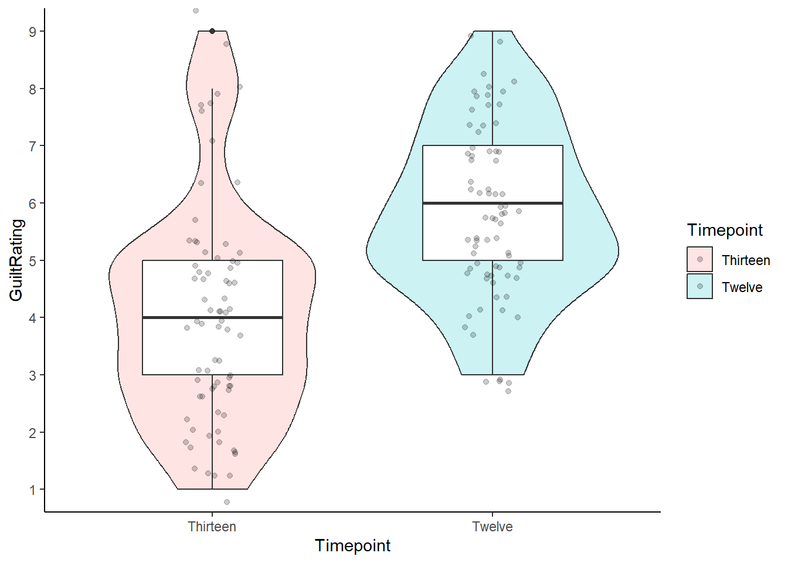

## Solutions to Questions


Below you will find the solutions to the questions for the Activities for this chapter. Only look at them after giving the questions a good try and speaking to the tutor about any issues.

### The Paired-Sample t-test

#### Task 1


```r
library(broom)
library(tidyverse)

ratings <- read_csv("GuiltJudgements.csv")
```

[Return to Task](#Ch7InClassQueT1)

#### Task 2


```r
lates <- ratings %>%
  filter(Evidence == "Late") %>% 
  select(Participant, Evidence, `12`, `13`) %>% 
  rename(Twelve = `12`, Thirteen = `13`) %>%
  pivot_longer(cols = Twelve:Thirteen, 
               names_to = "Timepoint", 
               values_to = "GuiltRating")
```

* If you have carried this out correctly, `lates` will have 150 rows and 4 columns. This comes from 75 participants giving two responses each - TimePoint 12 and TimePoint 13.


[Return to Task](#Ch7InClassQueT2)

#### Task 3


```r
lates %>% 
  ggplot(aes(GuiltRating)) +
  geom_histogram(binwidth = 1) +
 facet_wrap(~Timepoint) +
  labs(x = "GuiltRating", y = NULL) +
theme_bw()
```

<div class="figure" style="text-align: center">

<p class="caption">(\#fig:ch7-task3)Potential Solution to Task 3</p>
</div>

[Return to Task](#Ch7InClassQueT3)

#### Task 4

The Task only asks for the boxplot. We have added some additional functions to tidy up the figure a bit that you might want to play with.


```r
lates %>% 
  ggplot(aes(x = Timepoint,
             y = GuiltRating)) + 
  geom_boxplot() +
  scale_y_continuous(breaks = c(1:9)) + 
  coord_cartesian(xlim = c(.5, 2.5), ylim = c(1,9), expand = TRUE) +
  theme_bw()
```

<div class="figure" style="text-align: center">

<p class="caption">(\#fig:ch7-task4)Potential Solution to Task 4</p>
</div>

You can see that there is one outlier in the `Thirteen` condition. It is represented by the the single dot far above the whiskers of that boxplot.

[Return to Task](#Ch7InClassQueT4)

#### Task 5

We have added color but that was not necessary:


```r
lates %>% 
  ggplot(aes(x=Timepoint,y=GuiltRating))+
  geom_violin(aes(fill = Timepoint), alpha = .2) + 
  geom_boxplot(width = 0.5) +
  scale_y_continuous(breaks = c(1:9)) + 
  coord_cartesian(ylim = c(1,9), expand = TRUE) +
  theme_bw()
```

<div class="figure" style="text-align: center">

<p class="caption">(\#fig:ch7-task5-1)Potential Solution to Task 5</p>
</div>

* You can still see the outlier at the top of the figure as a solid black dot.

You could even add the `geom_jitter` to have all the data points:


```r
lates %>% 
  ggplot(aes(x=Timepoint,y=GuiltRating))+
  geom_violin(aes(fill = Timepoint), alpha = .2) + 
  geom_boxplot(width = 0.5) +
  geom_jitter(aes(fill = Timepoint), width = .1, alpha = .2) + 
  scale_y_continuous(breaks = c(1:9)) + 
  coord_cartesian(ylim = c(1,9), expand = TRUE) +
  theme_classic()
```

<div class="figure" style="text-align: center">

<p class="caption">(\#fig:ch7-task5-2)Alternative Potential Solution to Task 5</p>
</div>

[Return to Task](#Ch7InClassQueT5)

#### Task 6


```r
descriptives <- lates %>% 
  group_by(Timepoint) %>%
  summarise(n = n(),
            mean = mean(GuiltRating),
            sd = sd(GuiltRating),
            se = sd/sqrt(n),
            LowerCI = mean - 1.96*se,
            UpperCI = mean + 1.96*se)
```

This would show the following data:


```r
knitr::kable(descriptives, align = "c", caption = "Descriptive data for the current study")
```


Table: (\#tab:ch7-task6-table1)Descriptive data for the current study

| Timepoint | n  | mean |    sd    |    se     | LowerCI  | UpperCI  |
|:---------:|:--:|:----:|:--------:|:---------:|:--------:|:--------:|
| Thirteen  | 75 | 4.04 | 1.934327 | 0.2233569 | 3.602221 | 4.477779 |
|  Twelve   | 75 | 5.80 | 1.497746 | 0.1729448 | 5.461028 | 6.138972 |


[Return to Task](#Ch7InClassQueT6)

#### Task 7

* A basic barplot with 95% Confidence Intervals. 
* We have embellished the figure a little but you can mess around with the code to see what each bit does.


```r
ggplot(descriptives, aes(x = Timepoint, y = mean, fill = Timepoint)) + 
  geom_col(colour = "black") +
  scale_fill_manual(values=c("#999000", "#000999")) +
  scale_x_discrete(limits = c("Twelve","Thirteen")) +
  labs(x = "Timepoint of Evidence", y = "GuiltRating") +
  guides(fill="none") +
  geom_errorbar(aes(ymin = LowerCI, ymax = UpperCI),
                position = "dodge", width = .15) +
  scale_y_continuous(breaks = c(1:9), limits = c(0,9)) +
  coord_cartesian(ylim = c(1,9), xlim = c(0.5,2.5), expand = FALSE) +
  theme_classic()
```

<div class="figure" style="text-align: center">

<p class="caption">(\#fig:ch7-task7-1)Possible Solution to Task 7</p>
</div>

* One thing to watch out for with the above code is the `scale_y_continuous()` function which helps us set the length and tick marks (-) on the y-axis. Rather oddly, if you set the `limits = ...` to the same values as the `ylim = ...` in `coord_cartesian()` then your figure will behave oddly and may disappear. `coord_cartesian()` is a zoom function and must be set within the limits of the scale, set by `scale_y_continuous()`.

* An alternative way to display just the means and errorbars would be to use the pointrange approach. This image shows again the 95% CI


```r
ggplot(descriptives, aes(x = Timepoint, y = mean, fill = Timepoint)) + 
  geom_pointrange(aes(ymin = LowerCI, ymax = UpperCI))+
  scale_x_discrete(limits = c("Twelve","Thirteen")) +
  labs(x = "Timepoint of Evidence", y = "GuiltRating") +
  guides(fill="none")+
  scale_y_continuous(breaks = c(1:9), limits = c(0,9)) +
  coord_cartesian(ylim = c(1,9), xlim = c(0.5,2.5), expand = FALSE) +
  theme_bw()
```

<div class="figure" style="text-align: center">

<p class="caption">(\#fig:ch7-task7-2)Alternative Solution to Task 7</p>
</div>

[Return to Task](#Ch7InClassQueT7)

#### Task 8

* Remember to set `paired = TRUE` to run the within-subjects t-test


```r
results <- t.test(GuiltRating ~ Timepoint, 
                  data = lates, 
                  paired = TRUE, 
                  alternative = "two.sided") %>% tidy()
```


| estimate| statistic| p.value| parameter|  conf.low| conf.high|method        |alternative |
|--------:|---------:|-------:|---------:|---------:|---------:|:-------------|:-----------|
|    -1.76| -8.232202|       0|        74| -2.185995| -1.334005|Paired t-test |two.sided   |

* Alternatively, using the `filter()` and `pull()` functions to make force in a given condition as the first condition. Here, below, we are forcing condition `Thirteen` as the first condition and so the values match the above approach. If you forced condition `Twelve` as the first condition then the only difference would be that the t-value would change polarity (positive to negative or vice versa).


```r
results <- t.test(lates %>% filter(Timepoint == "Thirteen") %>% pull(GuiltRating),
                  lates %>% filter(Timepoint == "Twelve") %>% pull(GuiltRating),
                  paired = TRUE, 
                  alternative = "two.sided") %>% tidy()
```


| estimate| statistic| p.value| parameter|  conf.low| conf.high|method        |alternative |
|--------:|---------:|-------:|---------:|---------:|---------:|:-------------|:-----------|
|    -1.76| -8.232202|       0|        74| -2.185995| -1.334005|Paired t-test |two.sided   |

The reason that the two outputs are the same is because the formula (top) method (x ~ y) is actually doing the same process as the second approach, but you are just not sure which is the first condition. This second approach (bottom) just makes it clearer.

<!-- 
</div>
 -->

**Note:** The `conf.low` and `conf.high` values are the 95% Confidence Intervals for the mean difference between the two conditions. This could be written as something like, "there was a difference between the two groups (M = -1.76, 95% CI = [-2.19, -1.33])".

[Return to Task](#Ch7InClassQueT8)

#### Task 9

A potential write-up for this study would be as follows:

**"A paired-samples t-test was ran to compare the change in guilt ratings before (M = 5.8, SD = 1.5) and after (M = 4.04, SD = 1.93) the crucial evidence was heard. A significant difference was found (t(74) = 8.23, p = 4.7113406\times 10^{-12}) with Timepoint 13 having an average rating 1.76 units lower than Timepoint 12. This tells us that the critical evidence did have an influence on the rating of guilt by jury members."**

**Working with rounding p-values**

When rounding off p-values that are less than .001, rounding will give you a value of 0 which is technically wrong - the probability will be very low but not 0. As such, and according to APA format, values less than .001 would normally be written as p < .001. To create a reader-friendly p-value, then you could try something like the following in your code:


```r
ifelse(results$p.value < .001, 
       "p < .001", 
       paste0("p = ", round(results$p.value,3))) 
```

So instead of writing **t(74) = 8.23, p = 4.7113406\times 10^{-12}**, you would write **t(74) = 8.23, p < .001** 

The in-line coding for these options would look like: 

p = <code>&#096;r results %>% pull(p.value)&#096;</code> for p = 4.7113406\times 10^{-12}

& 

<code>&#096;r ifelse(results\$p.value < .001, "p < .001", paste0("p = ", round(results\$p.value,3)))&#096;</code> for p < .001

[Return to Task](#Ch7InClassQueT9)

<span style="font-size: 22px; font-weight: bold; color: var(--purple);">Chapter Complete!</span>
