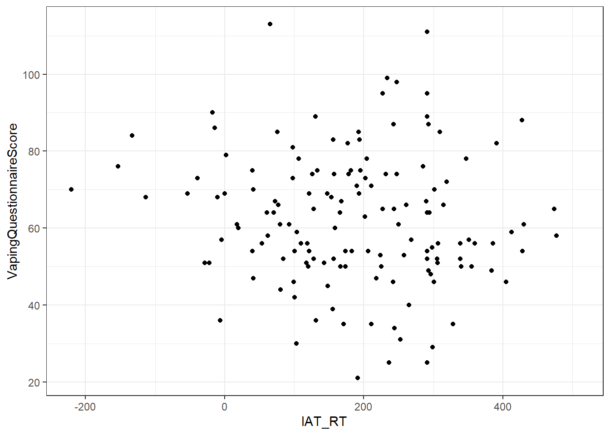

## Solutions to Questions


Below you will find the solutions to the questions for the activities for this chapter. Only look at them after giving the questions a good try and speaking to the tutor about any issues.

### Correlations Application

#### Task 1

* Loading in the data and the two libraries needed
* Good point to remind you that: 
    * we use `read_csv()` to load in data 
    * the order that libraries are read in is important. If there are any conflicts in terms of libraries then the last library that is loaded will be the functions you are using.
    

```r
library("broom")
library("tidyverse")
mh <- read_csv("MillerHadenData.csv")
```

[Return to Task](#Ch10InClassQueT1)

#### Task 2

* Actually the information within the textbook is unclear as to whether the data is interval or ordinal so we have accepted both as you could make a case for both arguments. A quick Google search will show just as many people who think that IQ is interval as think it is ordinal. In terms of Reading Ability, again we probably don't know enough information about this scale to make a clear judgement but it is at least ordinal and could well be interval.

[Return to Task](#Ch10InClassQueT2)

#### Task 3

* Missing data is represented by NA. It stands for Not Available but is a very good way of improving your Scottish accent. For example, "is that a number" can be replied with "NA!".

* If you want to keep everybody from the whole dataset that has a score for Ability you would use:


```r
filter(mh, !is.na(Abil))
```

<div class="kable-table">

<table>
 <thead>
  <tr>
   <th style="text-align:right;"> Participant </th>
   <th style="text-align:right;"> Abil </th>
   <th style="text-align:right;"> IQ </th>
   <th style="text-align:right;"> Home </th>
   <th style="text-align:right;"> TV </th>
  </tr>
 </thead>
<tbody>
  <tr>
   <td style="text-align:right;"> 1 </td>
   <td style="text-align:right;"> 61 </td>
   <td style="text-align:right;"> 107 </td>
   <td style="text-align:right;"> 144 </td>
   <td style="text-align:right;"> 487 </td>
  </tr>
  <tr>
   <td style="text-align:right;"> 2 </td>
   <td style="text-align:right;"> 56 </td>
   <td style="text-align:right;"> 109 </td>
   <td style="text-align:right;"> 123 </td>
   <td style="text-align:right;"> 608 </td>
  </tr>
  <tr>
   <td style="text-align:right;"> 3 </td>
   <td style="text-align:right;"> 45 </td>
   <td style="text-align:right;"> 81 </td>
   <td style="text-align:right;"> 108 </td>
   <td style="text-align:right;"> 640 </td>
  </tr>
  <tr>
   <td style="text-align:right;"> 4 </td>
   <td style="text-align:right;"> 66 </td>
   <td style="text-align:right;"> 100 </td>
   <td style="text-align:right;"> 155 </td>
   <td style="text-align:right;"> 493 </td>
  </tr>
  <tr>
   <td style="text-align:right;"> 5 </td>
   <td style="text-align:right;"> 49 </td>
   <td style="text-align:right;"> 92 </td>
   <td style="text-align:right;"> 103 </td>
   <td style="text-align:right;"> 636 </td>
  </tr>
  <tr>
   <td style="text-align:right;"> 6 </td>
   <td style="text-align:right;"> 62 </td>
   <td style="text-align:right;"> 105 </td>
   <td style="text-align:right;"> 161 </td>
   <td style="text-align:right;"> 407 </td>
  </tr>
  <tr>
   <td style="text-align:right;"> 7 </td>
   <td style="text-align:right;"> 61 </td>
   <td style="text-align:right;"> 92 </td>
   <td style="text-align:right;"> 138 </td>
   <td style="text-align:right;"> 463 </td>
  </tr>
  <tr>
   <td style="text-align:right;"> 8 </td>
   <td style="text-align:right;"> 55 </td>
   <td style="text-align:right;"> 101 </td>
   <td style="text-align:right;"> 119 </td>
   <td style="text-align:right;"> 717 </td>
  </tr>
  <tr>
   <td style="text-align:right;"> 9 </td>
   <td style="text-align:right;"> 62 </td>
   <td style="text-align:right;"> 118 </td>
   <td style="text-align:right;"> 155 </td>
   <td style="text-align:right;"> 643 </td>
  </tr>
  <tr>
   <td style="text-align:right;"> 10 </td>
   <td style="text-align:right;"> 61 </td>
   <td style="text-align:right;"> 99 </td>
   <td style="text-align:right;"> 121 </td>
   <td style="text-align:right;"> 674 </td>
  </tr>
  <tr>
   <td style="text-align:right;"> 11 </td>
   <td style="text-align:right;"> 51 </td>
   <td style="text-align:right;"> 104 </td>
   <td style="text-align:right;"> 93 </td>
   <td style="text-align:right;"> 675 </td>
  </tr>
  <tr>
   <td style="text-align:right;"> 12 </td>
   <td style="text-align:right;"> 48 </td>
   <td style="text-align:right;"> 100 </td>
   <td style="text-align:right;"> 127 </td>
   <td style="text-align:right;"> 595 </td>
  </tr>
  <tr>
   <td style="text-align:right;"> 13 </td>
   <td style="text-align:right;"> 50 </td>
   <td style="text-align:right;"> 95 </td>
   <td style="text-align:right;"> 97 </td>
   <td style="text-align:right;"> 673 </td>
  </tr>
  <tr>
   <td style="text-align:right;"> 14 </td>
   <td style="text-align:right;"> 50 </td>
   <td style="text-align:right;"> 82 </td>
   <td style="text-align:right;"> 140 </td>
   <td style="text-align:right;"> 523 </td>
  </tr>
  <tr>
   <td style="text-align:right;"> 15 </td>
   <td style="text-align:right;"> 67 </td>
   <td style="text-align:right;"> 114 </td>
   <td style="text-align:right;"> 151 </td>
   <td style="text-align:right;"> 665 </td>
  </tr>
  <tr>
   <td style="text-align:right;"> 16 </td>
   <td style="text-align:right;"> 51 </td>
   <td style="text-align:right;"> 95 </td>
   <td style="text-align:right;"> 112 </td>
   <td style="text-align:right;"> 663 </td>
  </tr>
  <tr>
   <td style="text-align:right;"> 17 </td>
   <td style="text-align:right;"> 55 </td>
   <td style="text-align:right;"> 94 </td>
   <td style="text-align:right;"> 102 </td>
   <td style="text-align:right;"> 684 </td>
  </tr>
  <tr>
   <td style="text-align:right;"> 18 </td>
   <td style="text-align:right;"> 54 </td>
   <td style="text-align:right;"> 103 </td>
   <td style="text-align:right;"> 142 </td>
   <td style="text-align:right;"> 505 </td>
  </tr>
  <tr>
   <td style="text-align:right;"> 19 </td>
   <td style="text-align:right;"> 57 </td>
   <td style="text-align:right;"> 96 </td>
   <td style="text-align:right;"> 127 </td>
   <td style="text-align:right;"> 541 </td>
  </tr>
  <tr>
   <td style="text-align:right;"> 20 </td>
   <td style="text-align:right;"> 54 </td>
   <td style="text-align:right;"> 104 </td>
   <td style="text-align:right;"> 102 </td>
   <td style="text-align:right;"> 678 </td>
  </tr>
  <tr>
   <td style="text-align:right;"> 21 </td>
   <td style="text-align:right;"> 52 </td>
   <td style="text-align:right;"> 98 </td>
   <td style="text-align:right;"> 124 </td>
   <td style="text-align:right;"> 564 </td>
  </tr>
  <tr>
   <td style="text-align:right;"> 22 </td>
   <td style="text-align:right;"> 48 </td>
   <td style="text-align:right;"> 117 </td>
   <td style="text-align:right;"> 87 </td>
   <td style="text-align:right;"> 787 </td>
  </tr>
  <tr>
   <td style="text-align:right;"> 23 </td>
   <td style="text-align:right;"> 61 </td>
   <td style="text-align:right;"> 100 </td>
   <td style="text-align:right;"> 141 </td>
   <td style="text-align:right;"> 582 </td>
  </tr>
  <tr>
   <td style="text-align:right;"> 24 </td>
   <td style="text-align:right;"> 54 </td>
   <td style="text-align:right;"> 101 </td>
   <td style="text-align:right;"> 117 </td>
   <td style="text-align:right;"> 647 </td>
  </tr>
  <tr>
   <td style="text-align:right;"> 25 </td>
   <td style="text-align:right;"> 48 </td>
   <td style="text-align:right;"> 94 </td>
   <td style="text-align:right;"> 111 </td>
   <td style="text-align:right;"> 448 </td>
  </tr>
</tbody>
</table>

</div>

* Alternatively, if you want to keep everybody from the whole dataset that does not have a score for Ability you would use:


```r
filter(mh, is.na(Abil))
```

<div class="kable-table">

<table>
 <thead>
  <tr>
   <th style="text-align:right;"> Participant </th>
   <th style="text-align:right;"> Abil </th>
   <th style="text-align:right;"> IQ </th>
   <th style="text-align:right;"> Home </th>
   <th style="text-align:right;"> TV </th>
  </tr>
 </thead>
<tbody>
  <tr>

  </tr>
</tbody>
</table>

</div>

Remember that you would need to store the output of this step, so really it would be something like `mh <- filter(mh, !is.na(Abil))`

[Return to Task](#Ch10InClassQueT3)

#### Task 4

* Reading ability data appears as normal as expected for 25 participants. Hard to say how close to normality something should look when there are so few participants.


```r
ggplot(mh, aes(x = Abil)) + 
  geom_histogram(binwidth = 5) +
  theme_bw()
```

<div class="figure" style="text-align: center">

<p class="caption">(\#fig:ch10InClassSolT4-1)Histogram showing the distribution of Reading Ability Scores from Miller and Haden (2013)</p>
</div>

* IQ data appears as normal as expected for 25 participants

```r
ggplot(mh, aes(x = IQ)) + 
  geom_histogram(binwidth = 5) +
  theme_bw()
```

<div class="figure" style="text-align: center">

<p class="caption">(\#fig:ch10InClassSolT4-2)Histogram showing the distribution of IQ Scores from Miller and Haden (2013)</p>
</div>

* The relationship between reading ability and IQ scores appears appears linear and with no clear outliers. Data also appears homeoscedastic.
* We have added the `geom_smooth()` function to help clarify the line of best fit (also know as the regression line or the slope).


```r
ggplot(mh, aes(x = Abil, y = IQ)) + 
  geom_point() +
  geom_smooth(method = "lm", se = FALSE) +
  theme_bw()
```

```
## `geom_smooth()` using formula = 'y ~ x'
```

<div class="figure" style="text-align: center">

<p class="caption">(\#fig:ch10InClassSolT4-3)Scatterplot of IQ scores as a function of Reading Ability from Miller and Haden (2013) data</p>
</div>

[Return to Task](#Ch10InClassQueT4)

#### Task 5

Based on the scatterplot we might suggest that as reading ability scores increase, IQ scores also increase and as such it would appear that our data is inline with our hypothesis that the two variables are positively correlated. This appears to be a medium strength relationship.

[Return to Task](#Ch10InClassQueT5)

#### Task 6

* We are going to run a pearson correlation as we would argue the data is interval and the relationship is linear.
* The correlation would be run as follows - tidying it into a nice and usable table.


```r
results <- cor.test(mh$Abil, 
                    mh$IQ, 
                    method = "pearson", 
                    alternative = "two.sided") %>% 
  broom::tidy()
```

* The output of the table would look as follows:

<div style="border: 0px;overflow-x: scroll; width:100%; "><table class="table" style="margin-left: auto; margin-right: auto;">
<caption>(\#tab:ch10InClassSolT6-tab)The correlation output of the Reading Ability and IQ relationship.</caption>
 <thead>
  <tr>
   <th style="text-align:right;"> estimate </th>
   <th style="text-align:right;"> statistic </th>
   <th style="text-align:right;"> p.value </th>
   <th style="text-align:right;"> parameter </th>
   <th style="text-align:right;"> conf.low </th>
   <th style="text-align:right;"> conf.high </th>
   <th style="text-align:left;"> method </th>
   <th style="text-align:left;"> alternative </th>
  </tr>
 </thead>
<tbody>
  <tr>
   <td style="text-align:right;"> 0.451 </td>
   <td style="text-align:right;"> 2.425 </td>
   <td style="text-align:right;"> 0.024 </td>
   <td style="text-align:right;"> 23 </td>
   <td style="text-align:right;"> 0.068 </td>
   <td style="text-align:right;"> 0.718 </td>
   <td style="text-align:left;"> Pearson's product-moment correlation </td>
   <td style="text-align:left;"> two.sided </td>
  </tr>
</tbody>
</table></div>

[Return to Task](#Ch10InClassQueT6)

#### Task 7

In the Task 6 output:

* The correlation value (r) is stored in `estimate`
* The degrees of freedom (N-2) is stored in `parameter`
* The p-value is stored in `p.value`
* And `statistic` is the t-value associated with this analysis as correlations use the t-distribution (same as in Chapters 6, 7 and 8) to determine probability of an outcome.
* Remember that we can use the `pull()` function to get individual values as shown here.


```r
pvalue <- results %>% 
  pull(p.value) %>% 
  round(3)

df <- results %>% 
  pull(parameter)

correlation <- results %>% 
  pull(estimate) %>% 
  round(2)
```

And we can use that information to write-up the following using inline coding for accuracy:

* A pearson correlation found reading ability and intelligence to be positively correlated with a medium to strong relationship, (r(<code>&#096;r df&#096;</code>) = <code>&#096;r correlation&#096;</code>, p = <code>&#096;r pvalue&#096;</code>). As such we can say that our hypothesis is supported and that there appears to be a relationship between reading ability and IQ in that as reading ability increases so does intelligence.

Which when knitted would read as:

* A pearson correlation found reading ability and intelligence to be positively correlated with a medium to strong relationship, (r(23) = 0.45, p = 0.024). As such we can say that our hypothesis is supported and that there appears to be a relationship between reading ability and IQ in that as reading ability increases so does intelligence.

[Return to Task](#Ch10InClassQueT7)

#### Task 8

1. The table looks the same across the diagonal because the correlation of e.g. Abil vs Abil is not shown, and the correlation of Abil vs Home is the same as the correlation of Home vs Abil.
2. The strongest positive correlation is between the number of minutes spend reading at home (Home) and Reading Ability (abil), r(23) = .74, p < .001.
2. The strongest negative correlation is between the number of minutes spend reading at home (Home) and minutes spent watching TV per week (TV), r(23) = -.65, p < .001.

[Return to Task](#Ch10InClassQueT8)

#### Task 9

**Step 1**

* Reading in the Vaping Data using `read_csv()`


```r
dat <- read_csv("VapingData.csv")
```

**Steps 2 to 4**

* The main wrangle of parts 2 to 4


```r
dat <- dat %>% 
  filter(IAT_BLOCK3_Acc <= 1) %>%
  filter(IAT_BLOCK5_Acc <= 1) %>%
  mutate(IAT_ACC = (IAT_BLOCK3_Acc + IAT_BLOCK5_Acc)/2) %>%
  filter(IAT_ACC > .8) %>%
  mutate(IAT_RT = IAT_BLOCK5_RT - IAT_BLOCK3_RT)
```

**Step 5**

* It is always worth thinking about which averages are informative and which are not.
    * Knowing the average explicit attitude towards vaping could well be informative.
    * In contrast, if you are using an ordinal scale and people use the whole of the scale then the average may just tell you the middle of the scale you are using - which you already know and really isn't that informative. So it is always worth thinking about what your descriptives are calculating.
    

```r
descriptives <- dat %>% summarise(n = n(),
                          mean_IAT_ACC = mean(IAT_ACC),
                          mean_IAT_RT = mean(IAT_RT),
                          mean_VPQ = mean(VapingQuestionnaireScore, 
                                          na.rm = TRUE))
```

**Step 6**

* A couple of visual checks of normality through histograms


```r
ggplot(dat, aes(x = VapingQuestionnaireScore)) + 
  geom_histogram(binwidth = 10) +
  theme_bw()
```

```
## Warning: Removed 11 rows containing non-finite values (`stat_bin()`).
```

<div class="figure" style="text-align: center">

<p class="caption">(\#fig:ch10InClassSolT9-6-1)Histogram showing the distribution of Scores on the Vaping Questionnaire (Explicit)</p>
</div>


```r
ggplot(dat, aes(x = IAT_RT)) + 
  geom_histogram(binwidth = 10) +
  theme_bw()
```

<div class="figure" style="text-align: center">

<p class="caption">(\#fig:ch10InClassSolT9-6-2)Histogram showing the distribution of IAT Reaction Times (Implicit)</p>
</div>

* A check of the relationship between reaction times on the IAT and scores on the Vaping Questionnaire.
* Remember that, often, the scatterplot is considered the descriptive of the correlation, hence why you see them including in journal articles to support the stated relationship.
* The scatterplot can be used to make descriptive claims about the direction of the relationship, the strength of the relationship, whether it is linear or not, and to check for outliers and homeoscedasticity.


```r
ggplot(dat, aes(x = IAT_RT, y = VapingQuestionnaireScore)) + 
  geom_point() + 
  theme_bw()
```

```
## Warning: Removed 11 rows containing missing values (`geom_point()`).
```

<div class="figure" style="text-align: center">

<p class="caption">(\#fig:ch10InClassSolT9-6-3)A scatterplot showing the relationship between implicit IAT reaction times (x) and explicit Vaping Questionnaire Scores (y)</p>
</div>

* A quick look at the data reveals some people do not have a Vaping Questionnaire score and some don't have an IAT score.  The correlation only works when people have a score on both factors so we remove all those that only have a score on one of the factors.


```r
dat <- dat %>% 
  filter(!is.na(VapingQuestionnaireScore)) %>% 
  filter(!is.na(IAT_RT))
```

**Step 7**

* The analysis:


```r
results <- cor.test(dat$VapingQuestionnaireScore, 
                    dat$IAT_RT, 
                    method = "pearson") %>% 
  broom::tidy()
```

* And extracting the values:


```r
correlation <- results %>% 
  pull(estimate)

df <- results %>% 
  pull(parameter)

pvalue <- results %>% 
  pull(p.value)
```

* With inline coding:

Testing the hypothesis that there would be a relationship beween implicit and explicit attitudes towards vaping, a pearson correlation found no significant relationship between IAT reaction times (implicit attitude) and answers on a Vaping Questionnaire (explicit attitude), r(<code>&#096;r df&#096;</code>) = <code>&#096;r correlation&#096;</code>, p = <code>&#096;r pvalue&#096;</code>. Overall this suggests that there is no direct relationship between implicit and explicit attitudes when relating to Vaping and as such our hypothesis was not supported; we cannot reject the null hypothesis.

* and appears as when knitted:

Testing the hypothesis that there would be a relationship beween implicit and explicit attitudes towards vaping, a pearson correlation found no significant relationship between IAT reaction times (implicit attitude) and answers on a Vaping Questionnaire (explicit attitude), r(143) = -0.1043797, p = 0.2115059. Overall this suggests that there is no direct relationship between implicit and explicit attitudes when relating to Vaping and as such our hypothesis was not supported; we cannot reject the null hypothesis.

**Remember though that r-values and p-values are often rounded to three decimal places, so a more appropriate write up would be:**

Testing the hypothesis that there would be a relationship beween implicit and explicit attitudes towards vaping, a pearson correlation found no significant relationship between IAT reaction times (implicit attitude) and answers on a Vaping Questionnaire (explicit attitude), r(143) = -.104, p = .212. Overall this suggests that there is no direct relationship between implicit and explicit attitudes when relating to Vaping and as such our hypothesis was not supported; we cannot reject the null hypothesis.


### Practice Your Skills

Check your work against the solution to the tasks here:  [**Chapter 9 Practice Your Skills Solution**](data/09-s02/GUID_L2_Ch9_PracticeSkills/L2_Ch9_PracticeSkills_solution.html).

[Return to Task](#Ch9PracticeSkills)
