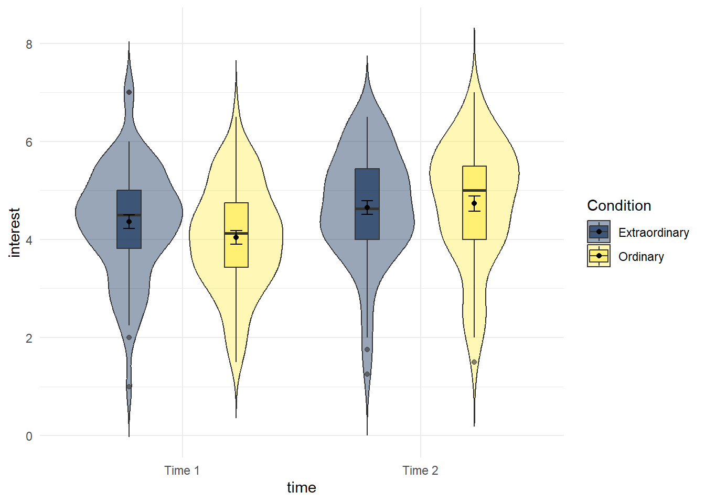
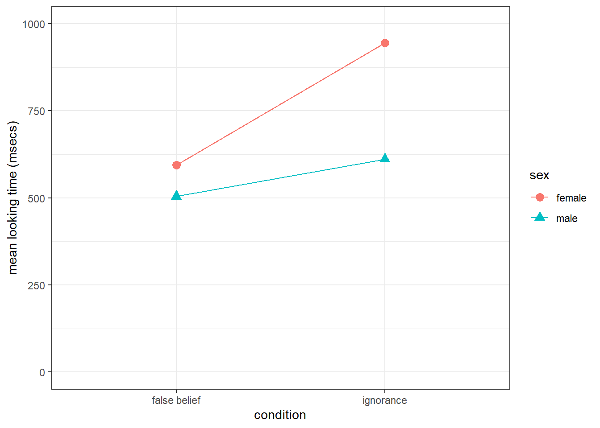

# Factorial ANOVA

In this chapter, we are continuing from the previous chapter on ANOVA and we're going to look at an example of a Factorial ANOVA. You'll learn more about interpreting these in the lectures, but for now, we'll just focus on the code.

We're going to reproduce the analysis from Experiment 3 of [Zhang, T., Kim, T., Brooks, A. W., Gino, F., & Norton, M. I. (2014). A "present" for the future: The unexpected value of rediscovery. Psychological Science, 25, 1851-1860.](https://journals.sagepub.com/doi/abs/10.1177/0956797614542274).

To help you understand the data we are working with, here is the abstract:

> Although documenting everyday activities may seem trivial, four studies reveal that creating records of the present generates unexpected benefits by allowing future rediscoveries. In Study 1, we used a time-capsule paradigm to show that individuals underestimate the extent to which rediscovering experiences from the past will be curiosity provoking and interesting in the future. In Studies 2 and 3, we found that people are particularly likely to underestimate the pleasure of rediscovering ordinary, mundane experiences, as opposed to extraordinary experiences. Finally, Study 4 demonstrates that underestimating the pleasure of rediscovery leads to time-inconsistent choices: Individuals forgo opportunities to document the present but then prefer rediscovering those moments in the future to engaging in an alternative fun activity. Underestimating the value of rediscovery is linked to people’s erroneous faith in their memory of everyday events. By documenting the present, people provide themselves with the opportunity to rediscover mundane moments that may otherwise have been forgotten.


This experiment has a 2 x 2 mixed design:

* The first IV is time (time1, time2) and is within-subjects 
* The second IV is type of event (ordinary vs. extraordinary) and is a between-subjects factor * The DV we will use is `interest` 

## Activity 1: Set-up {#factorial-a1}

* Open R Studio and set the working directory to your chapter folder. Ensure the environment is clear. 
* Open a new R Markdown document and save it in your working directory. Call the file "Factorial ANOVA". 
* Download <a href="data/13-s02/Zhang et al. 2014 Exp 3.csv" download>Zhang et al. 2014 Exp 3.csv</a> and extract the files in to your folder. 
* If you're on the server, avoid a number of issues by restarting the session - click `Session` - `Restart R` 
* If you are working on your own computer, install the package `rcompanion`. Remember **do not install packages on university computers, they are already installed**.
* Type and run the code that loads `pwr`, `rcompanion`, `lsr`, `car`, `broom`, `afex`, `emmeans` and `tidyverse` using the `library()` function.


Run the below code to load the data and wrangle it into the format we need. You don't need to write this code yourself, but do make sure you can understand what each line is doing - a good way to do this when the code uses pipes (`%>%`) is to highlight and run each line progressively so you can see how it builds up. Line-by-line the code:

* Reads in the data file
* Select the three columns we need  
* Adds on a column of subject IDs  
* Tidies the data
* Recodes the values of `Condition` from numeric to text labels
* Recodes the values of `time` to be easier to read/write


```r
factorial <- read_csv("Zhang et al. 2014 Exp 3.csv")%>%
  select(Condition, T1_Predicted_Interest_Composite, T2_Actual_Interest_Composite)%>%
  mutate(subject = row_number())%>%
  pivot_longer(names_to = "time",values_to = "interest", cols =       c("T1_Predicted_Interest_Composite","T2_Actual_Interest_Composite"))%>%
  mutate(Condition = dplyr::recode(Condition, "1" = "Ordinary", "2" = "Extraordinary"))%>%
  mutate(time = dplyr::recode(time, "T1_Predicted_Interest_Composite" = "time1_interest",
                       "T2_Actual_Interest_Composite" = "time2_interest")) %>%
  mutate(Condition = as.factor(Condition)) %>% 
  mutate (time= as.factor(time))
```

## Activity 2: Descriptive statistics {#factorial-a2}

* Calculate descriptive statistics (mean and SD) for `interest` for each `Condition` for each `time` (hint: you will need to `group_by()` two variables) and store it in an object named `sum_dat_factorial`. These are known as the cells means.


## Activity 3: Violin-boxplots {#factorial-a3}

We're going to produce two kinds of plots to visualise our data. First, we'll produce violin-boxplots so that we can see the distribution of our data.

* Write the code that produces the below violin-boxplots for the scores in each group. 
  * Hint 1: you will need to add in the second IV in the first call to ggplot as a fill argument (aes(x,y,fill)). 
  * Hint 2: you will need to add `position = position_dodge(.9)` to geom_boxplot to get the plots to align. 

You don't need to replicate the exact colour scheme used below, see if you can play around with the settings to whatever colour scheme you think works best.

<div class="figure" style="text-align: center">

<p class="caption">(\#fig:plt1)Violin-boxplot by condition and time</p>
</div>

## Activity 4: Interaction plots {#factorial-a4}

Now we're going to produce an interaction plot that makes it easier to see how the IVs are interacting, which requires some ggplot2 functions we haven't come across yet. Rather than using the raw data in `dat_factorial`, we use the means that we produced in `sum_dat_factorial`. This type of plot requires two geoms, one to draw the points, and one to draw the lines that connect them. 

This plot reproduces the plot used in the paper.

* Run the code and then play around with how it looks by changing the arguments for e.g., colour, line-type, and the theme.


```r
ggplot(sum_dat_factorial, aes(x = time, y = mean, group = Condition, shape = Condition)) +
  geom_point(size = 3) +
  geom_line(aes(linetype = Condition))+
  scale_x_discrete(labels = c("Time 1", "Time 2"))+
  theme_classic()
```

<div class="figure" style="text-align: center">

<p class="caption">(\#fig:plot2)Interaction plot</p>
</div>

## Activity 5: ANOVA {#factorial-a5}

* Complete the below code to run the factorial ANOVA. Remember that you will need to specify both IVs and that one of them is between-subjects and one of them is within-subjects. Look up the help documentation for `aov_ez` to find out how to do this. 

* Save the ANOVA model to an object called `mod_factorial`
* Pull out the anova table, you can either do this with `mod_factorial$anova_table` or `anova(mod_factorial)` both have the same result. Save this to an object named `factorial_output` and make sure you have used `tidy()`.


```r
mod_factorial <- aov_ez(id = "NULL",
               data = NULL, 
               between = "NULL", 
               within = "NULL",
               dv = "NULL", 
               type = 3,
               es = "NULL") 
factorial_output <- NULL
```

Look at the results. Remember the information about how to read p-values in scientific notation.

* Is the main effect of condition significant? <select class='webex-select'><option value='blank'></option><option value=''>Yes</option><option value='answer'>No</option></select>
* Is the main effect of time significant? <select class='webex-select'><option value='blank'></option><option value='answer'>Yes</option><option value=''>No</option></select>
* Is the two-way interaction significant? <select class='webex-select'><option value='blank'></option><option value='answer'>Yes</option><option value=''>No</option></select>

## Activity 6: Assumption checking {#factorial-a6}

The assumptions for a factorial ANOVA are the same as the one-way ANOVA.

1. The DV is interval or ratio data
2. The observations should be independent
3. The residuals should be normally distributed
4. There should be homogeneity of variance between the groups

As before, we know assumption 2 is met from the design of the study. Assumption 1 throws up an interesting issue which is the problem of ordinal data. Ordinal data is the kind of data that comes from Likert scales and is very, very common in psychology. The problem is that ordinal data isn't interval or ratio data, there's a fixed number of values it can take (the values of the Likert scale) and you can't claim that the distance between the values is equal (is the difference between strongly agree and agree the same as the difference between agree and neutral?). 

Technically, we shouldn't use an ANOVA to analyse ordinal data - *but almost everyone does*. Most people would argue that if there are multiple Likert scale items that are averaged (which is the case in our study) and this averaged data is normally distributed, then it is not a problem. There is a minority (who are actually correct) that argue you should use non-parametric methods or more complicated tests such as ordinal regression for this type of data. Whichever route you choose, you should understand the data you have and you should be able to justify your decision.

* To test assumption 3, extract the residuals from the model (`mod_factorial$lm$residuals`), create a qq-plot and conduct a Shapiro-Wilk test.

* Are the residuals normally distributed? <select class='webex-select'><option value='blank'></option><option value=''>Yes</option><option value=''>No</option><option value='answer'>No, but given the sample it is probably acceptable to proceed</option></select> 

For the final assumption, we can again use `test_levene()` to test homogeneity of variance.

* Conduct Levene's test. Is assumption 4 met? <select class='webex-select'><option value='blank'></option><option value='answer'>Yes</option><option value=''>No</option></select>


## Activity 7: Post-hoc tests {#factorial-a7}

Because the interaction is significant, we should follow this up with post-hoc tests using `emmeans()` to determine which comparisons are significant. If the overall interaction is not significant, you should not conduct additional tests.

`emmeans()` requires you to specify the `aov` object, and then the factors you want to contrast. For an interaction, we use the notation `pairwise ~ IV1 | IV2` and you specify which multiple comparison correction you want to apply. Finally, you can use `tidy()` to tidy up the output of the contrasts and save it into a tibble.

* Run the below code and view the results. 


```r
# run the tests
posthoc_factorial <- emmeans(mod_factorial, 
                             pairwise ~ time| Condition, 
                             adjust = "bonferroni")
# tidy up the output of the tests
contrasts_factorial <- posthoc_factorial$contrasts %>%
  tidy()
```

Note that because there are two factors, we could also reverse the order of the IVs. Above, we get the results contrasting time 1 and time 2 for each condition. Instead, we could look at the difference between ordinary and extraordinary events at each time point.

* Run the below code and look at the output of `contrast_factorial` and `contrasts_factorial2` carefully making sure you understand how to interpret the results. You will find it useful to refer to the interaction plot we made earlier.


```r
posthoc_factorial2 <- emmeans(mod_factorial, 
                             pairwise ~ Condition| time, 
                             adjust = "bonferroni") 
contrasts_factorial2 <- posthoc_factorial2$contrasts %>%
  tidy()
```

Because our main effects (condition and time) only have two levels, we don't need to do any post-hoc tests to determine which conditions differ from each other, however, if one of our factors had three levels then we could use `emmeans()` to calculate the contrast for the main effects, like we did for the one-way ANOVA. 

Finally, to calculate effect size for the pairwise comparisons we again need to do this individually using 'cohensD()` from `lsr`. 
* Run the below code to add on effect sizes to `contrasts_factorial` and `contrasts_factorial2`.

```r
d_extra_t1_t2 <- cohensD(interest ~ time, 
                         data = (filter(factorial, Condition == "Extraordinary") %>% droplevels())) 
d_ord_t1_t2 <- cohensD(interest ~ time, 
                         data = (filter(factorial, Condition == "Ordinary") %>% droplevels())) 
Condition_ds <- c(d_extra_t1_t2, d_ord_t1_t2)
contrasts_factorial <- contrasts_factorial %>%
  mutate(eff_size = Condition_ds)
d_time1_extra_ord <- cohensD(interest ~ Condition, 
                         data = (filter(factorial, time == "time1_interest") %>% droplevels())) 
d_time2_extra_ord <- cohensD(interest ~ Condition, 
                         data = (filter(factorial, time == "time2_interest") %>% droplevels()))
time_ds <- c(d_time1_extra_ord, d_time2_extra_ord)
contrasts_factorial2 <- contrasts_factorial2 %>%
  mutate(eff_size = time_ds)
```

## Activity 8: Write-up {#factorial-a8}

* p-values of < .001 have been entered manually. There is a way to get R to produce this formatting but it's overly complicated for our purposes. If you want to push yourself, look up the [papaja](https://github.com/crsh/papaja) package. 
* The values of partial eta-squared do not match between our analysis and those reported in the paper. We haven't figured out why this is yet - if you know, please get in touch!
* We have replaced the simple effects in the main paper with our pairwise comparisons. 

First we need to calculate descriptives for the main effect of time as we didn't do this earlier.


```r
time_descrip <- factorial %>% 
  group_by(time) %>%
  summarise(mean_interest = mean(interest, na.rm = TRUE),
            sd_interest = sd(interest, na.rm = TRUE),
            min = mean(interest) - qnorm(0.975)*sd(interest)/sqrt(n()),
            max = mean(interest) + qnorm(0.975)*sd(interest)/sqrt(n()))
```

Copy and paste the below into **white-space**.


```r
We conducted the same repeated measures ANOVA with interest as the dependent measure and again found a main effect of time, F(`r factorial_output$num.Df[2]`, `r factorial_output$den.Df[2]`) = `r factorial_output$statistic[2] %>% round(2)`, p < .001, ηp2 = `r factorial_output$ges[2] %>% round(3)`; anticipated interest at Time 1 (M = `r time_descrip$mean_interest[1] %>% round(2)`), SD = `r time_descrip$sd_interest[1]%>% round(2)`)) was lower than actual interest at Time 2 (M = `r time_descrip$mean_interest[2]%>% round(2)`, SD = `r time_descrip$sd_interest[2]%>% round(2)`).We also observed an interaction between time and type of experience, F(`r factorial_output$num.Df[3]`, `r factorial_output$den.Df[3]`) = `r factorial_output$statistic[3] %>% round(3)`, p = `r factorial_output$p.value[3] %>% round(2)`, ηp2 = `r factorial_output$ges[3] %>% round(3)`. Pairwise comparisons revealed that for ordinary events, predicted interest at Time 1 (M = `r sum_dat_factorial$mean[3]%>% round(2)`, SD = `r sum_dat_factorial$sd[3]%>% round(2)`) was lower than experienced interest at Time 2 (M = `r sum_dat_factorial$mean[4]%>% round(2)`, SD = `r sum_dat_factorial$sd[4]%>% round(2)`), t(`r contrasts_factorial$df[2]%>% round(2)`) = `r contrasts_factorial$statistic[2]%>% round(2)`, p < .001, d = `r contrasts_factorial$eff_size[2]%>% round(2)`. Although predicted interest for extraordinary events at Time 1 (M = `r sum_dat_factorial$mean[1]%>% round(2)`, SD = `r sum_dat_factorial$sd[1]%>% round(2)`) was lower than experienced interest at Time 2 (M = `r sum_dat_factorial$mean[2]%>% round(2)`, SD = `r sum_dat_factorial$sd[2]%>% round(2)`), t(`r contrasts_factorial$df[1]%>% round(2)`) = `r contrasts_factorial$statistic[1]%>% round(2)`, p < .001, d = `r contrasts_factorial$eff_size[1]%>% round(2)` , the magnitude of underestimation was smaller than for ordinary events.
```

> We conducted the same repeated measures ANOVA with interest as the dependent measure and again found a main effect of time, F(1, 128) = 25.88, p < .001, ηp2 = 0.044; anticipated interest at Time 1 (M = 4.2), SD = 1.12)) was lower than actual interest at Time 2 (M = 4.69, SD = 1.19).We also observed an interaction between time and type of experience, F(1, 128) = 4.445, p = 0.04, ηp2 = 0.008. Pairwise comparisons revealed that for ordinary events, predicted interest at Time 1 (M = 4.04, SD = 1.09) was lower than experienced interest at Time 2 (M = 4.73, SD = 1.24), t(128) = -5.05, p < .001, d = 0.59. Although predicted interest for extraordinary events at Time 1 (M = 4.36, SD = 1.13) was lower than experienced interest at Time 2 (M = 4.65, SD = 1.14), t(128) = -2.12, p < .001, d = 0.25 , the magnitude of underestimation was smaller than for ordinary events.

## Activity 9: Transforming data {#factorial-a9}

In this chapter we decided that the violation of the assumption of normality was ok so that we could replicate the results in the paper. But what if we weren't happy with this or if the violation had been more extreme? One option to deal with normality is to **transform your data**.

There are various options for how you can transform data but we're going to use Tukeys Ladder of Powers transformation. This finds the power transformation that makes the data fit the normal distribution as closely as possible with this type of transformation.

* Run the below code. This will use `mutate()` to add a new variable to the data-set, `interest_tukey` which is going to be our transformed DV. The function `transformTukey()` is from the `rcompanion` package. Setting `plotit = TRUE` will automatically create qqPlots and histograms so that we can immediately visualise the new variable. 


```r
factorial <- factorial %>%
  mutate(interest_tukey = transformTukey(interest, plotit=TRUE))
```


Now that you've transformed the DV we can re-run the ANOVA with this new variable.


```r
tukey_factorial <- aov_ez(id = "subject",
               data = factorial, 
               between = "Condition", 
               within = "time",
               dv = "interest_tukey", 
               type = 3)
tukey_factorial
```

Notice that doing this hasn't changed the pattern of the ANOVA results, the p-values for the main effects and interactions are very slightly different but the overall conclusions remain the same. This is likely because the violations of normality was quite mild and there is a large sample size, however, with the transformation we can be more confident in our results and it may not always be the case that the transformed ANOVA is the same if the violations were more extreme. 

## Practice Your Skills

**Two-Factor ANOVA: Perspective-Taking in Language Comprehension**

In order to complete this exercise, download the .Rmd file which you need to edit titled `GUID_Level2B_PracticeSkills.Rmd`. This can be downloaded within a zip file from the below link. Once downloaded and unzipped you should create a new folder that you will use as your working directory; put the .Rmd file in that folder and set your working directory to that folder through the drop-down menus at the top. <a href="./data/13-s02/homework/ch13-practiceskills.zip" target = "_blank">Download the Practice Your Skills Exercise .zip file from here</a>.

**Background: Perspective-Taking in Language Comprehension**

For this exercise, you will be looking at real data from **Experiment 2** of <a href = "https://www.sciencedirect.com/science/article/pii/S0010027703000647?via%3Dihub" target = "_blank">Keysar, Lin, and Barr (2003)</a>, "Limits on Theory of Mind Use in Adults", **Cognition**, **89**, 29--41. This study used eye-tracking to investigate people's ability to take another's perspective during a communication game. (The data that you will be analysing, while real, did not appear in the original report.)

The communication game that participants played was as follows: Each participant sat at a table opposite a confederate participant (a person from the lab who pretended to be a naive participant). Between the two participants was an upright set of shelves (see figure below). The participants played a game in which the real participant was assigned the role of the "matcher" and the confederate the role of the "director". The director was given a picture with a goal state for the grid, showing how the objects needed to be arranged. However, the director was not allowed to touch the objects. To get the objects in their proper places, the director needed to give instructions to the matcher to move the objects. For example, the director might say, "take the red box in the top corner and move it down to the very bottom row," and the matcher would then perform the action. The matcher's eye movements were tracked as they listened to and interpreted the director's instructions. 

<div class="figure" style="text-align: center">

<p class="caption">(\#fig:img-lab13-grids)Director-Matcher Viewpoints from Keysar, Lin, and Barr (2003)</p>
</div>

To investigate perspective taking, the instructions given by the director were actually scripted beforehand in order to create certain ambiguities. Most of the objects in the grid, such as the red box, were mutually visible to both participants (i.e., visible from both sides of the grid). However, some of objects, like the brush and the green candle, were occluded from the director's view; the matcher could see them, but had no reason to believe that the director knew the contents of these occluded squares, and thus had no reason to expect them to ever refer to them. However, sometimes the director would refer to a mutually visible object using a description that also happened to match one of the hidden objects. For instance, the director might instruct the matcher to "pick up the small candle." Note that for the director, the small candle is the purple candle. A given matcher would see this grid in one of two conditions: In the **Experimental** condition, the matcher saw an additional green candle in a hidden box that was even smaller than the purple candle (see middle panel of the above figure). This object was called a "competitor" because it matched the description of the intended referent (the purple candle). In the **Baseline** condition, the green candle was replaced with an object that did not match the director's description, such as an apple. These ambiguous situations provided the main data for the experiment, and in total there were eight different grids in the experiment that presented analogous situations to the example above. 

<a href="https://journals.sagepub.com/doi/abs/10.1111/1467-9280.00211" target = "_blank">A previous eye-tracking study by the same authors</a> had found the presence of the competitors severely confused the matchers, suggesting that people were surprisingly egocentric---they found it hard to ignore "privileged" information when interpreting another person's speech. For example, when the director said to "pick up the small candle," they spent far more time looking at a hidden green candle than a hidden apple, even though neither one of these objects, being hidden, was a viable referent. We refer to the difference in looking time as the 'egocentric interference effect'.

Experiment 2 by Keysar, Lin, and Barr aimed to follow up on this finding. In the previous article, the matcher had reason to believe that the director was merely ignorant of the identity of the hidden objects. But what would happen if the matcher was given reason to believe that the director actually had a **false belief** about the hidden object? For example, would the matcher experience less egocentric interference if they had reason to think that the director thought that the hidden candle was a toy truck?

To test this, half of the participants were randomly assigned to a **false belief** condition, where the matcher was led to believe that the director had a false belief about the identity of the hidden object; the other half participated in the **ignorance** condition, where as in previous experiments, they were led to believe that the director simply did not know what was in the hidden squares.

There were 40 participants in this experiment, 20 in the false belief condition, and 20 in the ignorance condition. There were also an equal number of male and female participants in the study. To spoil the plot a bit, Keysar, Lin and Barr did not find any effect of condition on looking time. However, they did not consider sex as a potential moderating variable. Thus, we will explore the effects of ignorance vs. false belief on egocentric interference, broken down by the sex of the matcher.

**Before starting lets check:**

1. The `.csv` file is saved into a folder on your computer and you have manually set this folder as your working directory. 

2. The `.Rmd` file is saved in the same folder as the `.csv` files. Save it with the format `GUID_Level2B_PracticeSkills.Rmd` where `GUID` is replaced with your `GUID`.

### Task 1A: Libraries {#Ch13AssignQueT1A}

* In today's exercise you will need both the `tidyverse` and `afex` packages. Enter code into the t1A code chunk below to load in both of these libraries.


```r
# load in the packages
```

### Task 1B: Loading in the data {#Ch13AssignQueT1B}

* Use `read_csv()` to replace the `NULL` in the t1B code chunk below to load in the data stored in the datafile `keysar_lin_barr_2003.csv`. Store the data in the variable `dat`.


```r
dat <- NULL
```

Take a look at your data (`dat`) in the console using `glimpse()` or `View()`, or just display it by typing in the name. You will see the following columns:

|variable   |description|
|-----------|-----------|
|`subject`  |unique identifier for each subject|
|`sex`      |whether the participant was male or female|
|`condition`|what condition the subject was in|
|`looktime` |egocentric interference|

We have simplified things from the original experiment by collapsing the baseline vs. experimental conditions into a single DV. Our DV, egocentric interference, is the average difference in looking time for each participant (in milliseconds per trial) for hidden competitors (e.g., small candle) versus hidden non-competitors (e.g., apple). The larger this number, the more egocentric interference the participant experienced.

### Task 2: Calculate cell means {#Ch13AssignQueT2}

Today we are going to focus on just the main analysis and write-up, and not the assumptions, but as always you should check that your **assumptions** hold and justify your decisions.

One of the elements we will need for our write-up is some descriptives. We want to start by creating some summary statistics for the four conditions. Remember, two factors (sex and condition) with 2 levels each (sex: female vs. male; condition: false belief vs. ignorance) will give you four conditions, and as such in our summary table, four cells created by factorially combining sex and condition. 

* Replace the NULL in the `t2` code chunk below to create the four cells created by factorially combining sex and condition, calculating the mean and standard deviation for each cell.
    - Store the descriptives in the tibble called `cell_means`
    - Call the column for the mean `m` and the column for the standard deviation `sd`.
    - Your table should have four rows and four columns as shown below but with your values replacing the XXs
    - Follow the case and spelling *exactly*.


```r
cell_means <- NULL
```

<table>
 <thead>
  <tr>
   <th style="text-align:left;"> sex </th>
   <th style="text-align:left;"> condition </th>
   <th style="text-align:left;"> m </th>
   <th style="text-align:left;"> sd </th>
  </tr>
 </thead>
<tbody>
  <tr>
   <td style="text-align:left;"> female </td>
   <td style="text-align:left;"> false belief </td>
   <td style="text-align:left;"> XX </td>
   <td style="text-align:left;"> XX </td>
  </tr>
  <tr>
   <td style="text-align:left;"> female </td>
   <td style="text-align:left;"> ignorance </td>
   <td style="text-align:left;"> XX </td>
   <td style="text-align:left;"> XX </td>
  </tr>
  <tr>
   <td style="text-align:left;"> male </td>
   <td style="text-align:left;"> false belief </td>
   <td style="text-align:left;"> XX </td>
   <td style="text-align:left;"> XX </td>
  </tr>
  <tr>
   <td style="text-align:left;"> male </td>
   <td style="text-align:left;"> ignorance </td>
   <td style="text-align:left;"> XX </td>
   <td style="text-align:left;"> XX </td>
  </tr>
</tbody>
</table>

### Task 3: Marginal means for sex {#Ch13AssignQueT3}

We will also need to have some descriptives where we just look at the means of a given factor; the marginal means - the means of the levels of one factor regardless of the other factor.

* Replace the NULL in the `t3` code chunk below to calculate the marginal means and standard deviations for the factor sex. 
    - Store these descriptives in the tibble `marg_sex`
    - Call the column for the mean `m` and the column for the standard deviation `sd`. 
    - Your table should have two rows and three columns as shown below but with your values replacing the XXs
    - Follow the case and spelling *exactly*.


```r
marg_sex <- NULL
```

<table>
 <thead>
  <tr>
   <th style="text-align:left;"> sex </th>
   <th style="text-align:left;"> m </th>
   <th style="text-align:left;"> sd </th>
  </tr>
 </thead>
<tbody>
  <tr>
   <td style="text-align:left;"> female </td>
   <td style="text-align:left;"> XX </td>
   <td style="text-align:left;"> XX </td>
  </tr>
  <tr>
   <td style="text-align:left;"> male </td>
   <td style="text-align:left;"> XX </td>
   <td style="text-align:left;"> XX </td>
  </tr>
</tbody>
</table>

### Task 4: Marginal means for condition {#Ch13AssignQueT4}

And now do the same for condition. 

* Replace the NULL in the `t4` code chunk below to calculate the marginal means and standard deviations for the factor, condition 
    - Store these descriptives in the tibble `marg_cond`
    - Call the column for the mean `m` and the column for the standard deviation `sd`. 
    - Your table should have two rows and three columns as shown below but with your values replacing the XXs
    - Follow the case and spelling *exactly*.


```r
marg_cond <- NULL
```

<table>
 <thead>
  <tr>
   <th style="text-align:left;"> condition </th>
   <th style="text-align:left;"> m </th>
   <th style="text-align:left;"> sd </th>
  </tr>
 </thead>
<tbody>
  <tr>
   <td style="text-align:left;"> false belief </td>
   <td style="text-align:left;"> XX </td>
   <td style="text-align:left;"> XX </td>
  </tr>
  <tr>
   <td style="text-align:left;"> ignorance </td>
   <td style="text-align:left;"> XX </td>
   <td style="text-align:left;"> XX </td>
  </tr>
</tbody>
</table>

### Task 5: Interaction plot {#Ch13AssignQueT5}

And finally we are going to need a plot.  When you have two factors, you want to show both factors on the plot to give the reader as much information as possible and save on figure space. The best way to do this is through some sort of interaction plot. It is really a lot easier than it looks and it only requires you to think about setting the aes by the different conditions.

* Insert code into the `t5` code chunk below to replicate the figure shown to you. 
    - Pay particular attention to labels, axes dimensions, color and background. 
    - Note that the figure must appear when your code is knitted.
    
* **Note:** The figure below is a nice figure but should really have error bars on it if I was including it in an actual paper. Including the error bars may help in clarifying the descriptive statistics and you will see that here, although the means are different, there is huge overlap in terms of error bars which may indicate no overall effect.


```r
# to do: something with ggplot to replicate the figure
```


```
## `summarise()` has grouped output by 'sex'. You can override using the `.groups`
## argument.
```

<div class="figure" style="text-align: center">

<p class="caption">(\#fig:t5-hide)Replicate this Figure</p>
</div>

### Task 6: Recap Question 1 {#Ch13AssignQueT6}

Thinking about the above information, one of the below statements would be an acceptable hypothesis for the interaction effect of sex and condition, but which one:

* In the `t6` code chunk below, replace the `NULL` with the number of the statement below that best summarises this analysis. Store this single value in `answer_t6`

1. We hypothesised that there will be a significant difference between males and females in egocentric interference (mean looking time (msecs)) regardless of condition.
2. We hypothesised that there will be a significant difference between participants in the false belief condition and those in the ignorance condition in terms of egocentric interference (mean looking time (msecs)) regardless of sex of participant.
3. We hypothesised that there would be a significant interaction between condition and sex of participant on egocentric interference (mean looking time (msecs))
4. We hypothesised that there will be no significant difference between males and females in egocentric interference (mean looking time (msecs)) regardless of condition but that there would be a significant difference between participants in the false belief condition and those in the ignorance condition in terms of egocentric interference (mean looking time (msecs)) regardless of sex of participant.


```r
answer_t6 <- NULL
```

### Task 7: Recap Question 2 {#Ch13AssignQueT7}

Thinking about the above information, one of the below statements is a good description of the marginal means for sex, but which one:

* In the `t7` code chunk below, replace the `NULL` with the number of the statement below that best summarises this analysis. Store this single value in `answer_t7`

1. The female participants have an average longer looking time (M = 777.98, SD = 911.53) than the male participants (M = 555.04, SD = 707.81) which may suggest a significant main effect of sex.
2. The female participants have an average shorter looking time (M = 777.98, SD = 911.53) than the male participants (M = 555.04, SD = 707.81) which may suggest a significant main effect of condition.
3. The female participants have an average shorter looking time (M = 777.98, SD = 911.53) than the male participants (M = 555.04, SD = 707.81) which may suggest a significant main effect of sex.
4. The female participants have an average longer looking time (M = 777.98, SD = 911.53) than the male participants (M = 555.04, SD = 707.81) which may suggest a significant main effect of condition.


```r
answer_t7 <- NULL
```

### Task 8: Recap Question 3 {#Ch13AssignQueT8}

Thinking about the above information, one of the below statements is a good description of the marginal means for condition, but which one:

* In the `t8` code chunk below, replace the `NULL` with the number of the statement below that best summarises this analysis. Store this single value in `answer_t8`

1. The participants in the false belief group had an average longer looking time (M = 549.58, SD = 775.91) than the participants in the ignorance group (M = 749.58, SD = 861.23), which may suggest a significant main effect of condition.
2. The participants in the false belief group had an average shorter looking time (M = 549.58, SD = 775.91) than the participants in the ignorance group (M = 749.58, SD = 861.23), which may suggest a significant main effect of condition.
1. The participants in the false belief group had an average longer looking time (M = 549.58, SD = 775.91) than the participants in the ignorance group (M = 749.58, SD = 861.23), which may suggest a significant main effect of sex.
2. The participants in the false belief group had an average shorter looking time (M = 549.58, SD = 775.91) than the participants in the ignorance group (M = 749.58, SD = 861.23), which may suggest a significant main effect of sex.


```r
answer_t8 <- NULL
```

### Task 9: Running the Factorial ANOVA {#Ch13AssignQueT9}

Great, so we have looked at our descriptives and thought about what effects there might be.  What we need to do now is run the ANOVA using the `aov_ez()` function. The ANOVA we are going to run is a two-way between-subjects ANOVA because both conditions are between-subjects variables. You may need to refer back to the chapter or to have a look at the help on `aov_ez()` to see how to add a second variable/factor. 

* Replace the NULL in the `t9` code chunk below to run this two-way between-subjects ANOVA. 
    - Look at the chapter or help for guidance. You need the data, the DV, the two between-subjects conditions, and the participant id.
    - Set the type to `type = 3`
    - Do not `tidy()` the output. Do nothing to the output other than store it in the variable named `mod` (note: technically it will store as a list).
    - You will see in red in the output that the code will convert the conditions to factors automatically, and set the contrasts. This is fine.


```r
mod <- NULL
```

### Task 10: Interpreting the ANOVA output Question {#Ch13AssignQueT10}

Thinking about the above information, one of the below statements is a good summary of the outcome ANOVA, but which one:

* In the `t10` code chunk below, replace the `NULL` with the number of the statement below that best summarises this analysis. Store this single value in `answer_t10`

1. There is a significant main effect of sex, but no main effect of condition and no interaction between condition and sex.
2. There is a significant main effect of condition, but no main effect of sex and no interaction between condition and sex.
3. There is no significant main effect of sex or condition and there is no significant interaction between condition and sex.
4. There is a significant main effect of sex, a significant main effect of condition, and a significant interaction between condition and sex.


```r
answer_t10 <- NULL
```

### Task 11: Report your results {#Ch13AssignQueT11}

Write a paragraph reporting your findings.


<span style="font-size: 22px; font-weight: bold; color: var(--blue);">Finished!</span>

Well done! Check your answers against the solutions below.

## Solutions to Activities {#factorial-sols}

### Chapter Activities 1-9

#### Activity 1 {#factorial-a1sol}


<div class='webex-solution'><button>Activity 1</button>


```r
library("pwr")
library("rcompanion")
library("car")
library("lsr")
library("broom")
library("afex")
library("emmeans")
library("tidyverse")
```

</div>


** Click tab to see solution **


#### Activity 2 {#factorial-a2sol}


<div class='webex-solution'><button>Solution</button>


```r
sum_dat_factorial<-factorial%>%
  group_by(Condition, time)%>%
  summarise(mean = mean(interest, na.rm = TRUE),
            sd = sd(interest, na.rm = TRUE)
            )
```

</div>


** Click tab to see solution **


#### Activity 3 {#factorial-a3sol}


<div class='webex-solution'><button>Solution</button>


```r
ggplot(factorial, 
       aes(x = time , y = interest, fill = Condition))+
  geom_violin(trim = FALSE, 
              alpha = .4)+
  geom_boxplot(position = position_dodge(.9), 
               width = .2, 
               alpha = .6)+
  scale_x_discrete(labels = c("Time 1", "Time 2"))+
  scale_fill_viridis_d(option = "E")+
  stat_summary(fun = "mean", geom = "point",
               position = position_dodge(width = 0.9)) +
  stat_summary(fun.data = "mean_se", geom = "errorbar", width = .1,
               position = position_dodge(width = 0.9)) +
  theme_minimal()
```

</div>


** Click tab to see solution **

#### Activity 5 {#factorial-a5sol}


<div class='webex-solution'><button>Solution</button>


```r
mod_factorial <- aov_ez(id = "subject",
               data = factorial, 
               between = "Condition", 
               within = "time",
               dv = "interest", 
               type = 3) 
factorial_output <- anova(mod_factorial) %>% tidy()
# OR
factorial_output <- mod_factorial$anova_table %>% tidy()
```

</div>


** Click tab to see solution **

#### Activity 6 {#factorial-a6sol}


<div class='webex-solution'><button>Solution</button>


```r
# normality testing
qqPlot(mod_factorial$lm$residuals)
shapiro.test(mod_factorial$lm$residuals)
# levene's test
test_levene(mod_factorial)
```

</div>


** Click tab to see solution **


### Practice Your Skills Activities


#### Task 1A: Libraries


<div class='webex-solution'><button>Solution</button>


```r
library(afex)
library(tidyverse)
```

</div>


** Click tab to see solution **

[Return to Task](#Ch13AssignQueT1A)


#### Task 1B: Loading in the data


<div class='webex-solution'><button>Solution</button>


```r
dat <- read_csv("keysar_lin_barr_2003.csv")
```

</div>


** Click tab to see solution **

[Return to Task](#Ch13AssignQueT1B)


#### Task 2: Calculate cell means for the cell means.


<div class='webex-solution'><button>Solution</button>


```r
cell_means <- dat %>%
  group_by(sex, condition) %>%
  summarise(m = mean(looktime), sd = sd(looktime))
```

```
## `summarise()` has grouped output by 'sex'. You can override using the `.groups`
## argument.
```

</div>


** Click tab to see solution **


<table>
 <thead>
  <tr>
   <th style="text-align:left;"> sex </th>
   <th style="text-align:left;"> condition </th>
   <th style="text-align:right;"> m </th>
   <th style="text-align:right;"> sd </th>
  </tr>
 </thead>
<tbody>
  <tr>
   <td style="text-align:left;"> female </td>
   <td style="text-align:left;"> false belief </td>
   <td style="text-align:right;"> 594.5833 </td>
   <td style="text-align:right;"> 899.1660 </td>
  </tr>
  <tr>
   <td style="text-align:left;"> female </td>
   <td style="text-align:left;"> ignorance </td>
   <td style="text-align:right;"> 944.6970 </td>
   <td style="text-align:right;"> 932.6990 </td>
  </tr>
  <tr>
   <td style="text-align:left;"> male </td>
   <td style="text-align:left;"> false belief </td>
   <td style="text-align:right;"> 504.5833 </td>
   <td style="text-align:right;"> 676.7338 </td>
  </tr>
  <tr>
   <td style="text-align:left;"> male </td>
   <td style="text-align:left;"> ignorance </td>
   <td style="text-align:right;"> 611.1111 </td>
   <td style="text-align:right;"> 778.0212 </td>
  </tr>
</tbody>
</table>

[Return to Task](#Ch13AssignQueT2)

#### Task 3: Marginal means for sex


<div class='webex-solution'><button>Solution</button>


```r
marg_sex <- dat %>%
  group_by(sex) %>%
  summarise(m = mean(looktime), sd = sd(looktime))
```

</div>


** Click tab to see solution **

<table>
 <thead>
  <tr>
   <th style="text-align:left;"> sex </th>
   <th style="text-align:right;"> m </th>
   <th style="text-align:right;"> sd </th>
  </tr>
 </thead>
<tbody>
  <tr>
   <td style="text-align:left;"> female </td>
   <td style="text-align:right;"> 777.9762 </td>
   <td style="text-align:right;"> 911.5331 </td>
  </tr>
  <tr>
   <td style="text-align:left;"> male </td>
   <td style="text-align:right;"> 555.0439 </td>
   <td style="text-align:right;"> 707.8138 </td>
  </tr>
</tbody>
</table>

[Return to Task](#Ch13AssignQueT3)

#### Task 4: Marginal means for condition


<div class='webex-solution'><button>Solution</button>


```r
marg_cond <- dat %>%
  group_by(condition) %>%
  summarise(m = mean(looktime), sd = sd(looktime))
```

</div>


** Click tab to see solution **


<table>
 <thead>
  <tr>
   <th style="text-align:left;"> condition </th>
   <th style="text-align:right;"> m </th>
   <th style="text-align:right;"> sd </th>
  </tr>
 </thead>
<tbody>
  <tr>
   <td style="text-align:left;"> false belief </td>
   <td style="text-align:right;"> 549.5833 </td>
   <td style="text-align:right;"> 775.9108 </td>
  </tr>
  <tr>
   <td style="text-align:left;"> ignorance </td>
   <td style="text-align:right;"> 794.5833 </td>
   <td style="text-align:right;"> 861.2306 </td>
  </tr>
</tbody>
</table>

[Return to Task](#Ch13AssignQueT4)

#### Task 5: Interaction plot


<div class='webex-solution'><button>Solution</button>


```r
ggplot(cell_means, aes(condition, m, shape = sex, group = sex, color = sex)) +
  geom_line() +
  geom_point(size = 3) +
  labs(y = "mean looking time (msecs)") +
  scale_y_continuous(limits = c(0, 1000)) + 
  theme_bw()
```

<div class="figure" style="text-align: center">

<p class="caption">(\#fig:t5_sol)You should have produced a similar figure</p>
</div>

</div>


** Click tab to see solution **

[Return to Task](#Ch13AssignQueT5)

#### Task 6: Recap Question 1

We want the alternative, not the null hypothesis here. So, an acceptable hypothesis for the interaction effect of sex and condition would be:

**We hypothesised that there would be a significant interaction between condition and sex of participant on egocentric interference (mean looking time (msecs)).**

As such the correct answer is:


```r
answer_t6 <- 3
```

[Return to Task](#Ch13AssignQueT6)

#### Task 7: Recap Question 2

A good description of the marginal means for sex would be:

**The female participants have an average longer looking time (M = 777.98, SD = 911.53) than the male participants (M = 555.04, SD = 707.81) which may suggest a significant main effect of sex.**

As such the correct answer is:


```r
answer_t7 <- 1
```

[Return to Task](#Ch13AssignQueT7)

#### Task 8: Recap Question 3

A good description of the marginal means for condition would be:

**The participants in the false belief group had an average shorter looking time (M = 549.58, SD = 775.91) than the participants in the ignorance group (M = 749.58, SD = 861.23), which may suggest a significant main effect of condition.**

As such the correct answer is:


```r
answer_t8 <- 2
```

[Return to Task](#Ch13AssignQueT8)

#### Task 9: Running the factorial ANOVA


<div class='webex-solution'><button>Solution</button>


```r
mod <- aov_ez(data = dat,
                   dv = "looktime", 
                   id = "subject",
                   type = 3,
                   between = c("condition", "sex"))
```

</div>


** Click tab to see solution **


```r
knitr::kable(mod$anova_table)
```

<table>
 <thead>
  <tr>
   <th style="text-align:left;">   </th>
   <th style="text-align:right;"> num Df </th>
   <th style="text-align:right;"> den Df </th>
   <th style="text-align:right;"> MSE </th>
   <th style="text-align:right;"> F </th>
   <th style="text-align:right;"> ges </th>
   <th style="text-align:right;"> Pr(&gt;F) </th>
  </tr>
 </thead>
<tbody>
  <tr>
   <td style="text-align:left;"> condition </td>
   <td style="text-align:right;"> 1 </td>
   <td style="text-align:right;"> 36 </td>
   <td style="text-align:right;"> 692778.4 </td>
   <td style="text-align:right;"> 0.7487009 </td>
   <td style="text-align:right;"> 0.0203735 </td>
   <td style="text-align:right;"> 0.3926176 </td>
  </tr>
  <tr>
   <td style="text-align:left;"> sex </td>
   <td style="text-align:right;"> 1 </td>
   <td style="text-align:right;"> 36 </td>
   <td style="text-align:right;"> 692778.4 </td>
   <td style="text-align:right;"> 0.6442294 </td>
   <td style="text-align:right;"> 0.0175807 </td>
   <td style="text-align:right;"> 0.4274507 </td>
  </tr>
  <tr>
   <td style="text-align:left;"> condition:sex </td>
   <td style="text-align:right;"> 1 </td>
   <td style="text-align:right;"> 36 </td>
   <td style="text-align:right;"> 692778.4 </td>
   <td style="text-align:right;"> 0.2130405 </td>
   <td style="text-align:right;"> 0.0058830 </td>
   <td style="text-align:right;"> 0.6471716 </td>
  </tr>
</tbody>
</table>

[Return to Task](#Ch13AssignQueT9)

#### Task 10: Interpreting the ANOVA output Question

A good summary of the outcome ANOVA would be:

**There is no significant main effect of sex or condition and there is no significant interaction between condition and sex.**

As such the correct answer is:


```r
answer_t10 <- 3
```

[Return to Task](#Ch13AssignQueT10)

#### Task 11: Report your results

There is no definitive way to write this paragraph, but essentially your findings should report both main effects and the interaction, giving appropriate F outputs, e.g. F(1, 36) = .79, p = .38, and give some interpretation/qualification of the results using the means and standard deviations above, e.g. looking time was not significantly different between the false belief task (M = X, SD = XX) or the Ignorance task (M = XX, SD = XX). Something along the following would be appropriate:

**A two-way between-subjects factorial ANOVA was conducted testing the main effects and interaction between sex (male vs. female) and condition (false belief vs. ignorance) on the average looking time (msecs) on a matching task. Results revealed no significant interaction (F(1, 36) = .21, p = .647) suggesting that there is no modulation of condition by sex of participant in this looking task. Furthermore, there was no significant main effect of sex (F(1, 36) = .64, p = .429) suggesting that male (M = 555.04, SD = 707.81) and female participants (M = 777.98, SD = 911.53) perform similarly in this task. Finally, there was no significant main effect of condition (F(1, 36) = .79, p = .38) suggesting that whether participants were given a false belief scenario (M = 594.58, SD = 775.91) or an ignorance scenario (M = 794.58, SD = 861.23) had no overall impact on their performance.**

[Return to Task](#Ch13AssignQueT11)
