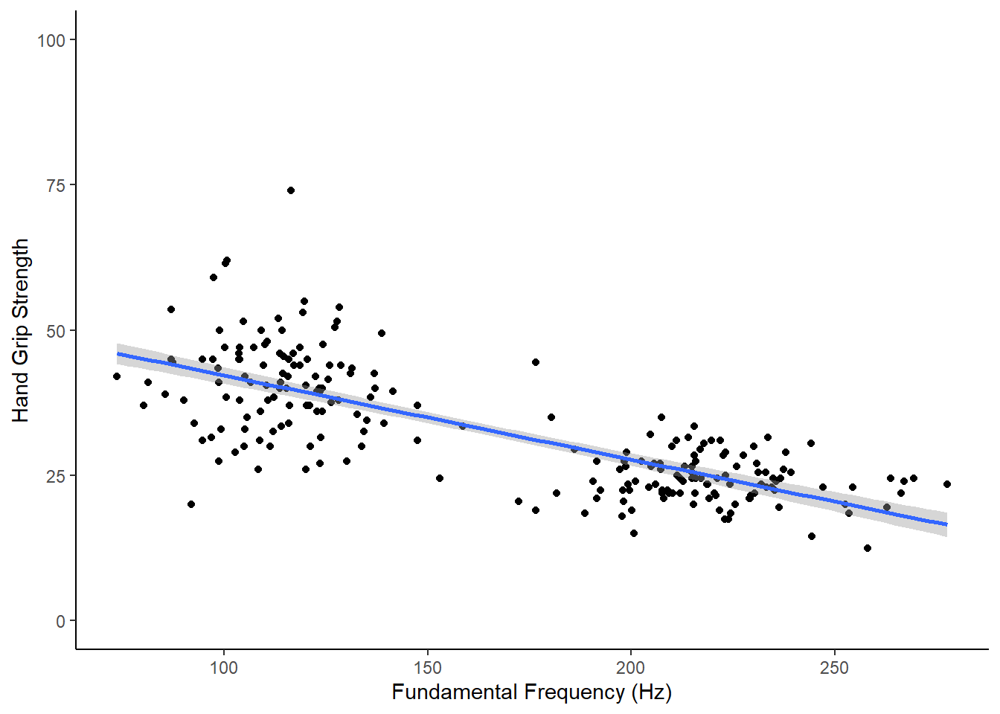

## Test Yourself

This is a **formative** assignment meaning that it is purely for you to test your own knowledge, skill development, and learning, and does not count towards an overall grade. However, you are strongly encouraged to do the assignment as it will continue to boost your skills which you will need in future assignments. You will be instructed by the Course Lead on Moodle as to when you should attempt this assignment. Please check the information and schedule on the Level 2 Moodle page.

**Chapter 15:  Regression with categorical and continuous factors**

Welcome to the final formative assignment of this book where we will look at rounding off the main topics of the quantitative approach we have looked at over the past few months. Over the weeks we have looked at analysing data from categorical factors in ANOVAs as well as continuous factors in regression. However, we have also looked that the General Linear Model and how it shows that ANOVAs and Regression are all part of the same model. If that is true then in principle you should be able to perform analysis with both categorical and continuous factors in the same model. This is what we looked at in the inclass activities of recent chapters and it is how we will round off the book, sending you on your way primed and ready for the next stage of your development!

In order to complete this assignment you first have to download the assignment .Rmd file which you need to edit for this assignment: titled `GUID_Level2_Semester2_Ch15.Rmd`. This can be downloaded within a zip file from the below link. Once downloaded and unzipped you should create a new folder that you will use as your working directory; put the .Rmd file in that folder and set your working directory to that folder through the drop-down menus at the top. <a href="./data/15-s02/homework/ch15-assign-data.zip" target = "_blank">Download the Assignment .zip file from here</a>.

**Background**

For this assignment, we will be looking at data from the following archival data:

**Han, C., Wang, H., Fasolt, V., Hahn, A., Holzleitner, I. J., Lao, J., DeBruine, L., Feinberg, D., Jones, B. C. No evidence for correlations between handgrip strength and sexually dimorphic acoustic properties of voices.** Available on the Open Science Framework, retrieved from <a href="https://osf.io/na6be/" target = "_blank">https://osf.io/na6be/</a>

Han and colleagues studied the relationship between the pitch of a person's voice (as measured by fundamental frequency - see Chapter 14) and hand grip strength to test the theory that lower voices signal physical strength.  In particular, the study sought to replicate a previous study that found lower voices associated with greater grip strength in male participants but in for female participants.  The idea proposed in previous studies is that pitch is a signal of physical strength and people use it as a mate preference signal, though more recent work, including this data, would tend to refute this notion.

So in summary, the main relationship of interest is between voice frequency (`F0` - pronounced `F zero`) and hand grip strength (`HGS`) as modulated by sex (male or female), testing the hypothesis that there is a negative relationship between F0 and HGS in male voices but not in female voices.  

* **Note 1:** Lower values of `F0` are associated with lower pitch voices (deep voices) and higher values of `HGS` would be associated with a stonger grip.
* **Note 2:** The data also contains nationality but we will not look at that today.
* **Note 3:** On the original OSF page for this archival data, the data is in excel format. You can actually read in excel data using `readxl::read_excel()` but we have given you the data in  `.csv` format for consistency and to keep our open practices. Excel is software that most people have to purchase and as such does not fully conform with the ideas of open science. Hence, creating and transferring data as `.csv` format is always preferrable. Today, make sure to use the `.csv` format we have been teaching all year.
* **Note 4:** Pay particular attention to your spelling when working with the pitch column. Note that it is labelled as `F0` (F and the number 0) and not `FO` (F and the letter O). Do not rename the column. Be exact on your spelling and typing.   

**Before starting let's check:**

1. The `.csv` file is saved into a folder on your computer and you have manually set this folder as your working directory. 

2. The `.Rmd` file is saved in the same folder as the `.csv` files. For assessments we ask that you save it with the format `GUID_Level2_Semester2_Ch15.Rmd` where `GUID` is replaced with your `GUID`. Though this is a formative assessment, it may be good practice to do the same here.

### Task 1A: Load add-on packages {#Ch15AssignQueT1A}

* Today we will need only the `tidyverse` package. Load in this package by putting the appropriate code into the `T1A` code chunk below.


```r
# call in the required library packages
```

### Task 1B: Load the data {#Ch15AssignQueT1B}

* Using `read_csv()` replace the `NULL` in the `T1B` code chunk to read in the data file with the **exact** filename you have been given. 
    - Store `Han_OSF_HGSandVoiceData.csv` as a tibble in `dat`


```r
dat <- NULL
```

Be sure to have a look at your data through the viewer or by using commands in your console only, not in your code.

### Task 2: Demographics {#Ch15AssignQueT2}

Because the researchers are really excellent the data is already set up in a nice layout for us to quickly create some demographics.

* In the `T2` code chunk below replace the `NULL` with a code pipeline that calculates the number of male and female participants there are, in the data, as well as the mean age and standard deviation of age for both sex.
    - store the output as a tibble in `demogs`
    - the resulting tibble will have the following columns in this exact order: `sex`, `n`, `mean_age`, `sd_age`.
    - there will be four columns (as named above in that order) with 2 rows; i.e. 1 row for each sex of voice.
    - Be exact on spelling and order of column names. By alphabetical order, female data will be in row one.


```r
demogs <- NULL
```

### Task 3: Plotting the general relationship of F0 and HGS {#Ch15AssignQueT3}

Great, we will need that data later on but for now let's start looking at the data by plotting a basic relationship between F0 and HGS regardless of sex.

* Enter code into the `T3` code chunk below to exactly replicate the shown figure.
    - you must use ggplot()
    - make sure the background, colors, labels, and x and y dimensions match what is shown below.


```r
# replicate the figure shown using a ggplot() approach
```

<div class="figure" style="text-align: center">

<p class="caption">(\#fig:T3-hide)Replicate this Figure</p>
</div>


### Task 4: Analysing the general relationship of F0 and HGS {#Ch15AssignQueT4}

Hmmm, so the scatterplot illustrates the basic relationship between F0 and HGS but we should test this using a simple linear regression.

* Using the data in `dat`, replace the `NULL` in the `T4` code chunk below to run a simple linear regression testing the relationship of F0 (our IV) predicting hand grip strength (our DV).
     - store the output of the regression in `mod1`
     - Do nothing to the output of lm() other than store it in the variable named `mod1` (note: technically it will store as a list).
     - do not include sex in this model. Just include the stated DV and the IV. 
     - You will need to think about the order to make sure F0 is predicting hand grip strength.


```r
mod1 <- NULL
```

### Task 5: Interpreting the general relationship of F0 and HGS {#Ch15AssignQueT5}

You should have a look at the output of `mod1` but only do this in the console and not in your code.  Based on that output and on the scatterplot in Task 4, one of the below statements is a coherent and accurate summary of the above analysis.

1. As illustrated in the scatterplot of Task 4, the model revealed that fundamental frequency does predict hand grip strength, explaining approximately 56.7% of the population variance. The model would suggest that there is a negative relationship between F0 and HGS (b = -.145) supporting the basic hypothesis that as pitch increases, hand grip strength decreases (Adjusted R-squared = .567, F(1, 289.3) = 219, p < .001.
2. As illustrated in the scatterplot of Task 4, the model revealed that fundamental frequency does predict hand grip strength, explaining approximately 56.7% of the population variance. The model would suggest that there is a positive relationship between F0 and HGS (b = .145) supporting the basic hypothesis that as pitch increases, hand grip strength increases (Adjusted R-squared = .567, F(1, 289.3) = 219, p < .001.
3. As illustrated in the scatterplot of Task 4, the model revealed that fundamental frequency does predict hand grip strength, explaining approximately 56.7% of the population variance. The model would suggest that there is a negative relationship between F0 and HGS (b = -.145) supporting the basic hypothesis that as pitch increases, hand grip strength decreases (Adjusted R-squared = .567, F(1, 219) = 289.3, p < .001.
4. As illustrated in the scatterplot of Task 4, the model revealed that fundamental frequency does predict hand grip strength, explaining approximately 56.7% of the population variance. The model would suggest that there is a positive relationship between F0 and HGS (b = .145) supporting the basic hypothesis that as pitch increases, hand grip strength increases (Adjusted R-squared = .567, F(1, 219) = 289.3, p < .001.

* In the `T5` code chunk below, replace the `NULL` with the number of the statement below that best summarises this analysis. Store this single value in `answer_t5`


```r
answer_t5 <- NULL
```

### Task 6: Plotting the modulation of voice/strength relationship by sex {#Ch15AssignQueT6}

Well that is interesting but we really want to look at the relationship between fundamental frequency and hand grip strength separately for male and female participants. 

* Let's start by plotting the relationship between F0 and HGS for males and females separately. Enter code into the `T6` code chunk below to represent this relationship for each sex separately.
    - This has to be one figure, meaning only one ggplot call. Two ggplot calls will not be accepted.
    - male and female can be represented on the same plot area or split into two plot areas using any method previously shown.
    - Why not start with your code from Task 3 and simply add an aes call or an additional line to split the male and female data.
    - Your output should show two separate regression lines; one for the male participants and one for the female participants.
    - Make any other changes to your figure that you wish, the only criteria are: that there is only one ggplot call in your code chunk; that each participant is represented by a dot; that voice pitch is on the x-axis; that there are two regression lines, one for each sex.


```r
# you must use the stated function
```


### Task 7: Mean centering and Deviation coding the variables. {#Ch15AssignQueT7}

Looking at your new figure this would perhaps suggest that there is not quite as clear a relationship between HGS and F0 as our previous analysis showed. Now that we have split male and female data, the regression lines for both sex look relatively flat and not the sloping relationship we saw earlier. We are going to test the relationship in the next Task but, before doing that, thinking back to the in-class activities of the chapter, we said we needed to do two things to the data first before running a regression that has both continuous and categorical data. Those two steps were mean centering the continuous predictor and deviation code the categorical predictor.

* In the `T7` code chunk below, replace the `NULL` with a line of code that adds on two new columns to the dataset. The first new column will be the mean centered continuous variable (F0). The second new column will be the deviation coded categorical variable (sex)
    - store the output of this wrangle in the tibble called `dat_dev`.
    - call the column containing the mean centered continuous variable `F0_C`. To clarify, that is pronounced as F zero underscore C. Both the F and C should be capital letters.
    - call the column containing the deviation coded categorical variable `sex_C`. To clarify, that is pronounced as sex underscore C. The C is a capital letter but the s is a lowercase letter.
    - deviation code females as -.5 and males as .5
    - Keep all other columns and pay strict attention to the order asked for when adding the two new columns; `F0_C` then `sex_C`.


```r
dat_dev <- NULL
```

### Task 8: Estimate the modulation of voice/strength relationship by sex {#Ch15AssignQueT8}

Ok great, the data is now in the correct format for us to test the hypothesis that there is a significant relationship between fundamental frequency and HGS in male voices but not in female voices. Another way of saying this is that the F0 and HGS relationship is modulated by sex, or that there is an interaction between sex and F0 when predicting HGS.

* Using the data in `dat_dev`, replace the `NULL` in the `T8` code chunk below to run a regression model testing the relationship of fundamental frequency and sex (our IVs) on predicting hand grip strength (our DV).
     - store the output of the regression in `mod2`
     - Do nothing to the output of lm() other than store it in the variable named `mod1` (note: technically it will store as a list).
     - Remember that we want the interaction of fundamental frequency and sex so set the model accordingly.
     - Put fundamental frequency as the first predictor and sex as the second predictor, and do not forget to use the mean centered and deviation coded variables.


```r
mod2 <- NULL
```

### Task 9: Interpreting the output 1 {#Ch15AssignQueT9}

Looking at the output of `mod2` (remember to do this only in your console and not in the code), one of the below statements is a true synopsis of each of the three effects.

1. The beta coeffecient of fundamental frequency (b = -.016) and the interaction (-.033) are not significant but the coeffecient of sex is significant (b = 13.182).
2. The beta coeffecient of fundamental frequency (b = -.033) and the interaction (-.016) are significant but the coeffecient of sex is not significant (b = 13.182).
3. The beta coeffecient of fundamental frequency (b = -.016) and the interaction (-.033) are significant but the coeffecient of sex is not significant (b = 13.182).
4. The beta coeffecient of fundamental frequency (b = -.033) and the interaction (-.016) are not significant but the coeffecient of sex is significant (b = 13.182).

* In the `T9` code chunk below, replace the `NULL` with the number of the statement below that best summarises this analysis. Store this single value in `answer_t9`


```r
answer_t9 <- NULL
```

### Task 10: Interpreting the output 2 {#Ch15AssignQueT10}

Based on the output of `mod2` one of the below statements is a true synopsis of slopes for male and female participants. Do any necessary additional calculations in your console, not in the script.

1. The slope of the male regression line (slope = -.042) is marginally more negative than the slope of the female regression line (slope = -.025).
2. The slope of the male regression line (slope = .042) is marginally more positive than the slope of the female regression line(slope = .025).
3. The slope of the female regression line (slope = -.042) is marginally more negative than the slope of the male regression line (slope = -.025).
4. The slope of the female regression line (slope = .042) is marginally more positive than the slope of the male regression line (slope = .025).

* In the `T10` code chunk below, replace the `NULL` with the number of the statement below that best summarises this analysis. Store this single value in `answer_t10`


```r
answer_t10 <- NULL
```

### Task 11: Interpreting the output 3 {#Ch15AssignQueT11}

Based on the output of all of the above, one of the below statements is a true synopsis of the analyses.

1. An analysis involving 221 participants (male: N = 110, Mean Age = 22.93, SD Age = 3.35; female: N = 111, Mean Age = 23.87, SD Age = 5.14) was conducted to test the hypothesis that there was a negative relationship between fundamental frequency and hand grip strength in males but not in females. A simple linear regression suggested that there was a significant negative relationship between F0 and HGS, when not controlling for sex. However, after controlling for participant sex, there appears to be no significant relationship between fundamental frequency and grip strength. The only significant effect suggests that there is a difference in hand grip strength between males and females but this is not related to fundamental frequency.

2. An analysis involving 221 participants (female: N = 110, Mean Age = 22.93, SD Age = 3.35; male: N = 111, Mean Age = 23.87, SD Age = 5.14) was conducted to test the hypothesis that there was a negative relationship between fundamental frequency and hand grip strength in males but not in females. A simple linear regression suggested that there was no significant negative relationship between F0 and HGS, when not controlling for sex. Likewise, after controlling for participant sex, there appears to be no significant relationship between fundamental frequency and grip strength. The only significant effect suggests that there is a difference in hand grip strength between males and females but this is not related to fundamental frequency.

3. An analysis involving 221 participants (female: N = 110, Mean Age = 22.93, SD Age = 3.35; male: N = 111, Mean Age = 23.87, SD Age = 5.14) was conducted to test the hypothesis that there was a negative relationship between fundamental frequency and hand grip strength in females but not in males. A simple linear regression suggested that there was a significant negative relationship between F0 and HGS, when not controlling for sex. However, after controlling for participant sex, there appears to be no significant relationship between fundamental frequency and grip strength. The only significant effect suggests that there is a difference in hand grip strength between males and females but this is not related to fundamental frequency.

4. An analysis involving 221 participants (female: N = 110, Mean Age = 22.93, SD Age = 3.35; male: N = 111, Mean Age = 23.87, SD Age = 5.14) was conducted to test the hypothesis that there was a negative relationship between fundamental frequency and hand grip strength in males but not in females. A simple linear regression suggested that there was a significant negative relationship between F0 and HGS, when not controlling for sex. However, after controlling for participant sex, there appears to be no significant relationship between fundamental frequency and grip strength. The only significant effect suggests that there is a difference in hand grip strength between males and females but this is not related to fundamental frequency.

* In the `T11` code chunk below, replace the `NULL` with the number of the statement below that best summarises this analysis. Store this single value in `answer_t11`


```r
answer_t11 <- NULL
```

<span style="font-size: 22px; font-weight: bold; color: var(--blue);">Job Done - Activity Complete!</span>

Well done, you are finished! Now you should go check your answers against the solution file which can be found on Moodle. You are looking to check that the resulting output from the answers that you have submitted are exactly the same as the output in the solution - for example, remember that a single value is not the same as a coded answer. Where there are alternative answers it means that you could have submitted any one of the options as they should all return the same answer. If you have any questions please post them on the forums.

